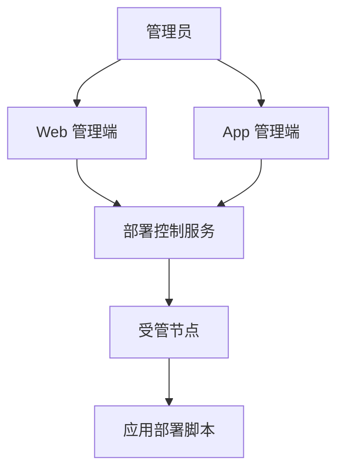

# 轻量级自动化部署服务需求

## 问题定义

许多小型服务已经拥有可工作的部署脚本，但缺少统一入口来管理服务器、部署目标、执行过程和历史记录。直接登录服务器运行脚本操作分散、难以审计，也不利于在桌面端和移动端及时查看与处理部署任务。

本项目的价值不是重新发明构建流水线，而是为应用已有脚本提供轻量控制面：集中管理节点和应用，以明确参数触发脚本，持续展示输出，并保存可追踪的执行结果。

## 产品关系

## 需求

**节点管理**

- R1. 管理员可以创建、查看、编辑和停用节点。
- R2. 节点需要呈现连接状态、最近检查时间和影响部署判断的基础信息。
- R3. 管理员可以从节点查看其承载的应用和相关部署历史。

**应用与脚本管理**

- R4. 管理员可以创建、查看、编辑和归档应用。
- R5. 应用可以关联一个或多个部署目标，每个目标指向节点及对应脚本入口。
- R6. 系统只托管脚本的执行配置和调用过程，脚本内容及真实部署逻辑由应用自身负责。
- R7. 敏感参数不得以明文出现在普通列表、部署摘要或执行日志中。

**部署执行**

- R8. 管理员可以从应用详情发起一次部署，并在确认前看到目标节点、脚本和参数摘要。
- R9. 每次部署具有排队、运行、成功、失败和取消等明确状态，并记录发起人和关键时间。
- R10. 运行中的部署持续展示脚本输出；完成后仍可查看日志与结果摘要。
- R11. 失败部署提供可辨识的失败状态和最后有效输出，但不替脚本推断业务级修复方案。
- R12. 对同一应用和目标的并发执行必须采用明确策略，避免无提示地重复部署。

**管理体验**

- R13. Web 管理端覆盖完整的首版管理和部署流程，适合配置与长日志查看。
- R14. App 管理端覆盖状态查看、发起与确认部署、查看日志等主要能力，复杂配置可按移动场景适度收敛。
- R15. Web 与 App 使用一致的领域术语、状态语义和操作结果，但不要求页面布局完全相同。
- R16. UI 设计源使用 mock 数据覆盖正常、空、加载、断连、失败和高风险确认状态。

## 首版主流程

1. 管理员添加节点并确认节点可用。
2. 管理员创建应用，配置部署目标和脚本入口。
3. 管理员在应用详情选择目标并发起部署。
4. 系统创建部署记录并调用目标节点上的应用脚本。
5. 管理员查看实时输出和状态变化。
6. 系统保存结果，供应用、节点和全局部署记录查询。

## 成功标准

- 用户无需直接登录服务器，即可完成已有脚本的一次可追踪部署。
- 部署前能明确识别应用、目标节点和脚本，部署后能定位发起人、时间、结果和日志。
- Web 与 App 的关键任务均能在 UI 设计源中完整演示。
- 产品边界保持轻量，没有演变为代码仓库、流水线或容器编排平台。

## 范围边界

- 不托管 Git 仓库，不负责代码评审和制品构建。
- 不提供通用 CI/CD DAG、可视化脚本编排或插件市场。
- 不替代 Kubernetes、Nomad 等基础设施编排平台。
- 首版不承诺自动回滚；是否回滚以及如何回滚由应用脚本定义。
- 首版不以监控告警、定时任务和多租户计费为核心能力。

## 关键决定

- 以应用自带脚本为部署能力边界，降低平台对不同技术栈的侵入。
- Web 管理端优先承载完整配置体验，App 管理端优先承载查看与操作体验。
- 先使用纯静态 UI 设计源收敛跨端流程，再分别实现正式客户端。
- UI 设计源复用参考项目静态 UI 模块的组织思路：hash router、mock store、本地静态资源和零构建依赖。

## 依赖与假设

- 使用者是有权管理节点和发起部署的内部管理员。
- 应用已经具备可重复调用、能通过退出码表达成功或失败的部署脚本。
- API 服务使用 Rust；Web 管理端技术栈在正式实现计划中确定；App 使用 Flutter。

## 待确认问题

### 实施 API 前确认

- 控制服务通过 SSH 直接调用脚本，还是在节点部署轻量 Agent？该决定影响节点接入、安全边界和实时日志协议。
- 首版采用单管理员、简单角色，还是需要细粒度的节点与应用权限？
- 同一部署目标的并发策略采用拒绝、排队还是允许并行？
- 脚本配置是引用节点上的固定路径，还是允许仓库内保存脚本内容？当前需求倾向只引用固定入口。

### UI 设计阶段可先使用的假设

- 默认采用“排队”表现并展示当前队列位置，后续可按执行模型调整。
- 首版设计角色使用“管理员”，暂不展开权限配置页。
- 高风险部署必须经过二次确认，确认内容包含应用、环境、节点和脚本。

## 下一步

按 `docs/plans/2026-07-30-bootstrap-and-ui-design.md` 先完成 UI 信息架构和可交互设计源，再进入 API 架构决策与模块工程初始化。
