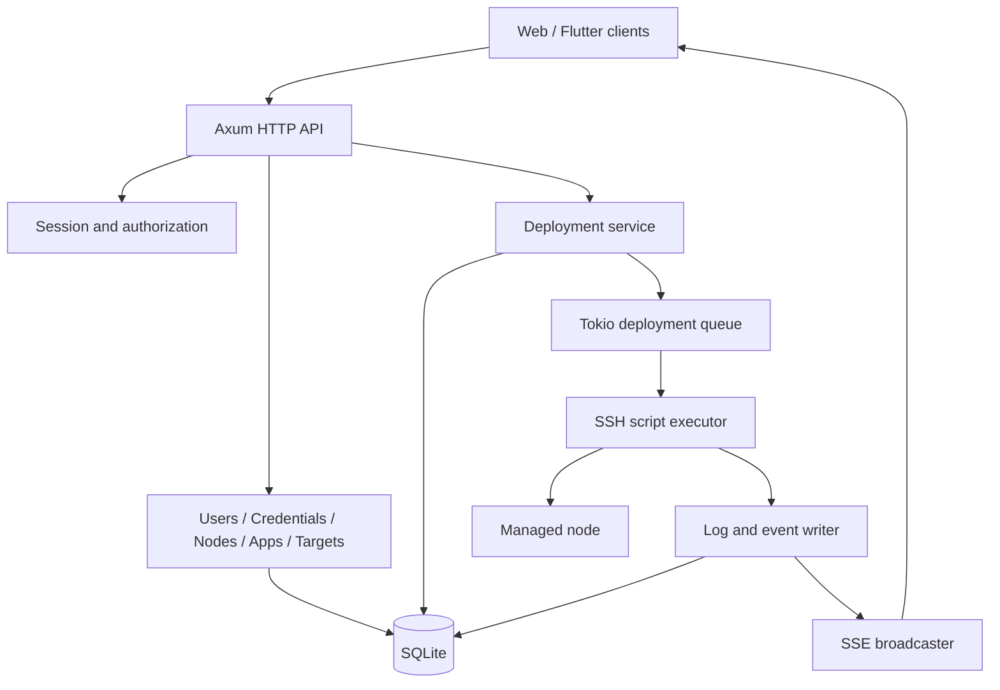
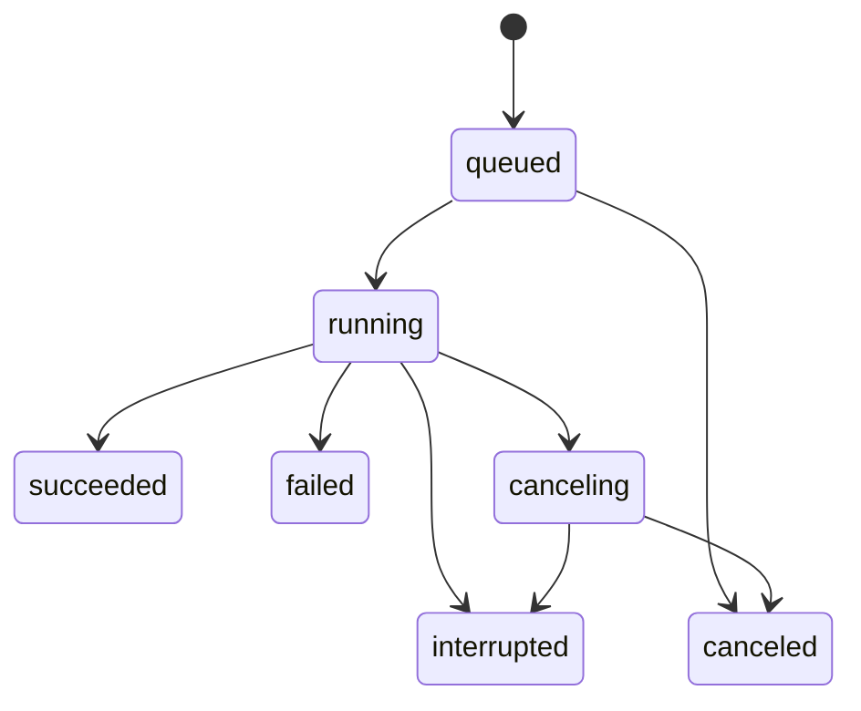
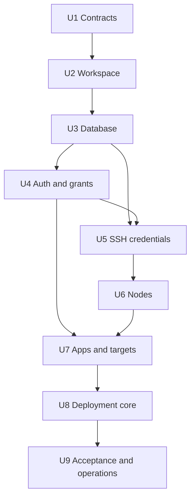

# API 基础与轻量部署内核实施计划

## Goal Capsule

- **目标：** 建立可供 Web 与 Flutter 共用的 Rust API，完成账号授权、SSH 凭证、节点、应用、部署目标、脚本执行、日志和审计的首版闭环。
- **权威输入：** `AGENTS.md`、`docs/standards/access-control.md`、`docs/standards/deploy-script-contract.md`、`docs/brainstorms/2026-07-30-lightweight-deployment-service.md` 和 `ui/docs/`。
- **执行边界：** 平台通过 SSH 执行节点上的固定脚本，只管理调用、状态、日志和结果，不接管应用内部部署逻辑。
- **执行策略：** 单实例 API、SQLite、进程内 Tokio 队列、部署目标级串行和全局并发上限。
- **停止条件：** 凭证加密、远程命令安全编码、host key 校验、目标并发约束或重启恢复语义无法被自动化测试证明时，不得接入真实节点。
- **尾部责任：** 本计划完成后分别建立 `admin/` 和 `admin-app/` 正式客户端计划；不得在本计划内顺带铺开客户端工程。

---

## Product Contract

### Summary

Deploy Go 为已有部署脚本提供轻量控制面。
管理员管理用户、SSH 凭证、节点、应用和部署目标。
获授权用户可以发起部署，查看实时日志和追踪最终结果。
应用脚本继续拥有部署、验证、清理和回滚逻辑的唯一控制权。

### Problem Frame

小型服务通常已经有可用脚本，但执行入口分散在服务器登录会话中。
现有方式缺少统一授权、参数约束、实时反馈、取消能力和历史审计。
完整 CI/CD 或部署编排平台会增加不必要的制品、流水线和运行时接管成本。
本项目只补齐安全、可观察且可追踪的脚本执行层。

### Actors

- A1. **唯一管理员：** 初始化系统、管理普通用户和全部资源、查看审计并执行所有部署操作。
- A2. **普通用户：** 查看已授权应用及其关联节点，发起、查看、取消和重试授权范围内的部署。
- A3. **应用维护者：** 在应用项目和节点上维护符合平台契约的部署脚本，不通过平台编辑脚本内容。

### Requirements

**账号与授权**

- R1. 系统必须保持唯一且不可停用、删除或降级的管理员。
- R2. 管理员必须能够创建、停用和重置普通用户凭证，停用后现有会话立即失效。
- R3. 普通用户必须通过应用授权获得查看和部署能力，节点可见性由已授权应用的部署目标间接获得。
- R4. 所有权限必须在 API 层强制执行，并区分未登录、权限不足和资源不存在。

**SSH 凭证与节点**

- R5. 管理员必须能够生成 SSH 密钥对，默认算法为 Ed25519，并查看或复制公钥与指纹。
- R6. SSH 私钥必须加密保存且不能通过普通 API 回显；系统不得将它写入日志、错误正文或审计详情。
- R7. 一个 SSH 凭证可以绑定多个节点，一个节点首版只能绑定一个有效 SSH 凭证，并支持绑定、更换和解绑。
- R8. 已被节点引用的 SSH 凭证不能删除；解绑后的节点必须进入缺少凭证状态并禁止检查和新部署。
- R9. 管理员必须能够创建、查看、编辑和停用节点，并通过显式确认指纹完成首次 host key 信任，再执行 SSH 连通性、系统能力、工作目录和磁盘检查。
- R10. 节点停用或检查不通过时不得承接新部署，但必须保留历史部署和审计关系。

**应用与部署目标**

- R11. 管理员必须能够创建、查看、编辑、归档和恢复应用。
- R12. 应用必须能够配置多个部署目标，每个目标绑定节点、环境、固定脚本路径、参数 schema、节点本地敏感文件引用、超时和验证配置。
- R13. 脚本路径解析后必须位于目标允许的工作根目录，平台不得保存、生成或修改脚本内容。
- R14. 应用归档、节点停用、凭证缺失或脚本契约检查失败时不得创建新部署。

**部署执行与结果**

- R15. 创建部署前必须返回可确认摘要，确认内容包含应用、目标、节点、脚本、非敏感参数和配置版本 hash。
- R16. 确认请求必须具有幂等键并校验配置版本 hash，避免重复提交或使用已经变化的目标配置。
- R17. 同一部署目标必须允许多个任务排队但只能运行一个，数据库约束必须阻止双跑；系统同时应用可配置的全局最大并发数。
- R18. 部署必须记录发起人、原部署关联、状态、阶段、队列时间、执行时间、退出码、协议完整性和结果摘要。
- R19. 平台必须追加保存 stdout、stderr 和 `DEPLOY_EVENT` 结构化事件，并通过 SSE 按游标提供断线续传。
- R20. 取消必须覆盖排队和运行任务；运行任务通过远端受控包装器记录的 PID 与取消文件发送取消信号，超过宽限期后强制终止远端进程组，但不得宣称应用已经回滚。
- R21. 重试必须创建新的部署记录并关联原部署，不得复用原任务状态、事件或日志。
- R22. API 重启后 queued 任务可以重新入队；无法证明远端状态的 running 任务必须标记为 interrupted，不得自动判定成功或失败。

**安全、审计与运维**

- R23. SSH 参数、脚本参数和环境变量必须通过受测的远端 token 编码器构造，禁止未经校验或转义地拼接用户输入，并禁止调用 `eval`。
- R24. 凭证、用户、节点、应用、部署目标、部署操作和系统设置的关键变更必须写入追加式审计日志。
- R25. 日志必须实施单行、单任务和保留周期限制，并对敏感值执行写入前脱敏。
- R26. API 必须提供健康检查、统一错误体、分页与筛选契约、结构化 tracing 和数据库 migration 运维入口。

### Key Flows

- F1. **初始化与登录**
  - **触发：** 空数据库首次启动。
  - **参与者：** A1。
  - **步骤：** 使用一次性初始化输入创建唯一管理员；管理员登录并建立可撤销会话。
  - **结果：** 系统不再接受第二次初始化，初始密码不被保存到普通日志。
  - **覆盖：** R1、R2、R4、R24。

- F2. **生成密钥并接入节点**
  - **触发：** 管理员新增 SSH 凭证和节点。
  - **参与者：** A1。
  - **步骤：** 平台生成 Ed25519 密钥对；管理员复制公钥到远端 `authorized_keys`；节点绑定凭证并执行 host key 与能力检查。
  - **结果：** 私钥加密保存，检查成功的节点可以绑定部署目标。
  - **覆盖：** R5-R10、R23、R24。

- F3. **配置应用部署目标**
  - **触发：** 管理员创建应用和目标。
  - **参与者：** A1、A3。
  - **步骤：** 配置节点、环境、固定脚本路径、参数 schema、敏感引用和超时；平台执行静态契约检查。
  - **结果：** 目标形成可版本化的执行快照，平台不读取或托管脚本源码。
  - **覆盖：** R11-R14。

- F4. **发起并观察部署**
  - **触发：** 用户确认部署摘要。
  - **参与者：** A1 或 A2。
  - **步骤：** API 校验授权与 hash；创建排队记录；执行器取得目标锁并通过 SSH 启动脚本；日志和事件持续写入并通过 SSE 输出。
  - **结果：** 退出码和协议事件共同形成最终状态，历史记录可查询。
  - **覆盖：** R15-R19、R23-R26。

- F5. **取消、重试与恢复**
  - **触发：** 用户取消任务、重试失败任务或 API 重启。
  - **参与者：** A1 或 A2。
  - **步骤：** 校验资源授权；发送取消信号或创建新记录；启动恢复器重新处理 queued 并隔离未知 running 状态。
  - **结果：** 操作可审计，原始日志不可变，远端未知结果不被误判。
  - **覆盖：** R20-R22、R24。

### Acceptance Examples

- AE1. 给定普通用户未获得应用授权，当其访问应用、目标、部署或关联节点时，则 API 返回一致的无权结果且不泄露资源详情。
- AE2. 给定 SSH 密钥已经绑定节点，当管理员删除该密钥时，则 API 拒绝删除并返回引用节点摘要。
- AE3. 给定节点解绑 SSH 密钥，当用户发起该节点目标的部署时，则 API 在创建任务前拒绝请求。
- AE4. 给定相同幂等键重复确认部署，当请求内容相同时，则 API 返回同一部署；内容不同时返回冲突。
- AE5. 给定同一目标已有运行任务，当第二个部署确认时，则新任务进入队列且不会并行启动。
- AE6. 给定日志 SSE 连接断开，当客户端携带最后游标重连时，则先补发缺失持久化日志，再继续实时流。
- AE7. 给定脚本退出码为零但缺少 `deploy.finished`，则任务可成功结束，但必须标记协议不完整并保留诊断事件。
- AE8. 给定 API 在任务运行期间重启，则该任务标记为 interrupted；系统不得自动重试或宣称远端执行失败。
- AE9. 给定输出包含已登记敏感值，则持久化日志、SSE、错误体和审计详情均不得出现原值。

### Success Criteria

- 管理员可以从空数据库完成账号初始化、SSH 密钥生成、节点检查、应用目标配置和一次模拟部署。
- 普通用户只能操作已授权应用，全部越权路径有服务端集成测试。
- 模拟 SSH 执行覆盖成功、失败、取消、超时、断连、异常事件、非法 UTF-8 和服务重启。
- Web 与 Flutter 所需的列表、详情、部署确认和日志续传能力均有稳定 API 契约。
- 首版没有引入 Git、制品、Compose/systemd 管理、部署 Agent、动态 RBAC 或自动回滚。

### Scope Boundaries

**本计划交付**

- `api/` Rust 服务、数据库 migration、OpenAPI 契约和测试。
- 账号授权、SSH 凭证、节点、应用、部署目标、部署、日志、事件、审计和设置 API。
- 本地开发、migration、SSH 接入和部署恢复 runbook。

**后续独立计划**

- `admin/` Web 正式工程及 UI 设计源迁移。
- `admin-app/` Flutter 正式工程及移动端状态恢复。
- 通知渠道、API token、凭证轮换向导和导入已有私钥。

**不属于产品身份**

- Git 托管、代码评审、制品构建和发布版本中心。
- 通用 CI/CD DAG、Compose/systemd 托管、容器编排和节点 Agent。
- Blue/Green、自动回滚、脚本在线编辑和插件市场。
- 动态角色、权限矩阵、第二管理员和用户自助注册。

---

## Planning Contract

### Key Technical Decisions

- KTD1. **采用 Cargo workspace 和单个 `api` binary。** 首版保持单进程部署，领域模块在 `api/src/` 内分层，不提前拆分微服务或共享 crate。
- KTD2. **采用 Axum、Tokio、SQLx 和 SQLite。** 该组合符合单实例轻量定位，SQLite migration 和数据库约束承担持久状态与竞争保护。
- KTD3. **首版通过系统 OpenSSH 客户端直连节点。** 平台以参数数组启动 `ssh`，管理独立 `known_hosts`，不引入节点 Agent 的安装、升级、心跳和协议版本成本。
- KTD4. **用户界面称“SSH 密钥”，领域模型称 `ssh_credentials`。** “SSH 证书”留给未来可能的 OpenSSH CA 能力，避免术语冲突。
- KTD5. **默认生成 Ed25519 密钥。** 私钥使用主密钥派生的 AEAD 密钥加密保存；带版本的主密钥只从进程环境或权限受控文件加载，不进入 SQLite。首版支持启动时读取当前和上一版本密钥，并提供离线重加密命令与 runbook。
- KTD6. **授权粒度固定为 application grant。** 普通用户通过 `user_application_grants` 获得应用和部署权限，节点只通过部署目标间接暴露，不建设动态 RBAC。
- KTD7. **部署记录、日志和事件分离持久化。** `deployments` 保存状态机，`deployment_logs` 保存有序输出，`deployment_events` 保存解析结果，避免自然语言日志驱动任务状态。
- KTD8. **任务队列在进程内运行，数据库是真实状态源。** Tokio worker 只调度数据库中的 queued 记录；SQLite partial unique index 只限制同一目标的 running/canceling 记录，事务领取任务并保持 queued 的先进先出顺序，全局 semaphore 限制并发。
- KTD9. **实时日志使用 SSE。** 日志先追加到数据库，再广播；客户端以递增游标续传，广播丢失不影响最终查询。
- KTD10. **运行任务重启后进入 interrupted。** SSH 断开不能证明远端脚本终止，系统不自动重试、不自动判定失败，并向用户提供基于新部署记录的人工重试。
- KTD11. **部署确认使用 snapshot hash 和幂等键。** 创建预览时固化目标配置摘要；确认时重新校验，避免部署目标在确认窗口内发生变化。
- KTD12. **远程执行只允许受控 shell token。** OpenSSH 会把远端命令交给登录 shell，因此固定包装器路径、脚本路径、白名单参数和固定环境键必须逐 token 校验并使用唯一的 POSIX shell 编码器；禁止自由命令文本、二次 shell 和 `eval`。
- KTD13. **运行中取消由平台固定包装器负责。** 平台通过 SSH stdin 传送版本固定且带 checksum 的包装器，不要求节点预装 Agent 或平台文件；包装器在目标工作根目录下创建部署专属运行目录，原子写入 PID、取消文件和状态。取消请求通过独立 SSH 调用校验部署 ID 后发送 TERM，宽限期后发送 KILL，并把无法确认的结果标记为 interrupted。
- KTD14. **首版敏感引用只指向节点本地文件。** 管理员配置位于节点允许 secrets root 内的文件路径，平台只把受控路径传给脚本，不读取、保存或经 SSH 传输文件内容；外部 secret manager 和平台托管应用 secret 延后实现。

### High-Level Technical Design

部署状态机：

### Data Model Direction

- `users`、`sessions`、`user_application_grants`
- `ssh_credentials`、`nodes`、`node_checks`
- `applications`、`deployment_targets`、`secret_file_references`
- `deployments`、`deployment_logs`、`deployment_events`
- `audit_logs`、`system_settings`

所有业务主键使用不可预测的字符串 ID。
时间统一存储 UTC，并通过 RFC 3339 返回。
资源更新使用版本号或 `updated_at` 参与并发校验。
列表 API 使用稳定排序和游标分页；筛选字段只开放明确白名单。

### API Contract Direction

- 路由按 `/api/v1/auth`、`users`、`ssh-credentials`、`nodes`、`applications`、`deployment-targets`、`deployments`、`audit-logs` 和 `settings` 分组。
- 错误体至少包含 `code`、`message`、`request_id` 和可选 `field_errors`，不得将内部错误或敏感值直接返回。
- Session 使用 HttpOnly、Secure、SameSite cookie；状态变更接口实施 CSRF 防护。Flutter 使用同一会话 API，但凭证存储方式由客户端计划确定。
- OpenAPI 是客户端对接契约；每个实现单元同步更新 schema 和示例，不在末尾一次性补齐。

### Log and Event Limits

- stdout 和 stderr 分别标记来源，但使用同一部署内递增序号形成稳定顺序。
- 非法 UTF-8 使用替换字符保存，并记录一次诊断事件。
- 单行默认上限 64 KiB，超出后截断并标记；单任务默认持久化上限 50 MiB，到限后继续消费进程输出但停止保存正文并写入限额事件。
- SSE 只发送已经持久化的记录，支持 `Last-Event-ID` 或显式 `after` 游标。
- 保留周期和单任务限额进入系统设置，但必须有服务端安全上限。

### Sequencing

### Risks and Mitigations

- **远端参数注入：** 使用专用编码器、严格字符集、固定包装器 checksum 和 fixture 测试；禁止通用命令输入接口。
- **私钥泄露：** AEAD 加密、主密钥外置、Debug 脱敏、API 永不回显私钥，并对日志和错误做泄漏测试。
- **host key 被替换：** 首次 keyscan 只生成待确认指纹，不自动信任；管理员通过带 hash 的确认请求接受后写入 known_hosts，后续变化一律阻断并要求重新确认。
- **SQLite 写竞争：** 启用 WAL 和 busy timeout，保持日志批量短事务，并用压力测试验证并发写入。
- **进程内队列丢唤醒：** 启动和周期扫描 queued 状态，数据库而非 channel 作为任务真实来源。
- **取消语义被误解：** 状态和 UI 明确取消不等于回滚；SSH 断连或 API 重启使用 interrupted 表达未知远端结果。
- **日志无限增长：** 写入预算、保留策略和清理任务共同限制数据库增长，清理不得删除部署摘要和审计关联。

### Sources and Patterns

- `docs/brainstorms/2026-07-30-lightweight-deployment-service.md`：产品边界、主流程与原始需求。
- `docs/standards/access-control.md`：固定身份与资源授权边界。
- `docs/standards/deploy-script-contract.md`：脚本输入、事件、取消、退出码和安全约束。
- `ui/docs/web-handoff.md`、`ui/docs/flutter-handoff.md`：客户端所需 API 数据与失败状态。
- `ui/tests/ui-preview.spec.js`：跨身份、异常状态和关键操作的验收行为清单。
- 参考项目的 `api/src/deploy.rs`、`api/src/tasks.rs`、`api/src/deployment_runtime.rs` 与 migration：仅借鉴可取消进程、追加日志、目标唯一约束和重启恢复，不继承制品、Compose、systemd 或发布编排模型。

---

## Implementation Units

### U1. 冻结 API、执行与安全契约

- **Goal：** 在工程初始化前把所有跨模块契约变成可实现、可测试的稳定规范。
- **Requirements：** R3-R8、R12-R26。
- **Files：** `docs/standards/deploy-script-contract.md`、`docs/standards/api-contract.md`、`docs/standards/ssh-credential-security.md`、`docs/runbooks/README.md`。
- **Approach：** 冻结状态映射、事件 JSON Schema、取消退出码、远端包装器、token 编码、日志限额、SSE 游标、错误体、ID/时间/分页、幂等、凭证加密、主密钥轮换和 host key 信任规则；将脚本契约从 draft 调整为 accepted。
- **Test Scenarios：** 用表格覆盖所有部署状态迁移；校验未知事件字段、异常 JSON、退出码冲突、远端 token 注入、取消竞态、日志限额、重复确认、host key 首次确认与变化、主密钥轮换和密钥删除引用冲突。
- **Verification：** 规范之间不存在术语和状态冲突；每项 R-ID 都能追踪到后续实现单元和测试场景。
- **Dependencies：** 无。

### U2. 建立 Rust workspace 与 API 运行基线

- **Goal：** 提供可启动、可配置、可观测并能执行测试的最小 Rust 服务。
- **Requirements：** R26。
- **Files：** `Cargo.toml`、`rust-toolchain.toml`、`api/Cargo.toml`、`api/src/main.rs`、`api/src/config.rs`、`api/src/http/`、`api/src/error.rs`、`api/tests/health.rs`、`Makefile`、`.gitignore`、`docs/runbooks/local-development.md`。
- **Approach：** 初始化 Cargo workspace；配置 Axum、Tokio、SQLx、Serde、tracing 和 OpenAPI；实现配置校验、request ID、统一错误映射、优雅停机、`/healthz` 与 `/readyz`。
- **Test Scenarios：** 默认配置启动；缺少必填配置拒绝启动；healthz 成功；数据库不可用时 readyz 失败；错误响应携带 request ID；优雅停机停止接收新请求。
- **Verification：** `cargo fmt --all --check`、`cargo clippy --workspace --all-targets -- -D warnings`、`cargo test --workspace`、`make api-check`。
- **Dependencies：** U1。

### U3. 建立 SQLite 数据与 migration 基线

- **Goal：** 建立核心数据表、约束、事务工具和可恢复 migration 流程。
- **Requirements：** R1-R4、R7-R10、R11-R22、R24-R26。
- **Files：** `api/migrations/`、`api/src/db/`、`api/tests/migrations.rs`、`api/tests/database_constraints.rs`、`docs/runbooks/api-migrations.md`、`Makefile`。
- **Approach：** 创建全部核心表；启用 foreign keys、WAL 和 busy timeout；使用约束保证唯一管理员、引用完整性、幂等键和目标活动任务唯一性；建立测试数据库辅助器。
- **Test Scenarios：** migration 从空库升级；重复升级幂等；唯一管理员约束；绑定凭证删除阻断；应用授权唯一；同目标允许多个 queued 但禁止两个 running/canceling；历史部署在用户停用、应用归档和节点停用后保留。
- **Verification：** migration 测试对临时 SQLite 文件执行 up；数据库约束测试证明竞争路径不能绕过服务层。
- **Dependencies：** U2。

### U4. 实现认证、固定身份、应用授权和系统设置

- **Goal：** 建立唯一管理员、普通用户、应用级授权和管理员系统设置的服务端安全边界。
- **Requirements：** R1-R4、R24-R26。
- **Files：** `api/src/auth/`、`api/src/users/`、`api/src/grants/`、`api/src/audit/`、`api/src/settings/`、`api/tests/auth_api.rs`、`api/tests/authorization_api.rs`、`api/tests/users_api.rs`、`api/tests/settings_api.rs`。
- **Approach：** 实现一次性管理员初始化、密码散列、登录/登出、会话轮换与撤销、CSRF、普通用户 CRUD、停用和密码重置；策略函数统一执行管理员和 application grant 判断；实现带服务端上下限的全局并发、日志预算和保留周期设置，并记录设置变更审计。
- **Test Scenarios：** 第二管理员初始化失败；管理员不能停用或删除；用户停用撤销全部会话；Cookie 属性正确；CSRF 缺失失败；普通用户不能访问系统管理；已授权和未授权应用、目标、部署及节点返回一致结果；设置只允许管理员读取和修改、越界值被拒绝且生效值有审计；所有管理变更产生审计。
- **Verification：** HTTP 集成测试覆盖 401、403、404 与成功路径；安全测试确认密码和 session token 不进入日志及错误体。
- **Dependencies：** U3。

### U5. 实现 SSH 凭证管理

- **Goal：** 安全生成、保存和管理平台用于节点登录的 SSH 密钥。
- **Requirements：** R5-R8、R23、R24。
- **Files：** `api/src/ssh_credentials/`、`api/src/crypto/`、`api/tests/ssh_credentials_api.rs`、`api/tests/credential_encryption.rs`。
- **Approach：** 生成 Ed25519 密钥对；保存 OpenSSH 公钥、SHA256 指纹和 AEAD 加密私钥；实现列表、详情、公钥复制数据、重命名和删除；API 序列化类型不得包含私钥字段。
- **Test Scenarios：** 生成公钥可被 OpenSSH 解析；相同明文每次加密密文不同；错误主密钥不能解密；API 与 Debug 输出不含私钥；绑定节点后删除失败；未绑定密钥删除成功；生成、改名和删除均有审计。
- **Verification：** 加密 round-trip、泄漏扫描和 HTTP 集成测试通过；日志捕获中不存在私钥头、明文或主密钥。
- **Dependencies：** U3、U4。

### U6. 实现节点管理与 SSH 检查

- **Goal：** 管理节点、凭证绑定和可信 SSH 连通性状态。
- **Requirements：** R7-R10、R23、R24、R26。
- **Files：** `api/src/nodes/`、`api/src/executor/ssh.rs`、`api/src/executor/process.rs`、`api/tests/nodes_api.rs`、`api/tests/ssh_executor.rs`、`api/tests/fixtures/ssh/`。
- **Approach：** 实现节点 CRUD、停用、凭证绑定/更换/解绑；首次 keyscan 只展示待确认指纹，管理员确认后写入独立 known_hosts；通过受控命令读取 OS、架构、磁盘、工作目录及可选能力，不自动安装组件。
- **Test Scenarios：** 未确认指纹不能连接；正确密钥与已确认指纹连接成功；认证失败、超时、DNS 失败和 host key 变化分类明确；解绑后禁止检查；更换密钥强制复检；停用节点禁止新目标使用；用户输入不能注入额外 SSH 参数；检查结果和审计持久化。
- **Verification：** mock SSH server 或隔离 fixture 覆盖网络与认证矩阵；不连接真实节点。
- **Dependencies：** U5。

### U7. 实现应用与部署目标

- **Goal：** 建立应用生命周期和可安全执行的部署目标配置。
- **Requirements：** R3、R10-R16、R23、R24、R26。
- **Files：** `api/src/applications/`、`api/src/deployment_targets/`、`api/src/secrets/`、`api/tests/applications_api.rs`、`api/tests/deployment_targets_api.rs`、`api/tests/execution_spec.rs`。
- **Approach：** 实现应用 CRUD/归档/恢复、application grant、目标 CRUD；校验节点状态、固定脚本路径、参数 schema、节点本地敏感文件引用、超时、验证配置和工作根目录；验证配置首版只允许 HTTP、TCP 或固定路径 command 类型及各自白名单字段，并进入不可变部署预览与 snapshot hash。
- **Test Scenarios：** 归档应用禁止部署；停用或未检查节点不能保存可用目标；路径穿越和符号链接逃逸被拒绝；参数 schema 拒绝未知字段与 shell 片段；敏感文件引用逃逸 secrets root 或指向非普通文件时失败；平台日志不读取文件内容；验证配置拒绝未知类型、越界超时和 command 自由文本；任何目标或验证配置变化使旧 hash 失效；普通用户只能读取授权应用关联资源。
- **Verification：** 领域单元测试和 HTTP 集成测试覆盖 UI 交付文档中的创建、编辑、归档、异常与权限状态。
- **Dependencies：** U4、U6。

### U8. 实现部署队列、执行、日志和恢复

- **Goal：** 完成从部署确认到最终结果的可靠脚本执行闭环。
- **Requirements：** R14-R25。
- **Files：** `api/src/deployments/`、`api/src/executor/`、`api/src/logs/`、`api/src/events/`、`api/tests/deployments_api.rs`、`api/tests/deployment_runtime.rs`、`api/tests/deployment_recovery.rs`、`api/tests/fixtures/scripts/`。
- **Approach：** 实现预览/确认、幂等、目标锁、数据库队列扫描、全局 semaphore、通过 stdin 传送并校验的固定远端包装器、SSH 脚本启动、日志批量追加、事件解析、SSE、远端进程组取消、超时、重试和启动恢复；最终状态由状态机、退出码和协议事件共同裁决。
- **Test Scenarios：** 成功和非零退出；缺少 finished；malformed 与未知事件；stdout/stderr 交错；非法 UTF-8；单行及总量超限；敏感值脱敏；SSE 断线续传；同目标多个 queued 串行和不同目标并发；重复幂等键；取消前进程退出、运行取消及宽限期强杀、取消 SSH 断连；排队取消；失败重试新建关联记录；API 重启后 queued 恢复和 running 进入 interrupted。
- **Verification：** 全部场景使用 fixture 和 mock SSH；并发测试证明数据库约束与 semaphore 同时生效；任何测试不得访问真实节点。
- **Dependencies：** U7。

### U9. 完成 API 验收与运维交付

- **Goal：** 证明核心 API 可供正式客户端接入，并形成可执行运维手册。
- **Requirements：** R1-R26。
- **Files：** `api/openapi/`、`api/tests/end_to_end.rs`、`docs/runbooks/local-development.md`、`docs/runbooks/api-migrations.md`、`docs/runbooks/ssh-node-onboarding.md`、`docs/runbooks/credential-master-key-rotation.md`、`docs/runbooks/deployment-recovery.md`、`README.md`、`Makefile`。
- **Approach：** 导出并校验 OpenAPI；建立从初始化到模拟部署的端到端测试；补齐本地开发、migration、密钥公钥安装、host key 变更、任务中断和数据库备份恢复操作。
- **Test Scenarios：** 空库初始化到成功部署；普通用户授权部署；节点凭证轮换；部署失败、取消、日志重连和服务重启；OpenAPI 响应与真实 handler 一致；runbook 命令在本地隔离环境可执行。
- **Verification：** `make check` 顺序执行 Rust format、clippy、全部测试、OpenAPI 校验和 `make ui-check`；端到端测试输出不含敏感值。
- **Dependencies：** U8。

---

## Verification Contract

| Gate | Command or evidence | Applies to |
| --- | --- | --- |
| Rust 格式 | `cargo fmt --all --check` | U2-U9 |
| Rust 静态检查 | `cargo clippy --workspace --all-targets -- -D warnings` | U2-U9 |
| Rust 测试 | `cargo test --workspace` | U2-U9 |
| API 聚焦检查 | `make api-check` | U2-U9 |
| 全仓检查 | `make check` | U9 |
| UI 设计源回归 | `make ui-check` | U7-U9 |
| Migration | 临时 SQLite 文件从空库完整升级并重复执行校验 | U3、U9 |
| 安全 | 私钥、主密钥、密码、session 和敏感参数泄漏测试 | U4-U9 |
| 执行器 | mock SSH 与 fixture scripts，不访问真实节点 | U6-U9 |
| 契约 | OpenAPI schema 与 handler 集成测试一致 | U4-U9 |
| Git | `git diff --check`、`git diff --cached --check` | 每个提交闭环 |

每个实现单元完成后先运行聚焦测试，再运行受影响 workspace 检查。
U8 和 U9 属于高风险执行链路，进入完成状态前必须执行 `$ce-code-review`，重点检查授权、注入、凭证泄漏、竞争、取消和恢复。

---

## Definition of Done

### Global

- R1-R26 均有实现路径、自动化测试和可定位证据。
- API 可以在隔离环境从空库启动，并完成管理员初始化、密钥生成、节点模拟检查、应用配置和部署模拟执行。
- 所有远程执行测试均使用 mock 或隔离 fixture，没有连接真实节点。
- 私钥和其他敏感值不出现在 API、日志、错误、tracing、审计或测试快照中。
- OpenAPI、runbook、README 和 Makefile 与最终实现保持一致。
- Web 与 Flutter 的后续计划无需重新发明状态、错误、授权和日志协议。
- 所有废弃实验代码、未使用依赖、临时脚本、测试数据库和调试输出已经删除。

### Per Unit

- U1：协议状态、日志、安全和 API 规范达到 accepted，且不存在跨文档冲突。
- U2：服务基线可启动、可停止、可观测，并通过 format、clippy 和测试。
- U3：migration 与数据库约束在临时 SQLite 上可重复验证。
- U4：唯一管理员、会话撤销和应用授权的全部越权路径有集成测试。
- U5：SSH 公钥可用、私钥加密且无法通过任何 API 或日志回显。
- U6：节点绑定/解绑、host key 和检查失败矩阵可通过 mock SSH 重现。
- U7：应用与目标生命周期、脚本路径和参数安全约束与 UI 契约一致。
- U8：部署成功、失败、排队、取消、重试、日志续传和重启恢复均可重复验证。
- U9：`make check` 通过，端到端模拟流程和全部 runbook 完成复核。
