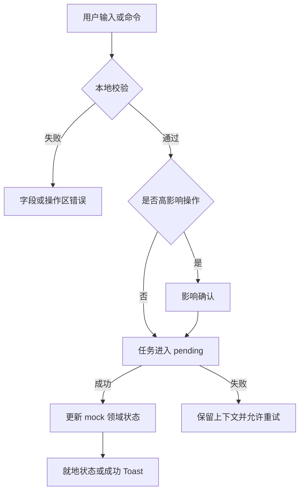

# Web 与 Admin App 现有页面交互完善计划

## Goal Capsule

- 将 `ui/` 从“页面和主要按钮可演示”提升为“现有业务流程可以连续、可恢复、可理解地操作”的交互设计基线。
- 只完善已有 Web 与 Admin App 页面，不增加 SSH 密钥管理、应用授权或其他新业务页面。
- 保持 Web 的 GitHub 风格黑白结构色和 App 的圆润移动风格；App 不增加 hover 交互。
- 设计源继续使用纯 HTML、CSS 和 JavaScript，通过 Python `8050` 端口预览，不连接真实 API 或节点。

## Product Contract

### Summary

现有 UI 已覆盖首版页面和主要业务动作，但部分操作仍表现为立即变更或简单 Toast，表单、危险操作、日志工具和异常恢复缺少完整的过程状态。本轮在不扩展页面范围的前提下，补齐操作前、操作中、成功、失败和恢复路径，使设计源能够更可靠地指导正式 Web 与 Flutter 客户端实现。

### Problem Frame

- 资源停用、应用归档和用户停用会直接生效，用户无法在提交前确认影响范围。
- 表单主要依赖原生 `required`，缺少字段级错误、跨字段约束、重复提交保护和离开未保存页面的提示。
- 筛选、搜索和空结果已经存在，但缺少统一的当前条件摘要、清空入口和数据继续加载语义。
- 部署日志具有暂停、复制、下载和重连入口，但没有完整表达剪贴板失败、下载失败、自动暂停和恢复跟随的反馈。
- 设计源状态名称与已经落地的 API 契约存在少量漂移，尤其缺少“执行中断”的明确呈现。

### Requirements

**通用交互**

- R1. 所有会改变持久状态的命令必须具备明确的空闲、处理中、成功和失败反馈，并阻止重复提交。
- R2. Modal 必须支持首焦点、焦点循环、Escape 返回、背景不可误触和关闭后焦点恢复；确认按钮文案应说明具体动作。
- R3. Toast 只反馈已完成或已受理的结果；需要用户处理的错误必须保留在相关内容附近，不能只依赖自动消失的 Toast。
- R4. 操作失败不得丢失已输入内容、已加载数据、当前筛选条件或日志内容，并提供就地重试。

**表单与导航**

- R5. 登录、用户创建、节点、应用、部署目标、系统设置和个人资料表单提供字段级校验、表单级错误摘要及首个错误聚焦。
- R6. 依赖检查的表单在关键字段变化后必须使旧检查结果失效；检查中禁止保存，检查失败保留输入并允许再次检查。
- R7. 有未保存修改时，通过站内链接、返回按钮或浏览器历史离开必须确认；保存成功或主动放弃后不再提示。
- R8. 表单提交期间显示稳定的进行中状态，按钮尺寸不变化；成功后进入可预测的详情或列表，失败后停留原页。

**资源与部署操作**

- R9. 停用用户、停用节点和归档应用在执行前展示对象、影响及不可继续的能力；启用、恢复等低风险逆向操作仍需处理中和结果反馈，但可不二次确认。
- R10. 发起部署在最终确认中展示应用、目标、节点、脚本、受控参数和敏感引用摘要；确认期间禁止修改选择或重复发起。
- R11. 取消部署区分“取消请求发送中”“取消中”和最终“已取消”；失败重试必须展示来源部署并创建独立记录。
- R12. 部署状态统一覆盖排队中、运行中、成功、失败、取消中、已取消和执行中断；执行中断说明远端最终状态未知，不自动等同失败。

**列表、日志与移动端**

- R13. 现有部署、应用和节点列表统一提供当前筛选表达、清空筛选、无结果恢复入口和刷新后状态恢复；密集数据通过“加载更多”表达增量加载，不新增分页页面。
- R14. 搜索输入保留键盘焦点，清空后立即恢复完整列表；组合筛选结果和数量变化必须可感知。
- R15. 日志阅读区在用户主动向上滚动时自动暂停跟随，回到底部时可恢复；复制、下载、跳到底部和断线重连均有成功及失败状态。
- R16. Web 可使用 hover 辅助扫描；App 只使用 tap、pressed、selected、disabled 和 focus，并保持所有触摸目标至少 `44px`。
- R17. App 一级 Tab 保持现有五项导航；二级页面的返回行为优先回到业务父页，不因浏览器历史中的入口页或场景页跳错位置。
- R18. 仓库提供可重复安装和执行的 Playwright 运行配置及 `make ui-test` 入口，测试自行启动或连接 `8050` UI 预览，并在结束后清理测试进程。

### Acceptance Examples

- AE1. 管理员编辑节点地址并完成检查后再次修改地址，旧的“检查通过”立即失效，保存按钮禁用，重新检查失败时输入仍保留。
- AE2. 管理员点击“停用节点”，确认面板展示受影响应用；确认后按钮进入处理中，成功后详情状态更新，失败则保留在线状态并显示就地错误。
- AE3. 用户填写应用表单后点击侧栏导航，先出现未保存确认；选择继续编辑后焦点回到触发导航的控件，选择放弃后才离开。
- AE4. 用户在运行日志中向上滚动后自动暂停，新增日志不会抢走阅读位置；点击“跳到末尾”恢复跟随。
- AE5. API 重启导致部署状态未知时，Web 和 App 均显示“执行中断”，提供解释和允许的重试动作，但不显示为普通部署失败。
- AE6. App 从部署详情通过返回按钮进入部署列表，即使此前从设计入口或深链打开详情，也不跳回 `#/entry`。

### Scope Boundaries

**本计划包含**

- 已有路由、表单、列表、Modal、Toast、日志和资源生命周期操作的交互完善。
- 现有 mock store 与场景扩展，以及对应 Playwright 规格和交付文档更新。
- 与当前 API 已确定状态语义的对齐，但不进行真实 API 请求。

**本计划不包含**

- SSH 密钥生成、查看公钥、复制、删除和节点绑定管理页面。
- 普通用户的应用授权分配或撤销页面。
- 新增 Web 或 App 业务模块、正式 `admin/` 工程或 Flutter `admin-app/` 工程。
- 真实认证、SSE、文件下载服务、SSH 连接和部署执行。
- 自定义角色、邀请用户、多管理员或自行注册。

### Sources

- `ui/docs/page-map.md`
- `ui/docs/component-inventory.md`
- `ui/docs/web-handoff.md`
- `ui/docs/flutter-handoff.md`
- `docs/reviews/2026-07-31-ui-completion.md`
- `api/openapi/openapi.json`

## Planning Contract

### Key Technical Decisions

- KTD1. **先建立统一的交互任务状态。** 在 mock state 中按操作保存 `idle`、`pending`、`succeeded`、`failed`，渲染函数只消费状态，不直接用临时 DOM 修改模拟异步过程。这样页面重渲染后不会丢失进行中或错误反馈。
- KTD2. **危险程度决定确认强度。** 停用和归档必须展示影响确认；启用和恢复不增加不必要确认，但仍使用 pending 与失败反馈。部署发起、取消和退出继续使用确认 Modal。
- KTD3. **错误归属到操作位置。** 字段错误贴近字段，表单错误置于表单顶部，资源操作错误保留在操作区域，Toast 只承担成功或后台已受理反馈。
- KTD4. **草稿只在当前会话保存。** 未提交表单草稿保留在内存，不写入 `localStorage`，避免把密码或敏感引用长期保存；已提交 mock 数据和非敏感筛选继续按既有方式持久化。
- KTD5. **返回路径使用路由父级映射。** App 二级页面不单纯依赖 `history.back()`；为现有二级路由定义稳定父页，只有明确的临时钻取场景才优先使用可信历史。
- KTD6. **交互状态对齐 API，视觉文案保持用户语言。** 内部 mock 使用 API 状态值，界面映射为稳定中文标签，并为 `interrupted` 提供独立图标、说明和操作边界。
- KTD7. **不拆分技术栈。** 继续沿用 `ui/assets/app.js` 的现有渲染与事件委托模式；允许提取同文件内的状态、校验和任务 helper，但本轮不引入框架或构建工具。

### High-Level Technical Design

### Sequencing

先统一交互状态、Modal 和错误反馈基础，再完善表单与导航保护；随后收敛资源操作、部署和日志；最后统一列表行为、跨端文档和自动化验收。基础 helper 完成前不并行扩展各页面，避免产生多套 pending/error 表达。

## Implementation Units

### U1. 建立交互任务、反馈与确认基线

- **Goal：** 为现有命令提供统一、可重渲染的过程状态和反馈组件。
- **Requirements：** R1-R4、R8。
- **Files：** `ui/assets/app.js`、`ui/assets/styles.css`、`ui/docs/component-inventory.md`、`ui/tests/ui-preview.spec.js`。
- **Approach：** 增加按操作键管理的任务状态；统一按钮 pending 文案、`aria-busy`、就地错误和 Toast 类型；完善 Modal 焦点恢复、背景点击边界和具体确认文案。
- **Test Scenarios：** 连续点击只产生一次状态变更；pending 时按钮稳定且禁用；失败保留页面内容并可重试；Modal Escape、Tab 循环、返回和确认后的焦点行为正确；App 不产生 hover selector。
- **Verification：** 聚焦 Playwright 规格、JavaScript 语法检查和 Web/App 固定视口截图。
- **Dependencies：** 无。

### U2. 完善表单校验、依赖检查和未保存保护

- **Goal：** 让所有现有表单具备清晰的纠错、提交和离开行为。
- **Requirements：** R4-R8。
- **Files：** `ui/assets/app.js`、`ui/assets/styles.css`、`ui/tests/ui-preview.spec.js`、`ui/docs/web-handoff.md`、`ui/docs/flutter-handoff.md`。
- **Approach：** 为各表单定义轻量校验器和错误映射；关键字段变化使节点检查或脚本契约校验失效；用统一 dirty tracking 拦截 hash 导航、站内返回和浏览器后退；密码与敏感引用不持久化。
- **Test Scenarios：** 必填、邮箱、端口、绝对路径、超时和跨字段错误；首错聚焦及错误摘要链接；检查成功后改变依赖字段会失效；pending 期间不能提交；站内链接、App 返回和浏览器后退均触发未保存确认；保存和放弃后不再提示。
- **Verification：** 每类表单至少一个成功和一个失败规格；检查 `localStorage` 不含密码及敏感输入。
- **Dependencies：** U1。

### U3. 收敛用户、节点和应用生命周期操作

- **Goal：** 为现有高影响资源操作补齐影响确认、异步状态和失败恢复。
- **Requirements：** R1-R4、R9。
- **Files：** `ui/assets/app.js`、`ui/assets/mock-data.js`、`ui/assets/styles.css`、`ui/tests/ui-preview.spec.js`。
- **Approach：** 停用用户、停用节点和归档应用进入通用影响确认；确认内容从现有 mock 关系计算影响对象；启用和恢复直接执行但显示 pending；新增资源操作失败场景且不错误修改领域状态。
- **Test Scenarios：** 唯一管理员仍不可停用；停用节点展示关联应用；归档应用展示部署不可用影响；返回不改变状态；重复确认只执行一次；失败后原状态不变并可重试；成功刷新后保持。
- **Verification：** Web 与 App 用户操作语义一致，节点和应用管理保持 Web-only 配置边界。
- **Dependencies：** U1。

### U4. 完善部署确认、状态、取消和重试交互

- **Goal：** 让部署操作完整表达请求受理、执行变化和不确定结果。
- **Requirements：** R1-R4、R10-R12。
- **Files：** `ui/assets/app.js`、`ui/assets/mock-data.js`、`ui/assets/styles.css`、`ui/tests/ui-preview.spec.js`、`ui/docs/page-map.md`、`ui/docs/component-inventory.md`。
- **Approach：** 最终确认冻结选择摘要；发起和重试使用独立 pending 任务；取消依次表达发送中、取消中与最终结果；加入 `interrupted` mock 场景和跨端状态映射，保留来源部署链接与未知远端状态说明。
- **Test Scenarios：** pending 时选择不可修改且不能重复确认；确认前条件变化进入就地错误；取消请求失败仍保持运行；取消中刷新保持；失败/取消/中断可重试并生成独立 ID；中断不显示成功或普通失败文案。
- **Verification：** Web 与 App 从部署列表到详情、取消、重试的连续流程规格。
- **Dependencies：** U1。

### U5. 完善列表筛选、增量加载与日志工作区

- **Goal：** 提升高频扫描和长时间日志阅读的可控性。
- **Requirements：** R3、R4、R13-R15。
- **Files：** `ui/assets/app.js`、`ui/assets/mock-data.js`、`ui/assets/styles.css`、`ui/tests/ui-preview.spec.js`、`ui/docs/web-handoff.md`、`ui/docs/flutter-handoff.md`。
- **Approach：** 统一搜索/筛选状态摘要和清空入口；密集数据初始只渲染稳定批次并支持加载更多；监听日志滚动位置控制 following；为 Clipboard、Blob 下载和重连模拟成功/失败结果。
- **Test Scenarios：** 多条件筛选、清空、无结果恢复和刷新保持；加载更多不重复、不改变既有顺序；输入搜索时焦点和光标保持；手动上滚自动暂停、新日志不跳动、跳到底部恢复；复制不可用或拒绝时显示就地错误；断线日志保留且重连失败可再次尝试。
- **Verification：** 密集场景、长日志、断连和工具失败规格；Web/App 无横向溢出。
- **Dependencies：** U1。

### U6. 固化移动返回语义与交互验收

- **Goal：** 消除 App 深链返回不确定性，并将完整交互契约沉淀为正式客户端交付基线。
- **Requirements：** R2、R3、R16-R18。
- **Files：** `ui/assets/app.js`、`ui/assets/styles.css`、`ui/tests/ui-preview.spec.js`、`playwright.config.js`、`package.json`、`package-lock.json`、`Makefile`、`ui/docs/page-map.md`、`ui/docs/component-inventory.md`、`ui/docs/web-handoff.md`、`ui/docs/flutter-handoff.md`、`docs/reviews/`。
- **Approach：** 建立 App 二级路由父级映射；统一按下、禁用、聚焦和 safe-area 行为；加入最小 Playwright runner 与 `make ui-test`；扩展测试覆盖操作中、失败恢复、浏览器历史、触摸目标、大字体和 reduced motion；复核后形成交互完善记录。
- **Test Scenarios：** 深链打开部署、应用、节点、用户及“我的”二级页后返回正确父页；五个 Tab 状态稳定；所有 App 控件至少 `44px`；130% 字体、窄屏和 reduced motion 下无裁切、重排抖动或不必要动画；Web Modal 关闭后焦点恢复。
- **Verification：** `360x800`、`390x844`、`1024x768`、`1440x900` 交互回归与截图；更新复核文档。
- **Dependencies：** U2-U5。

## Verification Contract

| Gate | Command or evidence | Applies to |
| --- | --- | --- |
| JavaScript 语法 | `node --check ui/assets/app.js`、`node --check ui/assets/mock-data.js`、`node --check ui/tests/ui-preview.spec.js` | U1-U6 |
| UI 静态检查 | `make ui-check` | U1-U6 |
| 全仓检查 | `make check` | U6 |
| 交互回归 | `make ui-test`，覆盖现有路由和本计划 AE1-AE6 | U1-U6 |
| 视觉与布局 | 四个固定视口截图，无页面级横向溢出、遮挡或按钮尺寸变化 | U1-U6 |
| 移动约束 | App 无 hover，触摸目标至少 `44px`，大字体和 safe area 正常 | U1、U6 |
| 安全 | `localStorage`、日志和页面不出现密码、私钥或敏感引用明文 | U2、U4-U6 |
| Git | `git diff --check`、`git diff --cached --check` | 每个提交闭环 |

## Definition of Done

### Global

- AE1-AE6 均有可重复的交互规格和可见结果。
- 所有现有持久化命令都有 pending、成功、失败和防重复提交行为。
- 所有现有表单都有字段错误、提交错误、依赖检查失效和未保存离开保护。
- 停用用户、停用节点和归档应用不会在没有确认的情况下生效。
- 部署中断、取消中和日志断线在 Web/App 中含义一致且不会错误合并为失败。
- 设计源未增加 SSH 密钥管理、应用授权或正式客户端工程，未连接真实 API 或节点。
- 页面地图、组件清单、Web/Flutter 交付说明、测试和复核记录与实现保持一致。
- `npm ci` 后可通过 `make ui-test` 在隔离预览进程中重复执行交互规格。
- 实施中产生的废弃实验代码、无效 mock 状态和临时调试输出已经移除。

### Per Unit

- U1：统一任务状态与反馈基线可被所有后续操作复用。
- U2：表单纠错、检查失效、提交和离开保护形成完整闭环。
- U3：三个现有高影响资源操作均经过影响确认并可从失败恢复。
- U4：部署确认、取消、重试和中断语义跨端一致。
- U5：列表和日志的高频操作在密集、断线和失败场景下仍可控。
- U6：App 返回路径稳定，四视口、键盘、触摸和大字体验收通过。
