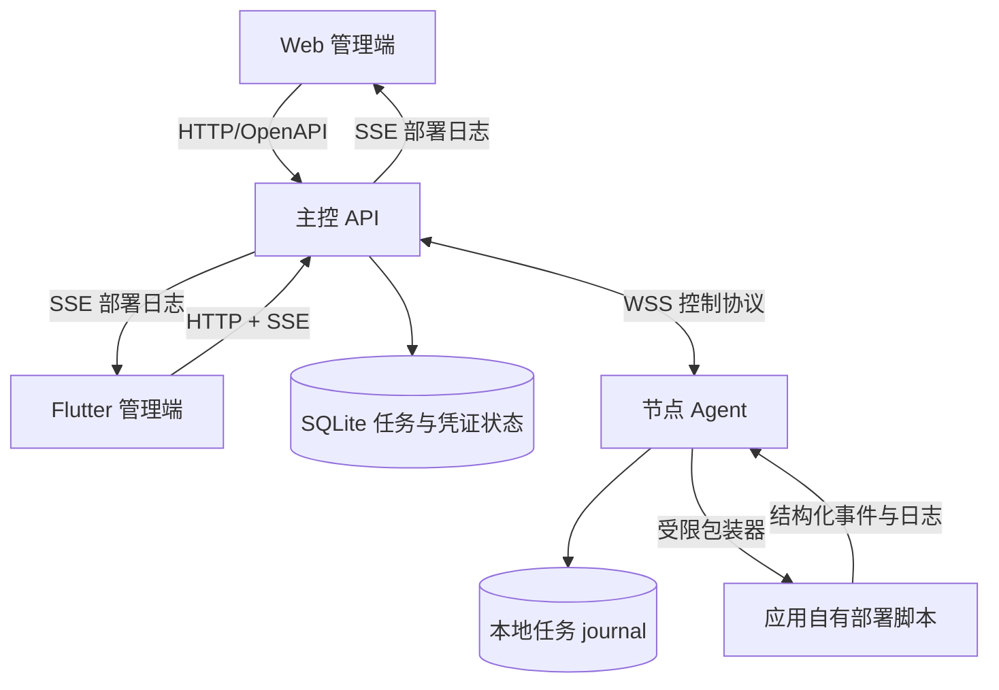
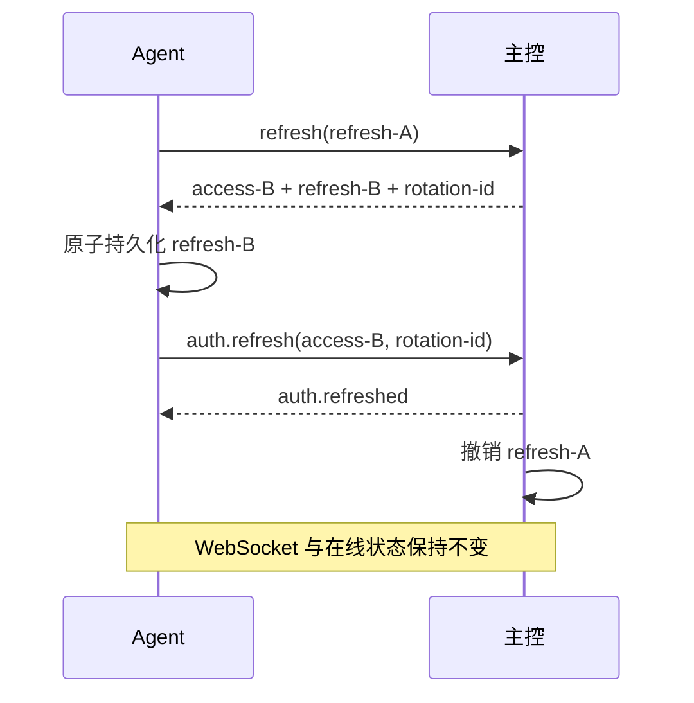
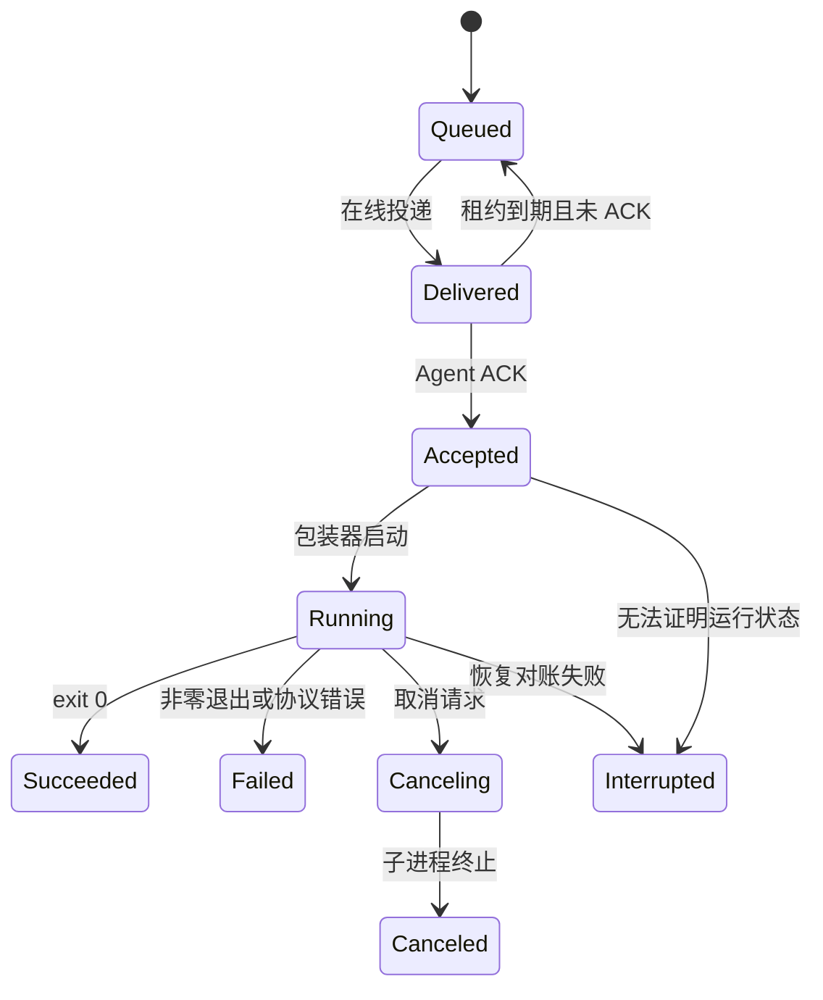
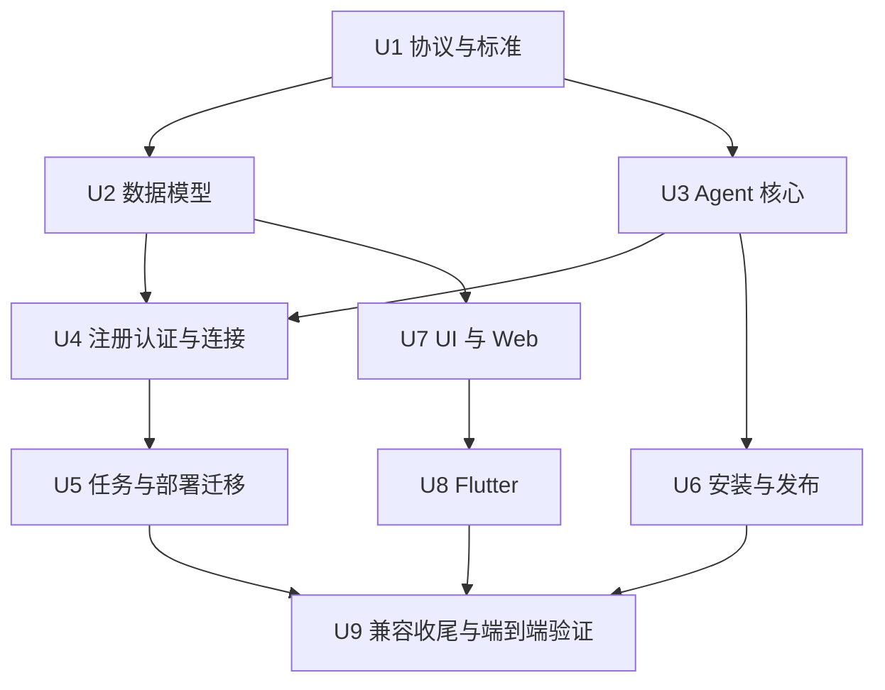

# 节点 Agent 与轻量控制通道实施计划

## Goal Capsule

新增 Rust `deploy-go-agent`，让服务器节点通过 systemd 常驻 Agent 主动连接主控，并由 Agent 执行受限部署脚本、回传日志与结果。日常部署不再要求主控持有 SSH 私钥或主动连入节点；管理员创建 Agent 后即可获得与当前主控版本兼容的一键安装脚本。

本计划覆盖 Agent 注册、独立凭证、无感续期、WebSocket 控制通道、任务幂等、systemd 安装、部署执行迁移、Web/Flutter/UI 管理界面、CI/release 和运行手册。实施及验证只使用本地进程、fixture 和隔离测试环境，不连接真实节点或执行生产部署。

---

## Product Contract

### Problem

当前主控通过 SSH 主动连接节点并发送脚本，要求平台托管 SSH 私钥、处理 host key，并让主控具备较大的远程访问能力。该模式也不利于 NAT 或防火墙后的节点主动接入。项目需要一个自研轻量执行端，但仍必须保持“只执行应用自己的规范脚本并反馈结果”的边界，不能演变成完整部署引擎或通用远程控制工具。

### Actors

- A1 管理员：创建、安装、重装、撤销和查看 Agent，管理所有节点及部署。
- A2 部署操作者：在已有应用授权范围内发起部署、查看日志、取消和重试任务。
- A3 节点 Agent：主动连接主控，认证后接收结构化任务，在本机执行受限操作并回传结果。
- A4 发布维护者：构建、校验和发布各受支持架构的 Agent 二进制及安装元数据。

### Requirements

**Agent 与节点**

- R1. 管理员创建新 Agent 时只输入唯一名称；主控在同一事务中创建一对一绑定的节点和离线 Agent。既有节点接管使用节点详情中的独立动作，只创建并绑定 Agent，不复制节点。
- R2. 节点是部署目标和历史记录归属，Agent 是连接、版本和执行身份；删除操作实现为凭证撤销与归档，不得物理级联删除节点、部署目标或部署历史。
- R3. Agent 对用户展示的连接状态只有在线和离线；从未连接、最后在线时间、凭证撤销和版本异常以辅助信息表达，不扩展主状态枚举。
- R4. 一个节点同时最多绑定一个有效 Agent，一个 Agent 只能绑定一个节点；重装或重新绑定不得产生两个并发有效身份。

**安装与生命周期**

- R5. 创建 Agent 后生成一次性安装命令，内容由主控公开基址、非敏感 Agent ID、兼容 Agent 版本和短时 enrollment token 组成；名称不作为可篡改安装参数重复传递。
- R6. enrollment token 只能注册预绑定 Agent，一次成功后立即失效，并在未使用时于 30 分钟内过期；数据库只保存不可逆摘要。
- R7. 安装器必须先读取本地身份并与命令中的 Agent ID 比对：无本地身份时消费 enrollment token 完成首次安装；身份相同且凭证有效时不再注册，只保留凭证并安全替换二进制；身份相同但凭证已撤销时仅可用新 enrollment token 重新绑定；身份不同时拒绝覆盖。
- R8. 二进制必须按 OS/架构和主控兼容版本选择并校验 SHA-256；替换失败或新服务健康检查失败时恢复旧版本。
- R9. Agent 和部署脚本统一以独立低权限 `deploy-go-agent` 系统用户运行；接入检查必须验证工作目录、脚本和 secret 引用对该用户可访问，平台不隐式授予 root 或 sudo。长期凭证只能存放在 root/服务用户可读的本地文件中，不出现在进程参数、shell history、普通日志或安装产物中。

**认证与连接**

- R10. 首次注册后 Agent 获得独立的 refresh token，并使用它换取 30 分钟有效的 access token；不同 Agent 的凭证可单独撤销。
- R11. 每次刷新同时滚动 access token 和 refresh token；新 refresh token 经 Agent 原子持久化并确认后旧 token 才失效，服务端必须识别旧 token 重用。
- R12. Agent 在 access token 到期前主动刷新，并在同一 WebSocket 上完成 `auth.refresh`，正常轮换不能造成节点短暂离线、丢日志或中断任务。
- R13. 刷新暂时失败时 Agent 在当前认证期限和有限宽限期内退避重试；只有认证最终失效、连接超时或管理员撤销后，节点才变为离线。
- R14. 管理员撤销 Agent 时，主控立即撤销其注册、access 和 refresh 凭证并关闭活动 WebSocket；后续恢复必须重新生成一次性安装命令。

**控制协议与执行边界**

- R15. 主控与 Agent 使用 `wss://` 双向控制通道；现有 API 到 Web/Flutter 的部署日志继续使用 SSE，普通管理接口继续使用 HTTP/OpenAPI。
- R16. Agent 只接受版本化结构化任务，首版覆盖能力采集、部署执行、取消、状态查询和健康诊断；协议不提供任意 shell 字符串、通用终端或需要特权的在线自升级。
- R17. 每项任务必须携带不可变任务 ID、类型、期限、幂等键和受约束 payload；Agent 必须 ACK 接收，并对重复投递返回原任务状态而不是再次执行。
- R18. 部署任务继续遵守 `docs/standards/deploy-script-contract.md`：脚本路径、参数、环境引用、超时、取消、事件格式和日志脱敏均由既有契约约束，Agent 不接管拉取、构建、守护、切流或脚本内部回滚。
- R19. Agent 断线或重启后必须根据本地 durable runner 目录与主控持久化状态恢复任务、日志偏移和退出结果；无法验证进程归属或原子完成标记时标记 interrupted，不能猜测成功或自动重复执行。
- R20. 心跳和连接代次必须防止同一 Agent 的旧连接继续发送事件；主控重启后节点先视为离线，Agent 重连成功后恢复在线。

**产品界面与交付**

- R21. Web 提供 Agent 列表、创建、安装命令、复制、连接信息、版本、最后在线时间、撤销和重新生成安装命令；节点详情展示一对一 Agent 信息和部署能力。
- R22. Flutter 提供 Agent 在线状态、版本、最后在线时间和必要的只读诊断信息；首次安装、凭证撤销及高风险维护操作保留在 Web。
- R23. UI 预览必须先覆盖 Agent 创建、安装、在线/离线、从未连接、版本异常、撤销确认和窄屏状态，再作为正式客户端实现依据。
- R24. OpenAPI 覆盖 Agent 管理、注册和刷新所需 HTTP 接口；WebSocket 消息使用独立版本化 JSON Schema，并在 CI 中校验兼容性和生成产物漂移。
- R25. GitHub Actions 构建 Linux `x86_64` 与 `aarch64` Agent，发布二进制、压缩包、SHA-256 和版本 manifest；主控只生成其兼容矩阵允许的安装命令。
- R26. 现有 SSH 凭证和节点数据必须通过新增 migration 保留；SSH 不再作为新节点或新部署的运行依赖，旧节点通过显式安装 Agent 完成接管，不进行自动远程安装。

### Key Flows

- F1 Agent 创建与安装：管理员输入名称 -> 主控创建节点与离线 Agent -> 签发一次性 enrollment token -> 展示安装命令 -> 服务器执行脚本 -> Agent 注册并换取独立凭证 -> WebSocket 连接 -> 节点显示在线。
- F2 无感凭证轮换：Agent 在到期前刷新 -> 主控滚动签发 access/refresh token -> Agent 原子保存 refresh token -> 同一 WebSocket 续期 -> 主控确认并撤销旧 refresh token -> 在线状态不变。
- F3 部署执行：操作者 preview/confirm -> 主控创建持久化任务 -> 在线 Agent ACK -> 受限脚本执行 -> 日志和事件回传 -> 主控持久化并继续通过 SSE 推送 -> 保存最终结果。
- F4 断线恢复：连接中断 -> Agent 退避重连 -> 新连接取代旧代次 -> 双方按任务 ID 对账 -> 已知结果补传、运行中任务继续跟踪、不可证明结果标记 interrupted。
- F5 安全撤销与重装：管理员撤销 Agent -> 主控终止连接并废止凭证 -> 节点保留且离线 -> 管理员生成新的 enrollment token -> 同身份安装器重新注册 -> 历史记录保持关联。
- F6 发布与安装：release workflow 构建多架构二进制 -> 生成 checksum/manifest -> 主控根据自身版本解析兼容版本 -> 管理员在节点首次运行或重新运行安装器 -> 下载并校验 -> systemd 启动与健康检查 -> 失败回滚。

### Acceptance Examples

- AE1. 创建名为 `production-01` 的 Agent 后，列表立即显示离线和“从未连接”；安装成功后同一记录变为在线且自动展示系统、架构和版本。
- AE2. 已消费的 enrollment token 不能在第二台服务器或清空本地身份后再次注册；数据库、API 响应和日志均不存在 token 明文。
- AE3. 已安装服务器重新运行相同 Agent ID 且凭证有效的安装命令时不再调用注册接口，而是保留长期凭证、替换二进制并重启服务；凭证已撤销时必须使用新 enrollment token 重新绑定；Agent ID 不同时拒绝覆盖。
- AE4. access token 在部署运行期间完成刷新，WebSocket 不断开，节点状态不闪烁为离线，部署日志序列连续且无重复。
- AE5. refresh token 响应在 Agent 持久化前连接中断时，允许受控恢复；已确认轮换后的旧 refresh token 被再次使用时，凭证族被阻断并产生审计记录。
- AE6. 同一部署任务因 ACK 丢失被重复投递时，Agent 只执行一次并返回已有状态；不同 payload 复用同一幂等键时明确拒绝。
- AE7. 主控或 Agent 在任务运行中重启后能够完成状态对账；无法确认脚本最终状态时部署进入 interrupted，不自动重跑。
- AE8. 管理员撤销在线 Agent 后，其 WebSocket 立即关闭、节点显示离线，旧 access/refresh token 均不能重新认证。
- AE9. 模拟新版本启动失败时，安装器恢复旧二进制并重新启动服务；日志不包含 token，systemd unit 不以内联明文凭证启动。
- AE10. 两种 Linux 架构的 release artifact 都有匹配 checksum 和 manifest；主控版本不兼容时不生成可执行安装命令并给出明确原因。

### Success Criteria

- 本地隔离环境可从创建 Agent 到执行模拟部署完整走通，过程中不需要 SSH 服务或 SSH 私钥。
- 认证刷新、断线重连、重复投递、取消和重启恢复均有自动化测试，且不会造成任务重复执行。
- Agent 正常刷新时节点在线状态保持稳定；撤销或心跳超时后在约定窗口内转为离线。
- CI 能校验 API、Agent、协议 schema、客户端生成代码、安装器和多架构发布产物。

### Scope Boundaries

**In scope**

- 单主控 SQLite 部署形态下的 Agent 控制面、单节点单 Agent、结构化任务和本地恢复。
- 新建 Agent 自动创建节点，以及既有节点显式绑定新 Agent 的兼容迁移。
- 本地 fixture、mock WebSocket 和隔离 systemd/容器测试，不触碰真实服务器。

**Deferred to follow-up work**

- 多主控实例的跨实例连接路由、外部消息队列和分布式任务租约。
- 风险评分、异常地域告警、硬件可信身份、mTLS 和管理员审批流。
- 批量节点操作、分批发布策略和完整自动升级编排。
- 低权限 Agent 的在线自升级及特权升级 helper；首版升级或修复由管理员在节点重新运行幂等安装器。

**Outside this product's identity**

- 任意远程 shell、交互终端、文件管理器或通用主机运维平台。
- 平台内置代码拉取、构建系统、服务守护、流量切换和应用回滚实现。

### Key Product Decisions

- 一对一资源模型（session-settled: user-approved — chosen over 合并节点与 Agent 为单一对象：节点需要继续承载部署目标和历史，Agent 只承担连接与执行身份）。Governs R1-R4、R21-R22、R26。
- 无 SSH 自助接入（session-settled: user-directed — chosen over 主控 SSH 安装或 SSH fallback：目标节点通过一次性脚本主动安装和注册）。Governs R5-R9、R26。
- 在线状态保持简单（session-settled: user-directed — chosen over 增加待接入等生命周期状态：用户只需要在线和离线，其他事实作为辅助信息）。Governs R3、R21-R23。
- 无感双 token（session-settled: user-approved — chosen over 每天凌晨 3 点串行轮换单一长期 token：短期 access token 与滚动 refresh token能在同一连接内持续续期）。Governs R10-R14。
- WebSocket 控制通道（session-settled: user-approved — chosen over SSE 加额外 HTTP 上行：命令、ACK、心跳、日志和结果需要双向协议）。Governs R15-R20。

---

## Planning Contract

### Key Technical Decisions

- KTD1. **Agent 作为 workspace crate**：在根 Cargo workspace 新增 `agent/`，共享 Rust 版本、协议类型和质量门禁，但 Agent 不依赖 API 数据库或服务端模块。
- KTD2. **协议类型独立共享**：新增轻量 `agent-protocol/` crate，定义有版本字段的控制消息、任务 payload、错误码和 JSON Schema；API 与 Agent 共同依赖，Web/Flutter 不直接消费控制协议。
- KTD3. **不使用 JWT**：access/refresh/enrollment 均采用高熵 opaque token，数据库只保存带用途域分离的摘要；当前 SQLite 单主控形态下，握手与每 30 分钟续期的数据库校验成本可控，且撤销语义直接。
- KTD4. **滚动 refresh token family**：每次刷新生成新代次，旧代次仅在“响应已签发但 Agent 尚未确认”的短窗口内受控重放同一结果；确认后旧 token 重用将撤销整个凭证族并断开连接。（session-settled: user-approved — chosen over 固定时间轮换单 token：无感续期同时缩短泄露窗口）
- KTD5. **同连接认证续期**：WebSocket 握手使用 access token，连接在到期前接受 `auth.refresh`；服务端连接注册表以 Agent ID 与连接代次仲裁，新连接或撤销会使旧连接失效，但普通 token 轮换不改变在线状态。
- KTD6. **数据库为任务事实源**：任务创建、租约、ACK、事件序列和最终结果由主控持久化；内存连接只负责投递。Agent 使用本地受限 journal 记录已接收任务和子进程状态，双方依靠任务 ID 对账。
- KTD7. **结构化 allowlist**：协议以任务类型匹配固定 payload，部署 payload 只携带既有快照中允许的脚本路径、参数 token、环境文件引用、超时和包装器版本；任何未知类型、额外高风险字段或裸 shell 命令均拒绝。
- KTD8. **兼容迁移而非修改历史 migration**：新增 migration 建立 Agent、token、连接和任务表，并重建/扩展节点约束以允许 Agent 节点不填写 SSH 字段；旧 SSH 记录保留但不再参与新部署，后续清理另行计划。
- KTD9. **安装基址显式配置**：安装脚本中的主控 URL 来自可信的公开基址配置，不根据未经验证的 `Host` header 推导；release manifest 明确主控版本、协议版本与 Agent semver 兼容范围。
- KTD10. **首版不做在线自升级**：低权限 Agent 不接收替换自身二进制的任务；管理员重新运行同一 Agent ID 的幂等安装器完成升级或修复，安装器只能选择主控兼容 manifest 中带 checksum 的版本。
- KTD11. **静态 Linux 发布物**：Agent 优先发布 musl 静态链接的 `x86_64-unknown-linux-musl` 与 `aarch64-unknown-linux-musl` 二进制，避免把 CI runner 的 glibc 版本变成节点前置条件；不支持的平台由安装器明确拒绝。
- KTD12. **固定低权限执行身份**：Agent 和应用脚本均以 `deploy-go-agent` 用户运行，不接受主控下发用户名且不内置提权；应用需要的目录权限或窄化 sudo 规则由节点管理员在系统侧显式配置，并由接入检查提前暴露缺失权限。
- KTD13. **持久化 runner 文件协议**：每个活动任务在受保护目录持久化 payload digest、进程身份、stdout/stderr、读取偏移、精确退出码和原子完成标记；Agent 重启后先验证进程 start-time 等身份信息再继续 tail，无法验证时进入 interrupted。

### High-Level Technical Design

以下图示只表达实现方向和边界，不规定具体类型或函数签名。

### Existing Patterns

- API 路由、统一错误、审计和 OpenAPI 注册：`api/src/lib.rs`、`api/src/error.rs`、`api/src/audit/mod.rs`。
- 节点和部署目标模型：`api/src/nodes/mod.rs`、`api/src/deployment_targets/mod.rs`、`api/migrations/0001_initial_schema.sql`。
- 当前部署状态、日志持久化和恢复：`api/src/deployments/runtime.rs`、`api/src/deployments/mod.rs`、`api/tests/deployment_recovery.rs`。
- 需要被 Agent 复用语义而非复制 SSH 的包装器：`api/src/executor/deployment.rs`、`api/src/execution_spec.rs`。
- 脚本与事件权威契约：`docs/standards/deploy-script-contract.md`、`docs/standards/deploy-event.schema.json`。
- 客户端契约生成和页面结构：`api/openapi/openapi.json`、`admin/src/api/`、`admin-app/lib/api/`、`ui/docs/page-map.md`。
- 构建与发布：`Makefile`、`.github/workflows/ci.yml`、`.github/workflows/release-artifacts.yml`、`docs/runbooks/github-actions-release.md`。

### System-Wide Impact

- **数据生命周期**：节点从 SSH 连接配置转为部署资源；Agent token、连接代次和任务租约成为新的持久化安全状态。
- **认证边界**：用户 Cookie 会话与 Agent token 完全隔离；Agent endpoint 不接受用户 Cookie，管理 endpoint 不接受 Agent token。
- **部署恢复**：API 重启不能再笼统把全部 running 部署立即标记 interrupted，应先等待 Agent 重连和有限对账窗口；超时后才进入 interrupted。
- **日志顺序**：Agent 事件携带任务内单调序号，API 去重持久化后继续生成现有 SSE 游标，客户端无需理解 WebSocket。
- **节点权限**：旧节点接管 Agent 前必须调整工作目录、脚本和 secret 引用对 `deploy-go-agent` 用户的权限；原 SSH username 不再决定执行身份。
- **配置与发布**：API 增加可信公开基址、token TTL、心跳和兼容 manifest 配置；release 新增 Agent 多架构产物。

### Sequencing

每个单元形成可独立解释、验证和回滚的小闭环。migration 只能新增，U2 完成后不得回写历史 migration；协议字段在 U1 固化后只能兼容扩展或提升协议版本。

### Risks And Mitigations

- **Token 轮换中断导致失联**：采用签发、持久化、同连接确认、旧 token 撤销的两阶段流程；对同一 rotation ID 返回同一结果，避免网络重试生成分叉凭证。
- **重复任务造成重复部署**：主控租约与 Agent 本地 journal 双重幂等；同任务 ID 与 payload digest 必须一致，恢复时先查询状态而非重发执行。
- **旧连接伪造事件**：连接代次绑定 access token 和任务租约，服务端只接受当前代次事件；新连接接管时主动关闭旧连接。
- **安装器破坏在线节点**：校验身份、架构、checksum 和兼容版本，原子替换并保留上一版本；健康失败自动恢复。
- **Agent 权限过大**：专用低权限用户、固定工作根目录、路径规范化、任务 allowlist、超时和进程组取消；需要额外系统权限的能力不进入首版。
- **Agent 重启丢失管道**：runner 先写受保护的 stdout/stderr 与退出状态文件，Agent 只负责按持久化偏移转发；恢复时校验进程身份，禁止仅凭可能复用的 PID 认领进程。
- **SQLite 与单实例限制**：首版明确单主控；连接注册表与数据库一致性围绕单进程设计，多实例路由不做伪支持。
- **SSH 退出造成历史兼容问题**：保留旧表和历史引用，API/UI 明确标记 legacy；新部署只允许已绑定在线 Agent 的节点，禁止静默 fallback 到 SSH。

---

## Implementation Units

### U1. Agent 协议与安全标准

- **Goal**：先固定 Agent 的信任边界、消息语义和脚本执行约束，为服务端与 Agent 提供同一协议来源。
- **Requirements**：R10-R20、R24。
- **Files**：新增 `agent-protocol/Cargo.toml`、`agent-protocol/src/lib.rs`、`agent-protocol/schema/agent-control.schema.json`、`agent-protocol/tests/schema_compatibility.rs`；修改 `Cargo.toml`、`docs/standards/deploy-script-contract.md`、`docs/standards/api-contract.md`、`docs/standards/deploy-event.schema.json`；新增 `docs/standards/agent-control-protocol.md`、`docs/standards/agent-credential-security.md`。
- **Approach**：定义版本协商、认证续期、心跳、任务 ACK、事件、结果、取消和诊断消息；任务 payload 使用严格枚举和拒绝未知字段。明确 token 摘要、重放处理、日志脱敏、路径边界和错误码，不把 HTTP/SSE 契约或在线自升级混入控制协议。
- **Test Scenarios**：双方对当前协议样例反序列化一致；未知消息类型、版本不兼容、裸 shell 字段和额外高风险字段被拒绝；部署事件继续满足现有 schema；兼容扩展不破坏上一受支持协议版本。
- **Verification**：协议 crate 的格式、clippy、单元测试和 JSON Schema 校验通过，标准文档之间不存在 SSH/Agent 执行边界冲突。
- **Dependencies**：无。

### U2. Agent、节点与凭证持久化模型

- **Goal**：通过新增 migration 建立一对一 Agent、token family、任务租约和连接审计模型，同时完整保留旧节点及部署历史。
- **Requirements**：R1-R6、R10-R14、R17、R19-R20、R26。
- **Files**：新增 `api/migrations/<next_version>_node_agents.sql`；修改 `api/src/db/mod.rs`、`api/src/nodes/mod.rs`、`docs/runbooks/api-migrations.md`；新增 `api/src/agents/store.rs`；新增或修改 `api/tests/migrations.rs`、`api/tests/database_constraints.rs`、`api/tests/nodes_api.rs`、`api/tests/agents_store.rs`。
- **Approach**：新增 agents、enrollment tokens、credential families/rotations、agent tasks 和必要事件表。nodes 使用同一 migration 事务内的标准重建流程：启用 `defer_foreign_keys`、创建新表、完整复制旧 ID 与数据、替换表、重建索引，并在提交前执行外键检查；禁止填入虚假 host 或凭证绕过旧约束。若所用 SQLx/SQLite 组合不能在 migration 事务中可靠完成该流程，U2 必须先停止实施并以新 migration runner 方案更新计划，不能静默改用非事务脚本。Agent/节点名称同步、创建、撤销和重新绑定必须事务化并受唯一约束保护。
- **Test Scenarios**：空库迁移成功；磁盘数据库从 0001+0002 且带节点、检查、目标、部署和 SSH 凭证关联数据升级后引用不变；迁移中途故障完整回滚；同名 Agent、双 Agent 绑定同节点和单 Agent 绑定双节点均失败；删除 Agent 不删除节点/历史；token 明文不会写入任何表；并发创建只成功一次。
- **Verification**：migration 从空库和现有磁盘 fixture 均可验证，`PRAGMA foreign_key_check` 无错误且备份/恢复步骤写入 runbook；数据库约束测试覆盖一对一关系、token 代次和任务幂等唯一键。
- **Dependencies**：U1。

### U3. Rust Agent 运行时与本地受限执行器

- **Goal**：交付可独立运行的轻量 Agent，能够安全保存身份、连接主控、维护心跳并执行受限任务。
- **Requirements**：R7-R9、R15-R20。
- **Files**：新增 `agent/Cargo.toml`、`agent/src/main.rs`、`agent/src/config.rs`、`agent/src/credential_store.rs`、`agent/src/connection.rs`、`agent/src/journal.rs`、`agent/src/executor.rs`、`agent/src/system_info.rs`；新增 `agent/tests/credential_store.rs`、`agent/tests/connection.rs`、`agent/tests/executor.rs`、`agent/tests/recovery.rs`；修改 `Cargo.toml`。
- **Approach**：Agent 只读取显式配置和受保护凭证文件，使用退避加随机抖动维持单条 WSS 连接。将现有部署包装器的行为迁移为以 `deploy-go-agent` 用户运行的本地 durable runner：严格验证规范化路径、目录权限、参数、环境引用、超时和进程组取消；在受保护任务目录写入 PID/start-time、stdout/stderr、转发偏移、精确退出码和原子完成标记。journal 不保存 secret 或完整敏感 payload。
- **Test Scenarios**：凭证文件权限不安全时拒绝启动；工作目录、脚本或 secret 引用不可访问时检查失败；断线按退避重连且无忙循环；重复任务只执行一次；同 ID 不同 digest 被拒；路径逃逸、未知任务和超限输出被拒；取消先 TERM 后按契约升级；分别在 runner 启动前、运行中和完成标记写盘后模拟 Agent 崩溃，恢复后日志不重复且结果符合可证明状态；PID 身份不匹配时 interrupted。
- **Verification**：Agent crate 格式、clippy、单元及集成测试通过；测试日志和 journal 扫描无 token、secret 或未脱敏环境值。
- **Dependencies**：U1。

### U4. 注册认证与 WebSocket 控制面

- **Goal**：在 API 中完成一次性注册、滚动双 token、同连接续期、心跳和连接代次管理。
- **Requirements**：R5-R6、R10-R15、R20、R24。
- **Files**：新增 `api/src/agents/mod.rs`、`api/src/agents/auth.rs`、`api/src/agents/ws.rs`、`api/src/agents/registry.rs`；修改 `api/Cargo.toml`、`api/src/lib.rs`、`api/src/config.rs`、`api/openapi/openapi.json`；新增 `api/tests/agent_enrollment.rs`、`api/tests/agent_auth.rs`、`api/tests/agent_websocket.rs`、`api/tests/openapi_contract.rs`。
- **Approach**：管理接口创建 Agent 和 enrollment token；Agent 专用 endpoint 以用途隔离的 opaque token 完成注册与刷新。WebSocket 握手后绑定 Agent/credential family/connection generation，在同一连接接收认证刷新。轮换记录必须支持响应丢失后的同 rotation ID 恢复，并在确认后检测旧 refresh token 重用。心跳超时、撤销和新连接接管统一通过 registry 更新节点在线状态。
- **Test Scenarios**：过期、已使用、错误 Agent 和并发使用 enrollment token 均失败；正常刷新不改变在线状态；刷新响应丢失可恢复同一 token 对；确认后旧 refresh token 重用触发凭证族撤销；管理员撤销立即关闭连接；旧连接不能继续提交事件；API 重启后离线、Agent 重连后在线。
- **Verification**：聚焦 API 测试、OpenAPI 生成/漂移检查和 mock WebSocket 时序测试通过；时间相关测试使用可控 clock，不依赖真实等待 30 分钟。
- **Dependencies**：U2、U3。

### U5. Agent 任务调度与部署运行时迁移

- **Goal**：让节点检查、部署执行、日志、取消和恢复全部经过 Agent，而不再调用 SSH executor。
- **Requirements**：R15-R20、R26。
- **Files**：新增 `api/src/agents/dispatcher.rs`、`api/src/executor/agent.rs`；修改 `api/src/deployments/runtime.rs`、`api/src/deployments/mod.rs`、`api/src/nodes/mod.rs`、`api/src/executor/mod.rs`、`api/src/lib.rs`；修改 `api/tests/deployment_executor.rs`、`api/tests/deployment_runtime.rs`、`api/tests/deployment_recovery.rs`、`api/tests/deployments_api.rs`、`api/tests/nodes_api.rs`；新增 `api/tests/agent_dispatcher.rs`。
- **Approach**：部署 worker 将既有 snapshot 转为版本化 Agent 任务并持久化后投递，Agent 事件按任务序号去重写入当前部署日志/事件表。取消使用结构化任务并保持幂等。API 重启为运行中任务保留有限恢复窗口，收到 Agent 对账后继续或终结，超时才 interrupted。新部署前置条件改为节点绑定有效且在线 Agent；不提供 SSH 自动 fallback。
- **Test Scenarios**：在线 Agent 部署成功、非零退出、超时和取消映射到既有状态；离线 Agent 的 confirm/调度行为明确且不丢任务；ACK 丢失和事件重复不会重复执行或重复日志；连接代次切换时旧事件被拒；API/Agent 分别重启后完成对账；SSE 游标与客户端日志语义保持兼容。
- **Verification**：部署 runtime、recovery、executor 和端到端 API 测试在 mock Agent 下通过；测试环境无需 `ssh`/`ssh-keyscan` 可执行文件。
- **Dependencies**：U4。

### U6. 幂等安装器、systemd 与多架构发布

- **Goal**：生成可审计的一键安装脚本，并让 CI/release 产出主控可解析的兼容 Agent artifact。
- **Requirements**：R5、R7-R9、R16、R25。
- **Files**：新增 `agent/install/install.sh`、`agent/install/deploy-go-agent.service`、`agent/release/manifest.schema.json`、`agent/tests/install.bats`；修改 `api/src/agents/mod.rs`、`api/src/config.rs`、`api/openapi/openapi.json`、`Makefile`、`.github/workflows/ci.yml`、`.github/workflows/release-artifacts.yml`、`.github/scripts/generate-release-notes.sh`；修改 `docs/runbooks/github-actions-release.md`。
- **Approach**：API 从显式公开基址和兼容 manifest 生成含 Agent ID 的短时安装命令。安装器先比对本地身份，无身份时才消费 enrollment token；同身份进入升级/修复，不同身份拒绝。安装器校验平台、checksum、配置身份与服务健康，使用临时文件加 rename 原子替换并保留上一版本。systemd 使用专用用户、固定目录、收紧权限和 journald，凭证不进入 unit 环境或命令行。release 构建 Linux x86_64/aarch64 musl 静态产物并发布 manifest/checksum。
- **Test Scenarios**：首次安装、同 Agent ID 且凭证有效时重跑不再次注册、凭证撤销后用新 token 重新绑定、已消费 token 在第二台服务器注册失败、升级成功、checksum 错误、不同 Agent ID 拒绝、服务启动失败回滚和不支持架构均有 fixture；安装输出、systemd unit、进程参数和 release artifact 不含长期 access/refresh token，enrollment token 不进入安装日志；manifest 不兼容时 API 拒绝生成命令。
- **Verification**：shell 静态检查、隔离容器中的安装测试、Agent release 构建和 manifest schema 校验通过；dry-run release 能下载并核对两种架构 artifact。
- **Dependencies**：U3、U4。

### U7. UI 预览与 Web Agent 管理闭环

- **Goal**：先完善设计源，再在 Web 中实现 Agent 创建、安装和维护的完整管理员体验。
- **Requirements**：R1-R5、R14、R21、R23-R24、R26。
- **Files**：修改 `ui/assets/app.js`、`ui/assets/mock-data.js`、`ui/assets/styles.css`、`ui/docs/page-map.md`、`ui/docs/component-inventory.md`、`ui/docs/web-handoff.md`、`ui/tests/ui-preview.spec.js`；新增 `admin/src/features/agents/AgentsPage.tsx`、`admin/src/features/agents/AgentDetailPage.tsx`、`admin/src/features/agents/api.ts`；修改 `admin/src/features/nodes/NodesPage.tsx`、`admin/src/features/nodes/NodeDetailPage.tsx`、`admin/src/routes/AppRoutes.tsx`、`admin/src/routes/routeMetadata.tsx`、`admin/src/test/server.ts`；新增 `admin/src/test/AgentManagement.test.tsx`、`admin/e2e/agent-onboarding.spec.ts`；更新生成 API client。
- **Approach**：沿用 GitHub 风格黑白灰 Web 设计和设置二级菜单。Agent 列表主状态仅在线/离线，辅助展示从未连接、最后在线、版本与异常。创建成功后显示一次性安装命令及过期时间；重新生成会使旧 token 失效。撤销和重新生成安装命令使用明确确认，不在客户端保存 token 或把完整命令写入遥测。
- **Test Scenarios**：创建后立即显示离线；安装模拟连接后变在线；复制命令成功和 fallback 可用；过期/重生成 token 有明确反馈；普通用户无管理入口且深链 403；撤销在线 Agent 需要确认并更新节点；窄屏文本不溢出、无装饰红框。
- **Verification**：UI 语法/E2E、Web 单元/组件/E2E、类型检查和敏感信息扫描通过；8050 预览与正式 Web 状态和文案一致。
- **Dependencies**：U2、U4。

### U8. Flutter Agent 状态与移动端恢复

- **Goal**：在移动端资源视图中提供必要的 Agent 状态和诊断信息，不复制高风险安装管理能力。
- **Requirements**：R3、R21-R24。
- **Files**：修改 `ui/docs/flutter-handoff.md`、`admin-app/lib/features/resources/resources_pages.dart`、`admin-app/lib/features/resources/resource_providers.dart`、`admin-app/lib/api/contracts.dart`、`admin-app/lib/api/mobile_data_gateway.dart`；新增或修改 `admin-app/test/features/resources/agent_status_test.dart`、`admin-app/integration_test/mobile_navigation_smoke_test.dart`；更新生成 API client。
- **Approach**：节点详情展示 Agent 在线/离线、版本、系统、最后在线和只读错误摘要；管理员可跳转到说明页但不在 App 暴露安装命令、token、撤销或升级。App 前后台切换后重新拉取状态，不维持 Agent WebSocket，也不把“从未连接”塑造成第三种主状态。
- **Test Scenarios**：在线、从未连接的离线、曾在线的离线和版本异常均正确展示；普通用户只看到其授权资源；系统字体放大和窄屏不溢出；后台恢复后刷新状态；任何 widget、日志和 fixture 不包含安装 token。
- **Verification**：Flutter format、analyze、widget test 和现有移动导航 smoke 通过。
- **Dependencies**：U7。

### U9. SSH 兼容退出、运行手册与端到端验收

- **Goal**：清除新运行链对 SSH 的依赖，补齐本地运维与恢复文档，并验证从创建到部署的完整 Agent 闭环。
- **Requirements**：R18-R26。
- **Files**：修改 `api/src/executor/mod.rs` 并移除 `api/src/executor/ssh.rs`、`api/src/executor/deployment.rs` 的运行时引用；修改 `api/src/ssh_credentials/mod.rs` 将旧凭证接口收敛为 legacy 查询与删除；修改 `admin/src/features/credentials/`、`admin/src/test/SshNodeOnboarding.test.tsx`、`admin/e2e/ssh-node-onboarding.spec.ts`；修改 `docs/standards/ssh-credential-security.md`、`docs/runbooks/ssh-node-onboarding.md`、`docs/runbooks/deployment-recovery.md`、`docs/runbooks/local-development.md`、`docs/runbooks/README.md`、`README.md`、`Makefile`；新增 `docs/runbooks/agent-onboarding.md`、`docs/runbooks/agent-recovery.md`、`api/tests/agent_end_to_end.rs`。
- **Approach**：新节点和部署路径移除 SSH 凭证、host key 扫描及 SSH executor 入口；旧数据保留为 legacy 只读/可清理记录，不自动连接。现有节点提供显式生成 Agent 安装脚本的接管动作，并在切换前验证 `deploy-go-agent` 用户对工作目录、脚本和 secret 引用的权限。runbook 覆盖安装、权限准备、日志、离线排查、撤销、重装、版本回滚、凭证恢复和恢复窗口；所有真实节点操作继续要求当前对话明确授权。
- **Test Scenarios**：没有 OpenSSH 客户端的环境仍可完成 Agent E2E；旧数据库升级后历史可查但新部署要求 Agent；旧节点在权限未准备时接管检查失败且不切换执行链，准备完成后 deployment target ID 和历史不变；凭证撤销、网络中断、API/Agent 重启、重复投递、升级回滚和 SSE 日志续传组成完整 smoke；所有文档命令可在本地 fixture 重放。
- **Verification**：聚焦 E2E、全仓 `make check`、`git diff --check` 和 release dry-run 通过；源码和正式客户端不再把 SSH 描述为日常部署前置条件。
- **Dependencies**：U5、U6、U8。

---

## Verification Contract

| Scope | Command or check | Proves |
| --- | --- | --- |
| Rust workspace | `cargo fmt --all --check` | API、协议和 Agent 格式一致 |
| Rust workspace | `cargo clippy --workspace --all-targets -- -D warnings` | 服务端与 Agent 无 clippy 警告 |
| Rust workspace | `cargo test --workspace` | 协议、migration、认证、连接、执行和恢复行为 |
| API contract | `make api-openapi-check` | OpenAPI artifact 与 Agent 管理 HTTP 接口一致 |
| Generated clients | `make api-client-check` | Web/Flutter 生成 client 无漂移 |
| UI preview | `make ui-check && make ui-test` | Agent 设计源、交互和响应式状态完整 |
| Web | `make admin-check && make admin-test-e2e` | Agent 管理闭环、权限和正式页面回归 |
| Flutter | `make admin-app-check` | Agent 只读状态和移动端恢复行为 |
| Installer | Agent 安装器隔离测试与 shell 静态检查 | 首装、重跑、升级、冲突和回滚安全 |
| Release | `workflow_dispatch` dry-run | 多架构 Agent、checksum 和 manifest 可生成并核验 |
| Repository | `make check` | 全仓聚合质量门禁 |
| Sensitive data | 客户端、测试产物、安装日志和 Agent journal 扫描 | token、secret 和凭证不泄漏 |

时间相关测试必须使用可控 clock；网络测试使用本地 mock WSS/HTTP 服务；systemd 行为使用隔离容器或等价 fixture。不得把连接真实节点、真实远程脚本或生产 migration 作为本计划验证步骤。

---

## Definition of Done

- R1-R26 均由至少一个实施单元和自动化场景覆盖，F1-F6 可在本地隔离环境复现。
- 创建 Agent 后能获得一次性安装命令，模拟节点安装后无需 SSH 即可上线并完成受限部署。
- access/refresh token 滚动续期不会改变在线状态，确认后的旧 refresh token 无法再次使用。
- 重连、重复投递、取消、API 重启和 Agent 重启不会造成脚本重复执行；不确定结果进入 interrupted。
- Agent、节点和历史部署的一对一关联经 migration 与 API 约束验证，删除/撤销 Agent 不损坏历史。
- Web 完成管理员 Agent 管理闭环，Flutter 完成必要只读状态，UI 预览与正式客户端保持一致。
- Linux x86_64/aarch64 Agent release artifact、checksum、manifest 和安装器通过 CI dry-run 验证。
- 标准、runbook、README、OpenAPI 和实际实现一致，SSH 不再是新节点或新部署的前置条件。
- 全仓质量门禁、敏感信息扫描和 `git diff --check` 通过；没有遗留失败方案、调试代码或无归属兼容分支。
