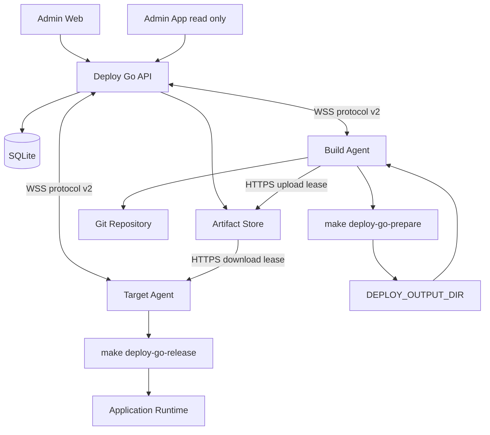
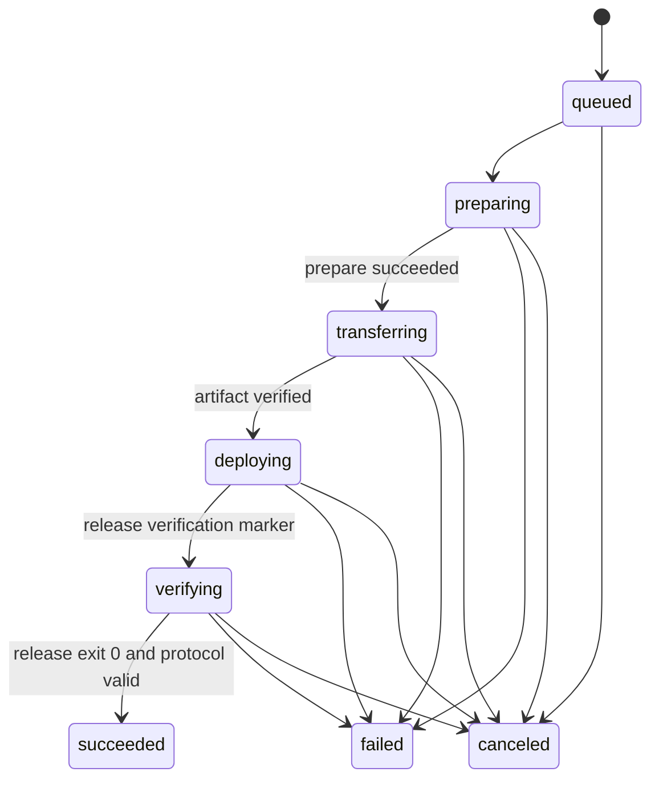
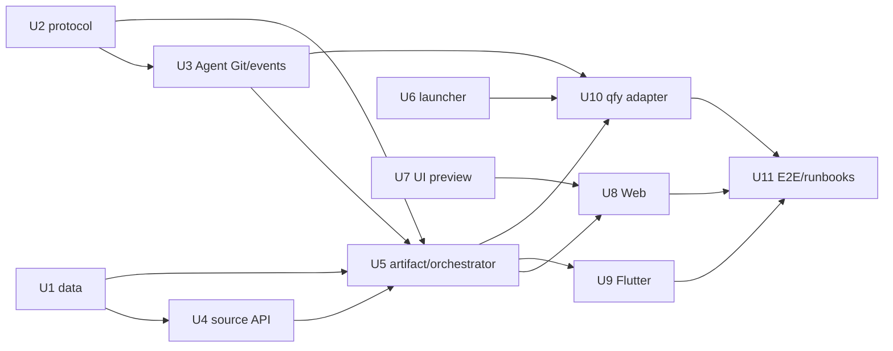

# Git 分支与两阶段部署实施计划

## Goal Capsule

- **目标：** 让管理员为应用绑定 Git 仓库、Git 凭证、构建 Agent 和固定分支，并让一次部署按 `prepare -> transfer -> release` 两阶段在 Agent 上可恢复执行。
- **核心边界：** Deploy Go 管理版本、任务、发布物、日志和状态；业务应用继续管理自己的编译、migration、seed、切换、重启、验证和回滚逻辑。
- **权威契约：** `docs/standards/git-branch-deployment-contract.md`、`docs/standards/application-deployment-contract.md`、`docs/standards/deploy-script-contract.md` 及其 JSON Schema。
- **执行资料：** `examples/branch-deployment/` 是业务脚本和平台测试的共同 fixture，不是生产脚本。
- **实施约束：** 直接在 `main` 按小闭环提交推送；只新增 migration；不修改已提交 migration；GitHub Actions 自动构建保持暂停，验证在本地执行。
- **停止条件：** 未获得当前对话针对具体节点的明确授权时，不连接真实 Agent，不执行真实部署、migration、重启、切流或清理。
- **后续责任：** 本计划交付固定分支模式；Tag 模式在分支链路稳定后复用来源发现、快照和 checkout 能力单独实施。

---

## Product Contract

### Summary

应用设置增加 Git 来源。管理员输入仓库地址、选择或生成 Git 凭证、选择在线构建 Agent，并从 Agent 返回的远程分支列表中固定一个部署分支。部署预览解析并展示该分支的确定 commit。确认后，Build Agent 检出该 commit 并运行 `make deploy-go-prepare`；平台校验并交接发布物；Target Agent 再运行 `make deploy-go-release`，同时把业务脚本的 `DEPLOY_GO_EVENT` 标记标准化为部署进度。

### Problem Frame

当前部署目标只保存目标节点、脚本路径和参数 Schema，一次部署只对应一个 `deployment_execute` Agent 任务。该模型无法表达 Git 来源、构建节点、确定 commit、构建发布物、跨节点交接和目标发布两个阶段。`agent_tasks.deployment_id` 还是唯一值，数据库也不允许一个部署拥有多个阶段任务。

`qfy-voucher-hub` 当前将 Git 更新、构建、上传、服务器发布和外层事件混在同一入口。直接让 Deploy Go 调用现有入口会重复 Git 决策、重新引入 SSH，并使平台无法区分准备成功与线上发布成功。

### Actors

- A1. **管理员：** 管理 Git 凭证、应用 Git 来源、构建 Agent、固定分支、目标节点和受控发布配置。
- A2. **普通用户：** 查看应用固定来源，在已有应用授权内预览、确认、取消和重试部署，不能切换分支或输入任意 Git 参数。
- A3. **Build Agent：** 查询远程 refs、检出固化 commit、执行准备 target、校验并上传发布物。
- A4. **Target Agent：** 下载并校验发布物、执行发布 target、转发日志和结构化进度。
- A5. **主控 API：** 保存事实状态、签发短期 secret/artifact lease、串联阶段、裁决结果并向客户端提供 HTTP/SSE。

### Requirements

**Git 来源与权限**

- R1. 只有管理员可以为应用配置 `repository_url`、Git 凭证、Build Agent、`source_policy=branch` 和固定 `deployment_branch`。
- R2. 首版支持无凭证公开仓库和 SSH deploy key 私有仓库；Git 凭证与历史服务器 SSH 凭证分域管理，不能复用同一记录或权限语义。
- R3. 管理员可以生成命名 Git SSH 凭证并查看公钥，以便把只读 deploy key 配置到 Git 托管平台；私钥永不返回客户端。
- R4. 分支列表必须由选定的在线 Build Agent 通过受限 `git ls-remote --heads` 取得。主控不在 API 进程直接运行 Git，也不根据 URL 猜测分支。
- R5. 修改 Git URL、凭证或 Build Agent 后，旧 refs 结果和分支验证立即失效；管理员必须刷新并重新选择分支。
- R6. 普通用户只能看到应用已经固定的分支，不能在部署时输入或选择任意分支、Tag、commit、Git URL 或额外 Git 参数。

**预览与不可变版本**

- R7. 部署预览必须使用有期限的 Agent refs 结果精确解析固定分支，展示短分支名、完整 ref、完整 commit SHA、模块、环境、发布版本、构建节点和目标节点。
- R8. 部署确认快照必须保存 `source_policy`、`requested_ref`、`resolved_commit_sha`、Git 来源版本和两个 Agent；确认后分支移动、删除或 force-push不能静默改变任务。
- R9. 重试必须复用原 commit SHA、参数、模块和目标快照。部署分支的新提交必须通过新的预览和部署记录进入系统。

**准备、发布物与发布**

- R10. 一次部署包含一个 prepare task 和一个 release task。两个任务共享 `deploy_id`，分别拥有稳定 `task_id`、`stage`、幂等键、日志和终态。
- R11. Build Agent 在任务独占工作区检出固化 commit 为 detached HEAD，确认工作区符合干净策略后，才执行固定 target `make --no-print-directory deploy-go-prepare`。
- R12. 业务准备 target 只能写 `DEPLOY_OUTPUT_DIR` 并生成 `deploy-go-artifact.json`，不得执行 `git pull`、SSH 上传、Agent CLI 或线上变更。
- R13. Agent 必须根据 manifest 重新计算大小和 SHA-256，拒绝路径逃逸、符号链接逃逸、重复模块、缺失文件、未声明文件和超出限额的发布物。
- R14. 跨节点发布物通过主控 artifact HTTP 服务和单次短期 lease 上传/下载，不通过 WebSocket 承载二进制；同一 Agent 仍走相同校验模型，可优化为任务独占 staging。
- R15. 只有 prepare、manifest 校验和 artifact 交接都成功后，主控才能创建 release task。
- R16. Target Agent 在任务独占目录完整下载并校验发布物后执行 `make --no-print-directory deploy-go-release`；业务发布 target 不得重新拉代码、重新构建或下载其他发布物。
- R17. 发布脚本继续拥有 migration、seed、release 目录、`current` 切换、容器或 systemd 重启、健康检查和显式回滚逻辑。Deploy Go 不接管这些应用语义。

**事件、状态与恢复**

- R18. Agent 只精确识别 stdout 行首 `DEPLOY_GO_EVENT `。后续单行 JSON 遵守 marker Schema；其余 stdout/stderr 原样作为普通日志保存。
- R19. 业务 marker 只提供事件名和模块/步骤字段。Agent 补充 `deploy_id`、`task_id`、`stage`、`timestamp`、`status`、`duration_ms`、环境、版本和目标，并生成 `deploy.started/finished`。
- R20. Agent 必须检测 marker 的 JSON 错误、未知事件、保留字段伪造、重复、越级、未结束步骤和失败/退出码冲突。诊断不能导致日志流崩溃，也不能把失败改判成功。
- R21. 部署保持外层状态 `queued/running/canceling/succeeded/failed/canceled/interrupted`，阶段细化为 `queued/preparing/transferring/deploying/verifying` 及同名终态。
- R22. 取消作用于当前活动 task，并阻止后续阶段创建。API 或 Agent 重启后必须按数据库 task、Agent journal、artifact 状态和事件偏移对账，不能重复构建或发布。
- R23. prepare 失败不能创建 release；release 失败不能反向改写 prepare 终态；任何失败、非零退出或协议冲突都不能形成成功部署。

**安全、限额与数据**

- R24. Git 私钥使用现有主密钥体系加密保存。Agent task payload、SQLite task JSON、Agent journal、命令行、审计和日志都不能包含私钥。
- R25. Agent 通过绑定 task 的短期一次性 secret lease 在内存或 `0600` 临时文件中使用 Git 私钥；任务结束或恢复清理时必须删除，lease 不能被其他 Agent 或 task 使用。
- R26. artifact 存储位于主控受控数据根目录，使用随机服务端 ID，不使用用户文件名决定磁盘路径；配置单文件、单部署和总存储硬上限，并与部署输出保留任务一致清理。
- R27. Agent 不加入 Docker 组，也不获得通用 root。需要目标特权时使用 root 所有、固定绝对路径、固定入口和参数白名单的应用 launcher，并配置精确 sudo 白名单。
- R28. `qfy-voucher-hub` 接入必须保留 PostgreSQL、Redis、`bill_files` external volume、`api.test.env`、测试账号、业务数据和现有 release；不得执行清库、`docker compose down -v` 或迁移历史重写。

**客户端与接入**

- R29. UI 预览先覆盖应用 Git 来源编辑、分支加载/刷新/失败、双阶段部署预览和 prepare/release 日志分组，再实现正式 Web。
- R30. Web 提供管理员完整 Git 凭证与来源配置；普通用户只读来源并在部署预览中确认 commit。所有修改使用现有 CSRF、并发版本和未保存离开保护。
- R31. Flutter 只读展示应用分支、commit 和双阶段状态，继续支持 SSE 断线续传和前后台恢复；Git 凭证、refs 刷新和来源编辑保留在 Web。
- R32. `qfy-voucher-hub` 增加 `deploy-go-prepare/release`，保留当前 `make deploy-test` 人工入口；适配先通过 fixture/mock 验证，真实测试环境演练必须另行获得明确授权。

### Key Flows

- F1. **配置分支来源**
  - **Trigger:** A1 编辑应用 Git 来源。
  - **Steps:** 保存 URL/凭证/Build Agent 草稿；触发 refs 查询；处理在线、认证、空列表和超时；从返回分支中固定一个分支；再次精确解析后保存来源版本。
  - **Outcome:** 应用拥有经过 Agent 验证的固定分支配置。
  - **Covered by:** R1-R6、R24-R25、R29-R31。
- F2. **分支部署**
  - **Trigger:** A2 选择应用和部署目标。
  - **Steps:** 预览解析 commit；确认固化快照；A3 checkout 并 prepare；上传/校验 artifact；A4 下载并 release；日志与 marker 持续回传；主控形成最终状态。
  - **Outcome:** 一次部署可追溯到唯一 commit、两项 task 和已校验发布物。
  - **Covered by:** R7-R23、R26-R27。
- F3. **失败、取消与恢复**
  - **Trigger:** Git、prepare、artifact、release、连接或进程发生异常，或用户请求取消。
  - **Steps:** 当前阶段进入明确终态；阻止下一阶段；保留已完成阶段和日志；重启后对账；用户按原 commit 重试或创建新部署。
  - **Outcome:** 不重复发布、不误报成功、不丢失恢复依据。
  - **Covered by:** R9-R10、R15、R18-R23。
- F4. **qfy-voucher-hub 接入**
  - **Trigger:** 平台双阶段闭环通过本地 fixture 后开始业务适配。
  - **Steps:** 拆准备/发布入口；复用现有构建与 remote runner；替换事件边界；加入受控 launcher；执行仓内 mock；获得授权后再演练测试环境。
  - **Outcome:** Deploy Go 可以托管既有测试发布，同时不破坏测试数据和人工恢复入口。
  - **Covered by:** R27-R28、R32。

### Acceptance Examples

- AE1. 管理员输入私有 SSH Git URL但未选择凭证时，refs 查询返回 `git_authentication_failed`，响应和日志不包含 URL 凭证或私钥。
- AE2. Build Agent 离线时不能保存未经验证的新分支配置；已保存配置仍可查看，但不能用过期结果创建新部署预览。
- AE3. 分支刷新返回 `main`、`develop` 和 `release/1.x`，管理员固定 `main`；普通用户部署页面只看到 `main` 和解析后的 commit，不能切换到 `develop`。
- AE4. 预览显示 commit A 后分支移动到 B，确认仍固化 A；prepare checkout A。若 A 无法取得，部署明确失败为 `git_commit_unavailable`，不能退回 B。
- AE5. prepare 输出合法 marker 和 manifest 后成功上传；release 只有在目标 Agent 完整下载并通过 SHA-256 校验后才开始。
- AE6. prepare 返回退出码 `0` 但留下未结束步骤，部署停止在 prepare 失败/协议冲突，不创建 release task。
- AE7. 发布物被修改一个字节，Target Agent 在运行 Make target 前拒绝，线上 `current` 不变化。
- AE8. release migration 失败并非零退出，prepare 保持 succeeded，release 为 failed，整个部署为 failed，恢复提示和日志可见。
- AE9. transferring 阶段取消后不创建 release task；遗留临时 artifact 由恢复/保留任务清理。
- AE10. API 在 prepare 成功后重启，通过数据库和 artifact 完成标记继续 transfer/release，不重新执行 prepare。
- AE11. 相同部署重试使用原 commit A 和新部署记录；分支当前 commit B 不影响重试。
- AE12. `qfy-voucher-hub` mock 发布不会修改 `/srv`、数据库或 volume；未获得明确授权时测试流程不会连接 `qfy-test`。

### Scope Boundaries

**本期交付**

- 固定单分支来源、SSH deploy key、refs 查询、不可变 commit、两阶段任务、artifact 服务、事件进度、Web 配置、Flutter 只读展示和 qfy 适配准备。

**Deferred for later**

- Tag 来源策略、一次部署多分支选择、签名 Tag/commit 门禁、GitHub App、HTTPS token、Webhook 自动部署、构建缓存分发、在线 Agent 自升级和多主控 artifact 共享存储。

**Outside this product's identity**

- 通用 CI pipeline、任意 Make target、任意 shell、源码托管、Docker/Kubernetes 编排、应用 migration 自动推导和应用脚本内部回滚接管。

### Dependencies

- 当前 Agent WebSocket、token 轮换、task journal、部署 SSE 和主密钥加密实现。
- 构建节点安装 `git`、`make` 及应用自身工具链；目标节点安装 `make` 及应用运行依赖。
- 私有 Git 仓库允许配置只读 SSH deploy key，并具备明确 SSH host key 信任配置。
- 跨节点 artifact 服务需要正式域名 HTTPS 和足够磁盘空间。

### Sources

- `docs/standards/git-branch-deployment-contract.md`
- `docs/standards/application-deployment-contract.md`
- `docs/standards/deploy-script-contract.md`
- `docs/standards/deploy-event-marker.schema.json`
- `docs/standards/deploy-event.schema.json`
- `docs/standards/deploy-artifact-manifest.schema.json`
- `examples/branch-deployment/`
- `docs/plans/2026-08-03-001-feature-node-agent-control-plane-plan.md`

---

## Planning Contract

### Product Contract Preservation

本计划直接从当前会话和已接受规范建立 Product Contract；没有独立 requirements-only artifact。已接受规范的行为边界保持不变。

### Key Technical Decisions

- KTD1. **应用直接输出专属 marker：** 业务脚本直接写 `DEPLOY_GO_EVENT {json}`，不引入 Shell SDK，不调用 Agent CLI，也不解析自然语言日志。Agent 负责识别、补全和诊断。(session-settled: user-directed — chosen over Shell helper 和 Agent CLI：业务接入只增加固定输出行，侵入最小)
- KTD2. **两项持久化 Agent task：** prepare 和 release 是同一 deployment 下的独立任务，artifact transfer 是两者之间的持久化阶段。数据库不再假设一个 deployment 只有一个 task。(session-settled: user-directed — chosen over 单脚本直接完成构建和线上发布：需要分别判断构建与服务器发布进度)
- KTD3. **固定 Make target：** 业务接口固定为 `deploy-go-prepare` 和 `deploy-go-release`。Agent 不扫描 Makefile，也不接受用户提供 target 名。(session-settled: user-approved — chosen over 自动识别任意 Makefile 指令：固定前缀可审计且避免命令注入)
- KTD4. **Agent 管 Git，脚本不更新代码：** refs、fetch、detached checkout 和 commit 校验属于 Agent 固定执行器。Make target 只处理业务构建或发布，避免确认 commit 与实际构建版本竞态。
- KTD5. **分支先行、Tag 延后：** 数据模型保留 `source_policy`，但本期 API 只接受 `branch`，每个应用固定一个分支。(session-settled: user-directed — chosen over 同时实现分支和 Tag：先完成可验证的分支闭环)
- KTD6. **Git 凭证独立分域：** 新建 Git 凭证模型，首版支持 SSH deploy key。复用现有加密基础设施，但不复用服务器 SSH 凭证表、节点绑定或主机登录语义。
- KTD7. **任务绑定 secret lease：** Agent task payload只携带 lease ID。Agent 使用自身 access token、task ID 和 payload digest 换取一次性短期 Git 私钥，写入受限临时文件后立即清理。任务 JSON和 journal 永不持久化私钥。
- KTD8. **artifact 走 HTTP，不走控制 WebSocket：** Build Agent 对主控 artifact 服务流式上传，Target Agent 流式下载；双方都重新计算 SHA-256。首版使用 API 本地磁盘存储，路径由服务端生成。
- KTD9. **Agent 协议 v2：** 新增 refs、prepare、release 和结构化 progress 消息。API 与 Agent 同时支持现有 v1 legacy task；两阶段目标要求 v2，避免旧 Agent 误执行未知 payload。
- KTD10. **状态与阶段分离：** deployment `status` 继续表达生命周期大类，`phase` 表达 preparing/transferring/deploying/verifying；UI 不从日志推导状态。
- KTD11. **受控应用 launcher：** 目标侧需要 Docker/root 时使用应用专属 root-owned launcher 和精确 sudo 白名单。禁止把 `deploy-go-agent` 加入 Docker 组，也禁止通用 sudo。(session-settled: user-approved — chosen over Agent 持有 SSH/通用服务器权限：Agent 只下发和观察受控应用动作)
- KTD12. **qfy 首次同节点接入：** Build Agent 与 Target Agent 首先都指向 `qfy-test` WSL 的同一 Agent，artifact 仍经过任务 staging 和 checksum；跨节点链路由通用 artifact HTTP 测试覆盖。现有测试数据和人工入口保持不变。

### High-Level Technical Design

### Data Model Direction

- 新增 `git_credentials`：名称、公钥、加密私钥、key version、状态、审计版本。
- 新增 `application_sources`：应用唯一来源、Git URL、credential、Build Agent、policy、branch、验证时间和乐观并发版本。
- 新增 `git_ref_discoveries` 及有界 refs 结果：绑定来源版本、Agent、状态、过期时间和错误码。
- 新增 `deployment_artifacts` 及文件条目：绑定 deployment/prepare task、manifest、大小、checksum、存储状态和保留时间。
- 重建 `agent_tasks`：移除 `deployment_id UNIQUE`，增加 `stage`，建立 `(deployment_id, stage)` 唯一约束；扩展 task kind。
- 扩展 deployment snapshot：保存来源和 commit；扩展 target 为 two-stage mode 并保留 legacy script 兼容。
- 所有变更进入新的 `api/migrations/0008_git_branch_two_stage_deployment.sql`；不修改 `0001` 至 `0007`。

### API Direction

- Git 凭证：创建、列表、详情公钥、归档；响应永不含私钥。
- 应用来源：读取、保存草稿、刷新 refs、读取刷新结果、验证并固定分支。
- 部署预览：要求来源结果仍在短 TTL 内，写入 branch/commit 快照。
- Artifact：Agent 专用的 upload begin/chunk-or-stream/complete、download 和 lease 消费端点；浏览器不能调用。
- 部署详情：返回 stage task 摘要、artifact 摘要和标准化事件，不暴露磁盘路径或 lease。
- OpenAPI 覆盖管理端 HTTP；Agent task/progress 和 artifact Agent 认证继续使用独立协议 Schema。

### Sequencing

### Risks And Mitigations

- **私钥泄漏：** secret lease 绑定 Agent/task/digest，短 TTL、单次消费、内存/临时文件清理，测试扫描 task JSON、journal、日志和错误。
- **分支漂移：** 预览固化 commit，checkout 只使用 SHA，重试不解析最新分支。
- **SQLite migration 风险：** 新 migration 使用同连接重建、完整复制、外键检查和约束测试；不修改历史 migration。
- **artifact 磁盘耗尽：** 流式限额、预留空间检查、原子完成标记、终态 retention 和孤儿清理。
- **双任务竞态：** `(deployment_id, stage)` 唯一约束、事务化阶段推进和幂等 task key，release 创建门禁只看持久化 prepare/artifact 事实。
- **取消后误发布：** release task 创建前再次检查 deployment cancel 状态；Target Agent 下载后、启动 target 前再次检查取消文件。
- **旧 Agent 兼容：** legacy target 继续 v1；two-stage target 保存时要求 Agent v2 capability。
- **qfy 权限扩大：** 专属 launcher 验证固定应用、模块、artifact 根和操作枚举，不接受任意命令、路径或 Docker 参数。

---

## Implementation Units

| Unit | Title | Primary files | Depends on |
| --- | --- | --- | --- |
| U1 | 数据模型与 Git 凭证 | `api/migrations/0008_git_branch_two_stage_deployment.sql`, `api/src/git_credentials/`, `api/src/applications/` | - |
| U2 | Agent 协议 v2 | `agent-protocol/src/lib.rs`, `agent-protocol/schema/agent-control.schema.json` | - |
| U3 | Agent Git、marker 与 prepare/release 执行器 | `agent/src/`, `agent/tests/` | U2 |
| U4 | 应用来源与 refs API | `api/src/application_sources/`, `api/src/http/`, OpenAPI | U1-U3 |
| U5 | Artifact 与双阶段编排 | `api/src/artifacts/`, `api/src/deployments/`, `api/src/agents/` | U1-U4 |
| U6 | 受控 launcher 契约 | `docs/standards/`, `docs/runbooks/`, fixture | - |
| U7 | UI 预览补全 | `ui/` | U4-U5 |
| U8 | Web 管理闭环 | `admin/src/features/`, generated client | U4-U7 |
| U9 | Flutter 只读与恢复 | `admin-app/lib/`, generated client | U4-U5 |
| U10 | qfy-voucher-hub 适配 | qfy 仓库内 `Makefile`, `scripts/deploy/` | U3, U5-U6 |
| U11 | 集成、恢复与文档 | API/Agent/client tests, `docs/runbooks/` | U8-U10 |

### U1. 数据模型与 Git 凭证

- **Goal:** 建立 Git 来源、凭证、refs、artifact 和多阶段 task 的持久化事实源，同时保持现有数据和 legacy 部署可读可执行。
- **Requirements:** R1-R3、R8-R10、R24-R26。
- **Files:** `api/migrations/0008_git_branch_two_stage_deployment.sql`；`api/src/git_credentials/mod.rs`；`api/src/applications/mod.rs`；`api/src/crypto/mod.rs`；`api/src/db/mod.rs`；`api/tests/migrations.rs`；`api/tests/database_constraints.rs`；`api/tests/git_credentials_api.rs`；`api/tests/credential_encryption.rs`。
- **Approach:** 新增表并重建 `agent_tasks` 唯一约束；为 target 增加 legacy/two-stage mode；复用主密钥 current/previous key 解密和重加密模式；生成 Ed25519 deploy key，API 只返回公钥/指纹；所有保存操作使用管理员、CSRF、版本冲突和审计。
- **Test Scenarios:** 从 `0007` fixture 迁移后应用、目标、部署、Agent task 和历史日志完整；一个部署允许 prepare/release 两 task 但同 stage 重复失败；legacy task 仍合法；私钥密文非明文且 current/previous key 均可读取；公钥可返回、私钥字段不存在；归档被引用凭证受约束；migration 外键检查通过。
- **Verification:** `cargo test -p deploy-go-api --test migrations --test database_constraints --test git_credentials_api --test credential_encryption`。

### U2. Agent 协议 v2

- **Goal:** 以严格结构消息承载 refs、prepare、release、progress、secret lease 和 artifact 引用，不增加任意 shell 能力。
- **Requirements:** R4、R10-R20、R24-R25。
- **Files:** `agent-protocol/src/lib.rs`；`agent-protocol/schema/agent-control.schema.json`；`agent-protocol/tests/schema_compatibility.rs`；`docs/standards/agent-control-protocol.md`。
- **Approach:** 增加 protocol v2 capability negotiation；新增 `git_refs_query`、`deployment_prepare`、`deployment_release` payload 和 `task_progress` message；所有 payload `deny_unknown_fields`，Make target 使用枚举而不是字符串；secret/artifact 只携带 opaque lease/reference；v1 保留原 `deployment_execute`。
- **Test Scenarios:** Rust/Schema 双向样例一致；v1 Agent 拒绝 two-stage task但仍执行 legacy；未知字段、裸命令、任意 target、内联私钥、带凭证 URL、路径逃逸和非法 stage 被拒；progress marker 标准字段可往返；协议版本协商准确。
- **Verification:** `cargo test -p deploy-go-agent-protocol`。

### U3. Agent Git、marker 与 prepare/release 执行器

- **Goal:** 让 Agent 安全完成 refs 查询、确定 checkout、固定 Make target、发布物本地校验和 marker 标准化，并保持 journal 恢复语义。
- **Requirements:** R4-R6、R11-R13、R16、R18-R20、R22、R24-R25。
- **Files:** `agent/src/task_handler.rs`；`agent/src/executor.rs`；`agent/src/runner.rs`；新增 `agent/src/git.rs`、`agent/src/deploy_events.rs`、`agent/src/artifacts.rs`；`agent/src/journal.rs`；`agent/tests/task_handler.rs`；`agent/tests/executor.rs`；新增 `agent/tests/git.rs`、`agent/tests/deploy_events.rs`、`agent/tests/artifacts.rs`、`agent/tests/recovery.rs` fixtures。
- **Approach:** 使用 `tokio::process::Command` 参数数组；隔离 workspace/cache；固定 refspec 和 detached SHA；固定 Make target 枚举；逐行识别 marker 并维护部署/模块/步骤状态；标准化事件通过 `task_progress`，普通行通过 `task_output`；artifact 遍历拒绝 symlink/path escape 并流式 hash；secret 临时文件生命周期纳入 journal cleanup，但 journal只记录 lease 元数据。
- **Test Scenarios:** 公共本地 bare Git fixture 枚举分支、斜杠分支、空仓库、分支移动、commit 不可得、脏工作区和取消；Makefile 中额外恶意 target 不可选择；合法/畸形/未知/伪造/分块 UTF-8 marker；步骤重复、越级、失败冲突和未结束；artifact 篡改、symlink、超限、取消；Agent 重启后不重复 Make target且清理 secret。
- **Verification:** `cargo test -p deploy-go-agent`；`make deploy-contract-demo-check`。

### U4. 应用来源与 refs API

- **Goal:** 提供管理员可配置、普通用户可查看的 Git 分支来源，以及异步 refs 刷新和短期精确解析结果。
- **Requirements:** R1-R8、R24-R25、R29-R31。
- **Files:** 新增 `api/src/application_sources/mod.rs`；`api/src/applications/mod.rs`；`api/src/agents/dispatcher.rs`；`api/src/http/mod.rs`；`api/src/lib.rs`；`api/src/main.rs` OpenAPI；新增 `api/tests/application_sources_api.rs`、`api/tests/git_refs_dispatcher.rs`、`api/tests/authorization_api.rs`；生成双端 API client。
- **Approach:** 保存 source 草稿与验证状态；POST refs refresh 创建 `git_refs_query` task，GET 返回状态/有界结果/过期时间；保存分支时要求同 source version 的成功结果并再次精确匹配；普通用户只读；任务通过 secret lease 取 Git key；错误使用规范错误码且脱敏。
- **Test Scenarios:** 公共/私有仓库、Agent 离线、认证失败、超时、空列表、特殊合法分支、非法 ref、结果过期、并发编辑、URL/credential/Agent 变化使验证失效、管理员与普通用户权限、归档应用和凭证、审计不含 secret。
- **Verification:** `cargo test -p deploy-go-api --test application_sources_api --test git_refs_dispatcher --test authorization_api --test openapi_contract`；`make api-client-check`。

### U5. Artifact 与双阶段编排

- **Goal:** 将现有单 task dispatcher 扩展为可恢复的 prepare、transfer、release 状态机，并提供受限 artifact HTTP 交接。
- **Requirements:** R7-R23、R26-R27。
- **Files:** 新增 `api/src/artifacts/mod.rs`；`api/src/deployments/mod.rs`；`api/src/deployments/runtime.rs`；`api/src/agents/dispatcher.rs`；`api/src/agents/websocket.rs`；`api/src/settings/mod.rs`；`api/src/config.rs`；`api/tests/deployments_api.rs`；`api/tests/deployment_runtime.rs`；`api/tests/agent_dispatcher.rs`；`api/tests/agent_end_to_end.rs`；新增 `api/tests/artifacts_api.rs`、`api/tests/two_stage_deployment.rs`、`api/tests/deploy_event_protocol.rs`、`api/tests/deployment_recovery.rs`。
- **Approach:** 预览快照加入 source/commit；dispatcher 按数据库 stage 创建 prepare，再签发 upload lease，完成后创建 release；Target Agent 使用 download lease；上传写临时文件后 fsync/hash/rename；task progress 幂等写 `deployment_events` 并继续 SSE；settings 增加 artifact 限额/保留；恢复扫描 task 与 artifact 原子状态。
- **Test Scenarios:** 正常两阶段；prepare/transfer/release 各自失败、超时、取消；ACK/结果丢失、重复消息、阶段重复创建竞态；API 分别在 prepare、upload、download、release 中重启；错误 checksum、大小、manifest、token 重放和跨 Agent lease；SSE 续传无重复；legacy 部署仍工作；同目标锁覆盖整个 deployment 而不是单 task。
- **Verification:** `cargo test -p deploy-go-api --test artifacts_api --test two_stage_deployment --test deploy_event_protocol --test deployment_runtime --test deployment_recovery --test agent_dispatcher --test agent_end_to_end --test deployments_api`。

### U6. 受控 launcher 契约

- **Goal:** 为必须使用 Docker/root 的业务提供最小权限入口，不扩大 Agent 为通用服务器控制账号。
- **Requirements:** R17、R27-R28、R32。
- **Files:** 新增 `docs/standards/privileged-release-launcher.md`；新增 `examples/privileged-release-launcher/` fixture；更新 `docs/standards/application-deployment-contract.md`；新增 `docs/runbooks/application-onboarding.md`；Makefile 聚焦检查入口。
- **Approach:** launcher root-owned 且不可由 Agent 修改；sudoers 固定命令绝对路径；结构输入只允许应用 ID、task ID、模块、release、artifact 目录和操作枚举；launcher realpath 校验目录、拒绝额外字段、转发 stdout/stderr/退出码/SIGTERM；不接受 shell、Docker 参数、URL 或环境文件内容。
- **Test Scenarios:** 合法 fixture、未知应用/模块/操作、路径逃逸、symlink、额外参数、环境污染、并发互斥、SIGTERM、底层失败退出码和日志；sudoers 文本检查确保无通配通用 shell和 Docker。
- **Verification:** 新增 `make privileged-launcher-check`；`git diff --check`。

### U7. UI 预览补全

- **Goal:** 先在设计源验证应用 Git 设置和双阶段进度的信息层级、状态与移动端只读边界。
- **Requirements:** R29-R31。
- **Files:** `ui/assets/app.js`；`ui/assets/mock-data.js`；`ui/assets/styles.css`；`ui/docs/page-map.md`；`ui/tests/ui-preview.spec.js`。
- **Approach:** Web 应用详情增加 Git 来源编辑区、凭证选择、公钥查看、Build Agent、刷新分支和固定分支；部署预览展示 commit；详情按 prepare/transfer/release 分组进度和日志。Admin App 应用详情只读显示来源，部署详情显示两阶段。沿用黑白 GitHub 色系和现有页面层级，不增加 hover-only 移动交互。
- **Test Scenarios:** 未配置、公开仓库、私有仓库、加载、空分支、Agent 离线、认证失败、过期、刷新成功、未保存离开、普通用户只读；prepare/transfer/release 成功失败取消、长分支名、长 commit、窄屏无重叠。
- **Verification:** `make ui-check`；`make ui-test`；桌面和移动截图复核。

### U8. Web Git 配置与部署闭环

- **Goal:** 在正式 Web 中交付管理员来源管理和所有用户的不可变 commit/双阶段部署体验。
- **Requirements:** R1-R9、R21-R23、R29-R30。
- **Files:** `admin/src/features/applications/ApplicationDetailPage.tsx`；`admin/src/features/applications/api.ts`；新增 `admin/src/features/git-credentials/`；`admin/src/features/deployments/NewDeploymentPage.tsx`；`admin/src/features/deployments/DeploymentDetailPage.tsx`；`admin/src/features/deployments/DeploymentLogPanel.tsx`；`admin/src/features/deployments/status.ts`；`admin/src/routes/AppRoutes.tsx`；生成 client；`admin/src/test/ApplicationConfiguration.test.tsx`；`admin/src/test/DeploymentFlow.test.tsx`；新增 `admin/src/test/GitSourceConfiguration.test.tsx`。
- **Approach:** refs 刷新使用轮询的异步 task 状态；来源表单变化使旧结果失效；分支选择使用菜单/搜索；公钥复制使用明确命令；预览展示 branch+SHA；详情把 task/stage 状态与同一 SSE 日志按 stage 分组，不自行推导部署状态；管理员/普通用户沿用 route 和 API 双重授权。
- **Test Scenarios:** 所有 U7 状态；双击刷新/保存/确认幂等；资源版本冲突；会话失效；普通用户不能发现编辑 API；SSE 重连后 stage 不错序；取消 transferring；retry 固定旧 SHA；日志与 Git 错误不注入 HTML或泄漏凭证。
- **Verification:** `make admin-test`；`make admin-build`；`make admin-test-e2e`；`make client-sensitive-check`。

### U9. Flutter 分支与双阶段只读体验

- **Goal:** 让移动端可靠查看应用来源、确认 commit 和观察双阶段部署，不引入高风险 Git 管理动作。
- **Requirements:** R6-R9、R21-R23、R31。
- **Files:** `admin-app/lib/api/mobile_data_gateway.dart`；`admin-app/lib/features/applications/`；`admin-app/lib/features/deployments/`；`admin-app/lib/app/providers.dart`；生成 client；`admin-app/test/app/deployment_features_test.dart`；`admin-app/test/features/deployment_providers_test.dart`；`admin-app/test/support/fake_mobile_data_gateway.dart`。
- **Approach:** 应用详情显示仓库标识、固定分支和最近解析时间但不显示 secret；部署 preview/confirm 显示完整 SHA 可复制；阶段时间线复用当前 provider/SSE 去重；后台释放连接，前台刷新 deployment 后按最后事件 ID 续传。
- **Test Scenarios:** 来源未配置、Agent 离线、普通用户授权变化、长分支/commit、自适应布局；prepare/transfer/release 各终态；后台期间阶段切换；取消/重试；日志重连去重；无 Git 编辑入口和敏感字段。
- **Verification:** `make admin-app-check`；需要设备时仅在明确指定 `DEVICE_ID` 后运行 integration smoke。

### U10. qfy-voucher-hub 两阶段适配

- **Goal:** 在业务仓库建立符合契约的准备/发布入口，复用成熟部署逻辑并保持现有测试数据与人工入口。
- **Requirements:** R12-R20、R27-R28、R32。
- **Files:** qfy 仓库内 `Makefile`；新增 `scripts/deploy/deploy-go-prepare.sh`、`scripts/deploy/deploy-go-release.sh`；调整 `scripts/deploy/deploy-test-local-wsl.sh`、`scripts/deploy/remote-runner.sh`、`scripts/deploy/common-output.sh`、`scripts/test/deploy-output-contract-self-test.sh`、`scripts/deploy/README.md` 和测试环境 runbook；新增应用专属 launcher 与测试。
- **Approach:** 保留 `make deploy-test`；prepare 复用现有各模块 build-release 并输出统一目录/manifest，不更新 Git、不写 `/srv`；release 从 artifact 目录按模块调用 remote runner，移除构建和外层 `deploy.started/finished`，补模块事件；内部人类日志 helper 可保留，但结构 marker 直接遵守 Deploy Go；launcher 只开放 qfy 固定 release 动作。
- **Test Scenarios:** 五模块全量和单模块 manifest；core seed 默认、其他 seed 默认关闭；prepare 不访问 `/srv`/SSH；release fixture 不清数据；marker 顺序和失败退出码；launcher 权限/取消/回滚提示；旧 `make deploy-test` 契约测试继续通过；developer 旧前缀解析同步更新。
- **Verification:** 在 qfy 仓库执行 `make deploy-output-contract-self-test`、新增 prepare/release/launcher 自测和 `git diff --check`；不运行真实部署命令。

### U11. 端到端验证、恢复与运行手册

- **Goal:** 证明跨组件契约一致，并形成可执行接入、恢复、清理和上线门禁。
- **Requirements:** R1-R32。
- **Files:** `api/tests/agent_end_to_end.rs`；Agent/协议 fixture；`admin/src/test/ClientBehaviorContract.test.tsx`；`admin-app/test/contracts/client_behavior_fixture_test.dart`；`test-fixtures/client-behavior.json`；`docs/runbooks/application-onboarding.md`；`docs/runbooks/deployment-recovery.md`；新增 `docs/runbooks/artifact-storage.md`；更新 README 和 OpenAPI/client 产物。
- **Approach:** 使用本地 bare Git、两个 mock Agent、临时 artifact 根和 Demo Make targets完成完整闭环；故障注入覆盖连接、进程、磁盘、token 和 API 重启；文档明确配置、验证、恢复、清理和真实演练授权边界。qfy 真实演练单列为人工门禁，不混入自动测试。
- **Test Scenarios:** AE1-AE12；OpenAPI 和双端 client 漂移；protocol v1/v2；artifact retention；敏感扫描；浏览器/Flutter状态一致；清理 abandoned workspace、secret 和 partial artifact；无自动 GitHub Actions 依赖。
- **Verification:** `make api-check`；`make agent-check`；`make deploy-contract-demo-check`；`make ui-check && make ui-test`；`make admin-check`；`make admin-app-check`；`make client-sensitive-check`；`git diff --check`。

---

## Verification Contract

| Gate | Commands | Proves |
| --- | --- | --- |
| Migration/data | `cargo test -p deploy-go-api --test migrations --test database_constraints --test credential_encryption` | 历史数据保留、约束、加密与多 task 模型 |
| Protocol/Agent | `cargo test -p deploy-go-agent-protocol -p deploy-go-agent` | v1/v2、Git、事件、artifact、取消与恢复 |
| API orchestration | 聚焦运行 U4/U5 新增 API tests | refs、secret lease、artifact、双阶段状态机和授权 |
| Contract Demo | `make deploy-contract-demo-check` | 两个 Make target、manifest、checksum、重复发布和篡改阻断 |
| UI design | `make ui-check && make ui-test` | Web/移动设计源状态和交互 |
| Web | `make admin-check` | 正式 Web 类型、单测、构建和 E2E |
| Flutter | `make admin-app-check` | 移动端格式、analyze 和测试 |
| Generated clients | `make api-openapi-check && make api-client-check` | OpenAPI 和双端 client 无漂移 |
| Sensitive data | `make client-sensitive-check` 加 task/journal/artifact fixture 扫描 | 私钥、lease、token 不进入客户端和持久化输出 |
| qfy adapter | qfy 仓库聚焦自测与 `git diff --check` | 业务脚本拆分且不触碰真实环境 |
| Repository | `git diff --check`、`git diff --cached --check`、审阅 staged diff | 范围、格式和提交边界 |

真实环境验证不属于自动门禁。只有用户明确授权 `qfy-test` 后，才按 runbook 执行安装/升级 Agent、应用来源配置、prepare/release 演练、migration、服务重启和公网验收。

---

## Definition of Done

- R1-R32 均有对应实现、自动测试和可追溯 U-ID，没有以 mock 状态代替正式运行逻辑。
- 管理员能完成 Git SSH 凭证生成、公钥查看、仓库/Agent 配置、refs 刷新和固定分支保存；普通用户只能只读来源。
- 部署预览和历史记录显示不可变 commit；分支漂移和重试语义符合规范。
- 一个 deployment 可以安全串联 prepare、artifact 和 release，取消、失败、API/Agent 重启不会重复执行或误报成功。
- Agent 能标准化 `DEPLOY_GO_EVENT`，普通日志、诊断、SSE 续传和客户端阶段展示一致。
- Git 私钥和 artifact lease 不出现在 task JSON、journal、日志、审计、OpenAPI 示例、客户端、fixture 或命令行。
- artifact 路径、checksum、大小、配额、原子完成、下载和 retention 均有故障测试。
- legacy 单脚本部署和已有 Agent v1 不因迁移立即失效；two-stage 目标明确要求 v2。
- `qfy-voucher-hub` 两个 Make target 和受控 launcher 通过本地测试，原人工部署入口和测试数据保护规则保留。
- 权威 standards 与 runbooks 和实现一致；历史 plan 未被当作运行手册。
- 全部聚焦和全仓检查通过；ShellCheck 不可用等环境缺口必须明确记录，不得伪装为已验证。
- 最终差异中不存在废弃实验代码、临时 secret、真实节点地址新增、调试开关、未使用 migration 或未纳入测试的替代执行路径。
