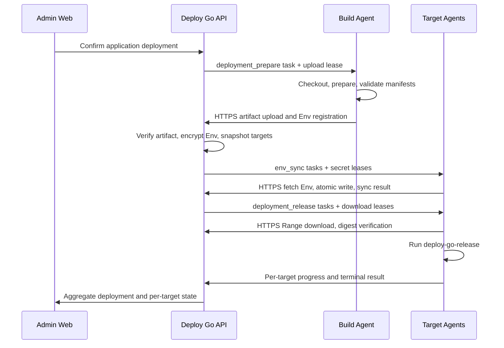

# 跨节点制品中转与业务应用 Env 管理计划

## Goal Capsule

- **目标：** 让 Build Agent 可以把业务应用发布物安全中转给多个 Target Agent，并让管理员在 Web 中查看、编辑和立即同步由业务应用首次上传登记的 Env 文件。
- **应用模型：** 一个 Deploy Go 应用代表一个独立业务环境实例，例如 `qfy-voucher-hub-production` 与 `qfy-voucher-hub-test`；名称后缀只是命名规范，不增加 `environment_kind`。
- **关键边界：** WSS 只承载控制消息，不传发布物；发布物是短期临时数据，Env 是加密、版本化的长期配置；Deploy Go 只调度脚本和同步配置，不接管 Compose 或业务发布逻辑。
- **当前限制：** 现有两阶段部署要求 Build Agent 与 Target Agent 位于同一节点，通过本地 staging 交接。本计划完成前，不得把不同 Agent 配置成已支持的跨节点发布链路。
- **安全原则：** Env 明文只对重新验证身份的管理员按需展示；日志、审计、任务载荷、URL 和 WSS 消息不得包含 Env 内容或制品凭证。

---

## Product Contract

### Summary

业务应用继续提供固定的 `deploy-go-prepare` 和 `deploy-go-release` Make target。Build Agent 检出确定 commit、完成编译打包并校验 manifest 后，通过 HTTPS 把发布物上传到 Deploy Go 临时制品区。主控只保存有期限的部署制品，向每个 Target Agent 签发绑定任务的短期下载凭证；Target Agent 通过 HTTPS 下载、再次校验后执行发布脚本。WSS 只负责下发任务、短期凭证引用、状态、日志和结果。

业务应用可以在准备阶段首次提交 Env 文件清单和初始内容。只有已被业务应用上传登记的 Env 才会出现在 Web；Web 不允许凭空新建 Env 文件。同名文件后续再次上传只确认声明，不覆盖管理员已经维护的值。本次部署未上传已有 Env 时继续保留，只有管理员明确删除才移除。管理员可以在 Web 通过键值表格或黑色终端风格原文编辑器查看和编辑明文；保存后主控立即让所有绑定该应用的在线 Target Agent 原子同步最新版本，离线节点上线后自动补齐。

### Problem Frame

当前 prepare 和 release 使用相同的任务 staging 路径，发布物不经过主控，因此只有同一 Agent 节点能够完整执行两阶段部署。虽然应用来源已经保存 Build Agent、部署目标也绑定 Target Agent，但不同节点之间没有文件传输协议，选择不同 Agent 会让 release 阶段找不到 prepare 产物。

当前部署目标还要求填写 `environment`，但产品已经采用“一个应用代表一个业务环境实例”的模型。同一个业务系统的正式和测试环境应创建为两个应用，因此目标级环境输入重复且容易产生冲突。

当前 Env 只支持管理员预先在节点创建文件，再将绝对路径作为敏感文件引用传给脚本。平台没有 Env 对象、加密版本、Web 编辑、节点同步状态，也不能保证同一应用的多个目标节点使用一致配置。

### Actors

- A1. **管理员：** 创建环境实例应用，管理 Git 来源、Build Agent、目标节点、Env 明文和同步状态。
- A2. **普通用户：** 在授权应用范围内预览和执行部署，不能查看或编辑 Env 明文。
- A3. **Build Agent：** 检出固化 commit、运行 prepare、校验制品和首次登记的 Env，并通过 HTTPS 上传。
- A4. **Target Agent：** 下载并校验制品、同步 Env、运行 release、回传进度和结果。
- A5. **主控：** 保存部署与配置事实、临时中转制品、加密 Env、签发短期凭证、调度任务并记录审计。

### Requirements

**应用与目标模型**

- R1. 一个 Deploy Go 应用必须代表一个独立业务环境实例；同一业务系统的正式、测试和预发布环境分别创建应用。
- R2. 应用 Slug 推荐使用显式环境后缀，例如 `qfy-voucher-hub-production`、`qfy-voucher-hub-test`；后缀只作为运维命名规范，系统不强制后缀，也不从 Slug 推断环境行为。
- R3. 不增加 `environment_kind`。部署目标不再要求管理员填写环境，部署上下文使用应用身份和兼容字段，不允许目标自由定义第二套环境事实。
- R4. 一个应用可以绑定多个 Target Agent；同一应用的 Env 内容对所有绑定目标保持一致，不提供节点级覆盖。

**跨节点制品中转**

- R5. Build Agent 与 Target Agent 可以是不同节点，所有 Agent 只需主动连接 Deploy Go，不要求目标节点开放入站文件服务。
- R6. Build Agent 必须先在本地完成 manifest、路径、数量、大小和 SHA-256 校验，再通过 HTTPS 上传制品；业务 Make target 不得自行 SSH、SCP 或调用任意目标地址。
- R7. 主控必须把制品存放在任务隔离的临时区域，设置单文件、总大小、文件数量、上传时间和保留期限上限，不把制品存入数据库或日志。
- R8. 主控只向当前部署的目标任务签发短期、单用途下载凭证；凭证绑定部署、目标 Agent、制品摘要和期限，不能跨任务复用。
- R9. Target Agent 下载完成后必须再次校验 manifest、文件集合、大小和 SHA-256，全部制品完整落盘前不得执行 release。
- R10. WSS 控制协议只传任务和不透明凭证引用，不承载制品字节；上传、下载和断点重试使用 HTTPS 数据通道。
- R11. 同一部署向多个目标节点发布时，每个目标拥有独立下载、校验、执行和终态；单个节点失败不能伪造其他节点成功，也不能静默重复发布。
- R12. 制品在无活跃 target run 或重试引用且达到保留期限后清理；上传失败超时或部署明确取消可提前清理。平台不提供长期制品仓库、历史下载或基于历史制品的回退。

**业务 Env 登记**

- R13. 业务仓库使用稳定文件名声明模块配置，推荐 `compose.env`、`shared.env`、`api.env`、`worker.env`，并在仓库保留对应 `.env.example`。
- R14. 真实 Env 只有通过 Build Agent 的受控上传清单才能首次创建；Web 不提供“新建 Env 文件”操作，未上传的文件不形成可编辑对象。
- R15. Env 清单必须包含稳定文件名、模块、内容摘要和格式版本，拒绝绝对路径、目录穿越、符号链接、重复名称、非法文件名和超限内容。
- R16. 首次上传创建 Env 对象并保存初始内容；后续同名上传只确认业务应用仍声明该文件，不覆盖 Web 当前值。
- R17. 某次部署未上传已有 Env 时，主控继续保留该对象和服务器文件，不自动停用、删除或覆盖。
- R18. Env 删除只能由管理员在 Web 明确执行，并经过影响范围确认；删除和节点清理必须可审计，不与普通部署隐式绑定。

**Env 加密、查看与编辑**

- R19. Env 内容由主控使用现有主密钥体系加密保存；列表、部署快照、任务 JSON、审计、日志和错误响应不得包含明文。
- R20. 只有管理员可以查看和编辑 Env。每次开始明文会话必须重新验证管理员密码，不能仅依赖已有 Cookie。
- R21. Env 列表只返回名称、摘要、版本、更新时间和同步汇总；单个明文读取接口必须禁止浏览器和代理缓存，并在短时编辑会话失效后拒绝继续读取。
- R22. Web 默认提供结构化键值表格，支持增加、修改、删除和校验键；同时提供黑色终端风格原文编辑器，使用等宽字体、行号、dotenv 高亮和错误定位。
- R23. 结构化模式与原文模式编辑同一个文档。模式切换和保存必须通过解析校验，保留可支持的注释与顺序，并拒绝重复键、非法变量名、控制字符和未闭合引号。
- R24. 保存前展示脱敏 Diff 和影响节点数量；Env 值不进入 URL、本地持久缓存、前端遥测或通用错误对象，离开编辑页后清除内存中的明文状态。
- R25. Env 更新使用乐观并发版本。管理员基于旧版本保存时必须显示冲突并重新加载，不能覆盖他人修改。

**Env 节点同步**

- R26. Env 保存成功后立即创建新版本，并为该应用绑定的所有 Target Agent 建立独立同步状态：`pending`、`syncing`、`succeeded` 或 `failed`。
- R27. 主控通过绑定 Env 版本和目标 Agent 的短期 secret lease 传递内容；WSS 任务和持久化 Agent journal 只保存 lease ID、应用 Slug、文件名、版本和摘要，不保存主控指定的绝对路径。
- R28. Target Agent 只能把 Env 写入自身受控 `secrets_root/<app-slug>/<file-name>`，不得接受主控提供的任意绝对路径。
- R29. Agent 使用同目录 `0600` 临时文件完成校验、fsync 和原子替换；失败时保留上一版本，不能留下半写文件。
- R30. 在线节点立即同步；离线节点保持 `pending`，恢复连接后自动取得并同步最新版本，不补写已经被后续版本取代的旧版本。
- R31. 某一节点同步失败不回滚其他已成功节点。Web 必须展示每个节点的实际版本、最后尝试时间和脱敏错误，并支持管理员重试。

**业务脚本与 Compose**

- R32. Deploy Go 不解析、不生成也不接管 `compose.yaml`；Compose 文件和 `deploy-go-release` 继续由业务仓库维护和审查。
- R33. 业务 release 脚本通过平台注入的固定 Env 文件路径调用 Compose。`compose.env` 用于 Compose 插值，`shared.env` 和模块 Env 通过服务的 `env_file` 进入容器。
- R34. Env 同步成功是 release 的前置条件。目标节点缺少必需 Env、版本落后或同步失败时不得启动业务发布脚本。
- R35. Agent 默认不获得 Docker/root 权限。需要 Compose 特权操作时继续使用应用专属受控 launcher，不把 Env 内容、任意 Docker 参数或 shell 放入 launcher 输入。

### Key Flows

- F1. **跨节点构建与发布**
  - **Trigger:** 用户确认一次应用部署。
  - **Steps:** 主控固化 commit；Build Agent prepare 并校验；通过 HTTPS 上传临时制品；主控创建各目标下载任务；Target Agent 下载并复验；确认 Env 已同步；执行 release；分别回传结果。
  - **Outcome:** Build Agent 与多个 Target Agent 无需共享磁盘即可完成可追溯发布。
  - **Covered by:** R5-R12、R34-R35。
- F2. **首次登记 Env**
  - **Trigger:** Build Agent 首次上传业务仓库声明的 Env 清单和内容。
  - **Steps:** 校验名称、格式、摘要和限额；主控创建加密 Env 对象；创建所有绑定目标的同步记录；在线 Agent 原子写入。
  - **Outcome:** 只有业务应用明确提供的 Env 成为 Web 可管理对象。
  - **Covered by:** R13-R18、R26-R30。
- F3. **管理员编辑 Env**
  - **Trigger:** 管理员从应用 Env 页面选择已有文件。
  - **Steps:** 重新验证密码；按需解密；结构化或原文编辑；校验并查看 Diff；保存新版本；立即同步所有目标；查看逐节点结果。
  - **Outcome:** 主控保存唯一权威版本，节点最终收敛到相同内容。
  - **Covered by:** R19-R31。
- F4. **后续部署重复声明**
  - **Trigger:** 新版本业务代码再次上传同名 Env，或本次未包含旧 Env。
  - **Steps:** 同名只更新声明事实、不覆盖内容；缺席文件保持原对象；管理员修改与节点版本不受部署上传影响。
  - **Outcome:** 代码部署不会意外覆盖或删除生产配置。
  - **Covered by:** R16-R18。

### Acceptance Examples

- AE1. 应用 `qfy-voucher-hub-production` 选择 Build Agent A 和 Target Agent B/C；A 上传制品后，B/C 分别下载并校验，WSS 消息中不出现制品字节。
- AE2. B 下载成功而 C 离线时，B 可以继续发布，C 保持等待；C 上线后取得仍有效的当前部署任务或进入明确终态，不能伪造成已发布。
- AE3. Build Agent 首次上传 `api.env` 后，Web 出现该对象；未上传 `worker.env` 时，Web 不提供创建 `worker.env` 的入口。
- AE4. 管理员在 Web 修改 `api.env` 后，下一次部署再次上传同名文件，主控保留管理员版本，不用仓库上传内容覆盖。
- AE5. 新版本不再上传已有 `shared.env`，对象和所有节点文件保持不变；只有管理员明确删除才能清理。
- AE6. 普通用户访问 Env 接口得到 403；管理员未重新验证密码时只能查看元数据，不能取得明文。
- AE7. 管理员保存 Env 时一台节点离线，在线节点显示 `succeeded`，离线节点显示 `pending`；离线节点恢复后自动同步最新版本。
- AE8. Agent 写入 Env 中途失败，服务器继续保留旧文件，主控显示该节点 `failed`，其他节点不回滚。
- AE9. Env 原文包含重复键或非法变量名时，Web 指向具体行并禁止保存；错误响应和审计不包含对应值。
- AE10. Target Agent 下载的制品与 manifest SHA-256 不一致时，在运行 `deploy-go-release` 前失败，线上服务和 Env 均不变化。

### Scope Boundaries

**本期交付**

- 主控临时制品中转、Build Agent HTTPS 上传、Target Agent HTTPS 下载与复验。
- 应用 Env 首次登记、加密版本、管理员明文编辑、立即多节点同步和状态展示。
- 应用即环境实例，部署目标移除环境输入，不增加 `environment_kind`。
- Web 键值表格与黑色终端风格原文编辑器。

**Deferred for later**

- S3/OSS 等外部对象存储后端、跨主控集群复制、长期制品保留和 CDN。
- 节点级 Env 覆盖、共享基础 Env 继承、变量引用、自动密钥轮换和审批流。
- Web 新建 Env、从服务器反向发现任意文件、非 dotenv 配置编辑和 Compose 可视化编排。

**Outside this product's identity**

- 通用 CI pipeline、任意文件管理器、远程终端、源码托管、Compose/Kubernetes 接管和业务应用自动迁移推导。

### Planning Questions Resolution

- OQ1 已解决：默认限制为单文件 512 MiB、单次部署总大小 2 GiB、最多 256 个文件、上传窗口 30 分钟、制品 TTL 24 小时；全部通过运行配置覆盖，并在 API 与 Agent 两端取更严格值。
- OQ2 已解决：所有目标成功时部署整体才是 `succeeded`；任一目标失败时整体为 `failed`，响应同时给出逐目标事实以表达部分成功。重试创建新部署，只执行失败或未执行目标，不改写历史部署，也不重复发布已成功目标。
- OQ3 已解决：Env 明文授权有效期 5 分钟并绑定当前用户与登录会话；读取、保存和删除均要求有效授权，其中删除还要进行影响范围确认。
- OQ4 已解决：首版 dotenv 支持空行、`#` 注释、`KEY=VALUE` 及单/双引号；禁止重复键、`export`、多行值、变量展开、控制字符和未闭合引号，保存时保留可支持的注释与顺序。
- OQ5 已解决：不改写历史快照和 migration；新增 migration 使 `deployment_targets.environment` 成为兼容字段，新写 API 不再接收该字段，旧响应在客户端迁移期保留只读兼容值。

### Sources

- `docs/standards/application-deployment-contract.md`
- `docs/standards/agent-control-protocol.md`
- `docs/standards/git-branch-deployment-contract.md`
- `docs/standards/deploy-script-contract.md`
- `docs/standards/privileged-release-launcher.md`
- `docs/plans/2026-08-06-004-git-branch-two-stage-deployment-plan.md`

---

## Planning Contract

### Product Contract Preservation

Product Contract changed: R2 澄清环境后缀仅为推荐命名规范；R12 澄清 TTL、活跃引用与清理关系；R27 以受控相对标识替代目标路径。三处均用于消除已确认语义的歧义，不增加产品范围；其余 R/F/AE 含义不变。

### Key Technical Decisions

- KTD1. **主控使用本地文件系统临时中转制品。** 首版在可配置的 `artifacts_root`（生产默认 `/var/lib/deploy-go/artifacts`）下按 deployment 隔离存储，不进入 SQLite；这与单主控轻量部署定位一致，并为后续 S3/OSS 存储适配保留边界。Governs R5-R12。
- KTD2. **制品数据走 HTTPS，控制状态走 WSS。** Agent 使用现有 access token 在 `Authorization` header 认证 HTTPS 请求，WSS 只传不可猜的 `lease_id`；服务端校验 lease 绑定的 Agent、deployment、target run、digest、purpose、期限和状态，不签发第二套 bearer。上传 lease 绑定唯一 upload session，分块可幂等重放，finalize 以原子 CAS 消费；下载 lease 在有效期内允许同一目标执行 Range 重试，target run 终态、取消或过期即撤销。token 只存摘要，上传完成后主控重新计算文件集合和 SHA-256。Governs R6-R10。
- KTD3. **一次应用部署固化目标快照并建立逐目标运行记录。** 新增 deployment target run 数据，不依赖部署期间可变的目标绑定；prepare task 每次部署唯一，release task 按 target run 唯一，顶层状态由逐目标终态汇总。Governs R4、R11。
- KTD4. **重试形成新的不可变部署事实并事务性 pin 制品。** 创建重试时必须 pin 仍为 `verified` 且未过期的 artifact，清理在新 deployment 终态前不得删除；只为失败或未执行目标建立可执行 run，已成功目标以 `reused` 事实呈现但不下发 release。artifact 已失效时拒绝局部重试，要求重新 prepare 并创建新的全目标部署；原部署、任务和日志不回写。Governs R11-R12。
- KTD5. **Env 与制品采用独立对象、通道和生命周期。** `application_env_files` 保存逻辑对象，`application_env_versions` 保存加密版本，`application_env_syncs` 保存节点收敛事实；prepare manifest 单独声明 Env，不能把 Env 混入普通 artifact manifest。Governs R13-R19、R26-R31。
- KTD6. **Env 沿用主密钥体系但使用独立且版本化的加密语义。** 复用 `MasterKeyRing` 和 ChaCha20Poly1305；AAD 使用 domain separator、algorithm version、不可变 application ID、Env file ID 与 version ID 的长度前缀 canonical bytes，每次加密生成新 nonce，key version 只选择对应解密 key。持久化 ciphertext、nonce、key version、digest 和版本号，避免重命名破坏解密或与 SSH/Git credential 密文互换。Governs R19。
- KTD7. **Env 首次上传只登记，后续声明不覆盖。** Build Agent 使用专用 `env_registration` lease 调用 HTTPS endpoint；lease 绑定 Build Agent、application、deployment、固化 commit、Env manifest digest、purpose 和期限。首次创建以数据库唯一约束和原子 insert 决胜；同名对象存在时拒绝接收明文，仅刷新声明元数据，缺席也不删除。逻辑唯一键为 `(application_id, file_name)`。Governs R13-R18。
- KTD8. **明文访问使用短期、可撤销的重新认证授权。** 管理员再次提交密码后获得 5 分钟、绑定 user/session/application 与 action scope 的 Env reveal grant，服务端只保存摘要，token 只驻留 Web 内存；登出、session/角色撤销或密码版本变化立即失效，重新认证沿用登录限速。明文 GET/PUT/DELETE 同时校验 grant、当前管理员权限与 CSRF，删除使用独立 action scope，并返回 `Cache-Control: no-store` 和 `Pragma: no-cache`。Governs R19-R25。
- KTD9. **首版 dotenv 采用受限且可保真的语法。** API 是解析和规范校验权威；Web 使用同一规则提供即时反馈。结构化编辑无法保持原文语义时禁止切换，提示管理员在原文模式修正。Governs R22-R25。
- KTD10. **Env 同步是独立 Agent 任务和 release 门禁。** `env_sync` payload 只含应用 Slug、文件名、版本、摘要和 lease ID；Agent 从 lease 取得明文，写入推导出的受控路径并以 `0600`、fsync、rename 原子替换。release 前检查该 target run 所需 Env 均为当前版本。Governs R26-R35。
- KTD11. **目标级 environment 采用渐进兼容。** 新请求和 Web 移除输入，数据库历史列与部署快照暂不删除；OpenAPI 先将字段标为只读/兼容，再更新生成客户端和 UI，最后才考虑单独清理。Governs R1-R4。
- KTD12. **业务 Compose 仍由业务仓库负责。** Deploy Go 只提供受控制品目录和 Env 固定路径，不解释 Compose 配置，也不扩展 launcher 为任意 shell/Docker 入口。Governs R32-R35。

### Architecture And Data Flow

### Data Model And Migration Boundaries

- 新 migration 从 `0012` 起追加，不修改 `api/migrations/0001_initial_schema.sql` 至 `api/migrations/0011_deployment_log_stage.sql`。
- `deployment_target_runs`：保存 `deployment_id`、目标/节点/Agent 快照、状态、phase、artifact digest、Env gate 结果、错误摘要、开始/结束时间和来源 run。每个 deployment 与 target snapshot 唯一。
- `agent_tasks` 增加可判别 task kind 与关联 FK 的 check constraint：prepare 要求 target/env sync FK 均为空，release 要求非空 `target_run_id`，env sync 要求非空 `env_sync_id`。使用 partial unique index 分别保证每 deployment 一个 prepare、每 target run 一个 release、每 Env 收敛事实一个 env sync；migration 在事务内先审计历史冲突再重建，不能依赖 SQLite 对 NULL 的 unique 行为。
- `deployment_artifacts`：SQLite 只保存 manifest 元数据、digest、大小、文件数、相对存储键、状态和过期时间；发布物字节始终在 `artifacts_root`。
- `application_env_files`、`application_env_versions`、`application_env_syncs` 分别承担对象、不可变加密版本和逐目标同步状态。删除 Env 使用软删除/明确 tombstone，保证审计和离线节点清理可追踪。
- `deployment_targets.environment` 不立即删除；新部署 target snapshot 以应用身份为准，历史响应继续可读，所有新写路径忽略并拒绝客户端提供该字段。

### API And Protocol Boundaries

- 部署预览与确认升级为应用级入口，响应包含固化 commit、Build Agent、全部有效目标、Env 门禁预览和限制检查；旧单 target 路由在客户端切换完成前保持兼容但不新增能力。
- 制品上传/下载 endpoint 要求现有 Agent access token 和短期 `lease_id`，严格校验调用 Agent 身份、deployment、target run、digest、purpose、期限和状态；错误不回显 token、文件内容或服务器绝对路径。
- Agent protocol 增加 artifact upload/download 引用、`env_sync` task 与 Env purpose lease。`agent-protocol/src/lib.rs` 是主控和 Agent 的共享契约，先扩展兼容枚举/结构，再分别接入发送端和处理端。
- Env API 分为元数据列表、重新认证、明文读取/保存/删除和同步重试。列表与部署 API 永不返回明文；保存使用 expected version 实现乐观并发。
- OpenAPI 与 `admin/src/api/generated/` 必须由仓库生成命令更新，不手工编辑生成文件；服务端兼容变化先落地，再切换 Web 调用。

### Runtime And Failure Semantics

- 制品默认限制：单文件 512 MiB、单 deployment 2 GiB、256 文件、上传 30 分钟、TTL 24 小时；API 和 Agent 都做路径、数量、大小与摘要校验。生产数据通道必须有界流式转发，不得按 `Content-Length` 整包读入内存。
- v1 上传协议固定为 initiate -> 顺序 `Content-Range` PUT -> status offset 查询 -> finalize。服务端拒绝并发错位 chunk，已确认 chunk 可幂等重放，空文件合法、零制品非法；upload session 和 offset 持久化，断连或 API 重启后可继续。finalize 只从 `active` 原子转为 `consumed`，摘要不符转 `failed` 且不能覆盖 verified artifact；下载支持绑定 lease 的 `Range` 重试。
- 上传只写同文件系统 quarantine/session 目录；校验后原子 rename 到不可变 content key，再以事务/CAS 标记 `verified`，下载只读取 verified。启动及周期 reconciliation 清理超时 quarantine、标记文件缺失的 verified 记录失败，并回收无数据库引用的孤儿目录。
- 离线 target run 的 deadline 不得晚于 artifact expiry；到期时原子标记 `failed/expired`，随后才允许清理。清理任务只删除无 pin/活跃引用且过期、上传失败且超时或明确取消的目录；创建重试与清理以事务/CAS 协调，下载期间保留 pin，文件删除成功后再清数据库元数据。
- 顶层 `succeeded` 要求所有可执行目标成功；任一失败为 `failed`；等待离线节点时保持非终态并受既有超时策略约束。UI 单独展示成功、失败、等待和 reused 数量。
- Env 保存成功即成为主控权威版本。单节点同步失败不回滚版本或其他节点；Agent 重连时比较最新版本，只同步缺失的最新版本。
- Agent 下载、校验、Env 门禁或 release 任一失败都只终止对应 target run，保留上一个线上版本和上一 Env 文件；主控汇总但不伪造全局回滚。

### Security And Observability

- lease token、Env 明文、制品 Authorization header 不进入 WSS 持久化 journal、部署日志、审计 details、tracing fields、URL、浏览器 storage 或通用异常对象。
- Env 审计记录操作者、应用、文件名、旧/新版本、摘要、节点影响数和结果，不记录值或明文 Diff；明文查看也记录独立审计事件。
- 应用 Slug 与文件名均使用严格 ASCII allowlist 并拒绝 `/`、`..`、绝对路径、Unicode 混淆、符号链接、hardlink 和非普通文件。Agent 以受控 root dirfd 逐段 no-follow 创建/打开目录，在同一 dirfd 内 fsync 与 rename，并固定目录 owner/mode；删除 tombstone 使用同一路径机制。
- 指标至少覆盖制品上传/下载字节与耗时、摘要失败、清理失败、逐目标 phase、Env 同步延迟与失败数；日志使用 deployment/target run/env version ID 关联，不使用敏感内容。

### Sequencing And Compatibility

实施顺序遵循“规范与数据基础 -> API 聚合模型 -> 制品通道 -> Agent 跨节点执行 -> Env 后端 -> Env Agent 同步 -> Web 部署界面 -> Web Env 编辑 -> 运行手册与端到端验证”。每个单元在合入时保持现有同节点链路可用；U4 的跨节点路径保持 feature flag 默认关闭，仅供隔离测试，必须等 U6 的 Env 门禁、兼容迁移和端到端验证完成后才允许生产启用。真实业务项目接入和真实节点操作不属于本计划代码实施授权。

---

## Implementation Units

### U1. 权威规范、协议 Schema 与数据基础

- **Goal:** 先固定跨节点制品、应用级多目标部署和 Env 生命周期的权威契约，并通过新增 migration 建立后续实现所需的数据结构。
- **Files:** `docs/standards/application-deployment-contract.md`、`docs/standards/agent-control-protocol.md`、`docs/standards/deploy-artifact-manifest.schema.json`、新增 Env manifest schema、`api/migrations/0012_*.sql`、`api/src/db/mod.rs`、`api/tests/migrations.rs`、`api/tests/database_constraints.rs`。
- **Patterns:** 沿用 `api/migrations/0008_git_branch_two_stage_deployment.sql` 的部署表设计和 `docs/standards/document-authority.md` 的权威顺序；历史 migration 只读。
- **Dependencies:** 无。
- **Covers:** R1-R18、R26-R35；KTD1-KTD5、KTD11-KTD12。
- **Test Scenarios:** 全新库可应用 1-12；从 1-11 升级保留历史 deployment/target/environment；新唯一约束允许多个 target release task 但拒绝重复 target run；Env 文件逻辑键和版本不可变约束生效；非法 migration 修改由校验发现。
- **Verification:** 聚焦 migration 测试、`cargo test -p deploy-go-api`、`make api-openapi-check`、`git diff --check`。

### U2. 应用级多目标部署 API 与汇总状态

- **Goal:** 将 preview/confirm、deployment response 和重试从单目标模型升级为应用级目标快照及逐目标执行事实，暂不改变制品传输方式。
- **Files:** `api/src/deployments/mod.rs`、`api/src/deployments/runtime.rs`、`api/src/deployment_targets/mod.rs`、`api/src/execution_spec.rs`、`api/tests/deployments_api.rs`、`api/tests/deployment_runtime.rs`、`admin/src/api/contracts.ts`。
- **Patterns:** 沿用部署确认令牌、固化 commit、不可变快照和现有状态机；汇总状态只从 target run 计算。
- **Dependencies:** U1。
- **Covers:** R1-R4、R11；F1；AE1-AE2；KTD3-KTD4、KTD11。
- **Test Scenarios:** preview 返回全部启用目标且拒绝零目标；confirm 后目标绑定变化不改变快照；两个目标可独立成功/失败；全部成功才汇总成功；失败重试只创建失败/未执行 run，成功节点不收到新 release；旧单目标数据仍可读取。
- **Verification:** 部署模块单元/集成测试、`cargo test -p deploy-go-api deployments`、`make api-openapi-check`。

### U3. 主控制品存储与 HTTPS 授权通道

- **Goal:** 实现受限、可校验、可清理的本地临时制品区，以及绑定 Agent 和任务的上传/下载 lease。
- **Files:** `api/src/config.rs`、新增 `api/src/artifacts/` 模块、`api/src/http/mod.rs`、`api/src/agents/auth.rs`、`api/src/agents/store.rs`、新增 `api/tests/artifacts_api.rs` 与 artifact 存储测试。
- **Patterns:** 复用现有 Agent 身份、token 摘要和 secret lease 的单用途校验思路，但为 artifact lease 使用独立 purpose 和存储对象。
- **Dependencies:** U1、U2。
- **Covers:** R5-R12；F1；AE1、AE10；KTD1-KTD2。
- **Test Scenarios:** 正确 Agent 可按 offset 分块/重试上传并完成校验；断连与 API 重启可恢复；空文件可传而零制品拒绝；越权 Agent、过期/撤销 lease、错误 digest、路径穿越、超限文件/总量/数量全部拒绝；并发 finalize 只有一次 CAS 成功；Target lease 不能下载其他 target run；Range 下载正确；故障注入覆盖 rename/DB 状态边界；TTL 清理、retry pin 和下载并发不触碰有效任务与目录外文件。
- **Verification:** artifact 模块单元/HTTP 集成测试、`cargo test -p deploy-go-api artifacts`、配置解析测试。

### U4. Agent 跨节点制品上传、下载与 release

- **Goal:** 让 Build Agent 上传 prepare 产物，让每个 Target Agent 下载到自身隔离 staging、复验后执行 release，解除同 Agent 限制。
- **Files:** `agent-protocol/src/lib.rs`、`agent/src/executor.rs`、`agent/src/staging.rs`、`agent/src/task_handler.rs`、`agent/src/connection.rs`、`agent/tests/two_stage.rs`、新增 `agent/tests/artifact_transfer.rs`、`api/src/agents/dispatcher.rs`、`api/tests/agent_dispatcher.rs`。
- **Patterns:** 保留现有 `deployment_prepare`、`deployment_release`、staging 限制、journal 恢复和 deploy event 日志解析；传输客户端复用当前认证/重试基础设施。
- **Dependencies:** U2、U3。
- **Covers:** R5-R12、R34-R35；F1；AE1-AE2、AE10；KTD2-KTD4。
- **Test Scenarios:** Build A 与 Target B/C 完成一次构建多节点发布；下载中断后 Range 续传且不重复 release；摘要错误在脚本前失败；单节点失败不影响已成功节点事实；Agent 重启后不重复已完成任务；journal 和日志不含 lease token；同节点旧路径在兼容期仍工作。
- **Verification:** `cargo test -p deploy-go-agent-protocol`、`cargo test -p deploy-go-agent`、dispatcher 集成测试、`make agent-check`。

### U5. Env 加密模型、首次登记与重新认证 API

- **Goal:** 建立应用级 Env 对象/版本，完成受控首次登记、受限 dotenv 校验、管理员短期明文授权和乐观并发 API。
- **Files:** 新增 `api/src/application_envs/` 模块、`api/src/crypto/mod.rs`、`api/src/auth/mod.rs`、`api/src/audit/mod.rs`、`api/src/lib.rs`、新增 `api/tests/application_envs_api.rs` 与 Env parser/crypto 测试、OpenAPI schema。
- **Patterns:** 复用 `MasterKeyRing`、Argon2 密码验证、Cookie session、CSRF 和审计接口；Env 使用独立 AAD 与 grant 类型。
- **Dependencies:** U1、U3 的受控上传模式。
- **Covers:** R13-R25；F2-F4；AE3-AE6、AE9；KTD5-KTD9。
- **Test Scenarios:** 合法 registration lease 首次上传创建加密版本；跨应用/部署、过期、manifest 不符和并发首次创建拒绝明文覆盖；同名再次上传不覆盖，缺席不删除；非法名、符号链接、超限和不支持 dotenv 拒绝；AAD 字段互换失败、重命名仍可解密、旧 key 可解密且 nonce 不复用；普通用户 403；管理员未重新认证不能读写；grant 跨应用/action/session、过期、登出、密码/角色变化和 CSRF 错误拒绝；重认证限速；响应 no-store；旧版本保存返回冲突；审计与错误不含值。
- **Verification:** Env parser/crypto 单元测试、API 权限与并发集成测试、`cargo test -p deploy-go-api application_envs`、`make api-openapi-check`。

### U6. Agent Env 原子同步、重连补偿与 release 门禁

- **Goal:** 新增 `env_sync` 协议和逐节点收敛逻辑，保证最新 Env 原子落盘并在 release 前完成版本门禁。
- **Files:** `agent-protocol/src/lib.rs`、`agent/src/secret_lease.rs`、`agent/src/task_handler.rs`、`agent/src/journal.rs`、`agent/src/config.rs`、新增 `agent/tests/env_sync.rs`、`api/src/agents/dispatcher.rs`、`api/src/agents/websocket.rs`、新增 `api/tests/env_sync_dispatcher.rs`。
- **Patterns:** 扩展现有一次性 secret lease broker，并明确 `purpose=application_env`；落盘沿用 staging 的路径防护和 fsync 思路。
- **Dependencies:** U5；与 U4 的 release 流程集成。
- **Covers:** R26-R35；F2-F3；AE7-AE8；KTD10、KTD12。
- **Test Scenarios:** 在线多节点立即同步同一版本；离线节点重连只取最新版本；临时写入失败保留旧文件；权限为 0600 且路径不能逃逸 secrets root；父目录 symlink、竞态替换、hardlink 和非普通文件全部拒绝；lease/journal/log 不含明文；同步失败阻止对应 release；重试只处理未收敛节点；删除 tombstone 走同一 no-follow 路径并保留审计。
- **Verification:** Agent 文件系统/协议测试、API dispatcher 集成测试、`cargo test -p deploy-go-agent`、`make agent-check`。

### U7. Web 应用级部署和逐节点状态交互

- **Goal:** 移除目标 environment 输入，将部署入口改为应用级全目标预览，并在详情页清晰展示逐节点阶段、结果和失败重试范围。
- **Files:** `admin/src/features/targets/TargetEditor.tsx`、`admin/src/features/applications/ApplicationDetailPage.tsx`、`admin/src/features/deployments/NewDeploymentPage.tsx`、`admin/src/features/deployments/DeploymentDetailPage.tsx`、`admin/src/features/deployments/api.ts`、`admin/src/test/ApplicationConfiguration.test.tsx`、`admin/src/test/DeploymentFlow.test.tsx`、`admin/e2e/deployment-flow.spec.ts`。
- **Patterns:** 复用现有页面容器、状态映射、确认流程、SSE 日志和无障碍表单组件；生成客户端只通过规定命令更新。
- **Dependencies:** U2、U4、OpenAPI 客户端已更新。
- **Covers:** R1-R4、R11；F1；AE1-AE2；KTD3-KTD4、KTD11。
- **Test Scenarios:** 目标编辑器不再出现 environment；部署预览覆盖 loading/空目标/API 错误并列出所有节点及 Env 门禁；提交一次只产生一个应用部署；详情展示部分成功但顶层失败；重试确认只列失败/未执行节点；状态与确认交互可由键盘操作并具有可读 accessible name；普通用户权限保持既有 RBAC。
- **Verification:** `make admin-check`、聚焦 Vitest、`admin/e2e/deployment-flow.spec.ts`。

### U8. Web Env 列表、终端编辑、Diff 与同步状态

- **Goal:** 在应用详情提供已有 Env 的元数据、重新认证、键值/原文编辑、保存确认、删除和逐节点同步状态，不提供新建入口。
- **Files:** 新增 `admin/src/features/application-envs/`、`admin/src/features/applications/ApplicationDetailPage.tsx`、`admin/src/routes/AppRoutes.tsx`、`admin/src/styles/index.css`、`admin/src/api/contracts.ts`、新增 `admin/src/test/ApplicationEnvManagement.test.tsx` 与 `admin/e2e/application-env-management.spec.ts`。
- **Patterns:** 沿用 `ConfirmDialog`、路由权限守卫、未保存变更保护和黑白 GitHub 风格；原文编辑区使用黑色背景、等宽字体和固定布局，不引入卡片嵌套。
- **Dependencies:** U5、U6、生成 API client。
- **Covers:** R14-R31；F2-F4；AE3-AE9；KTD7-KTD10。
- **Test Scenarios:** 列表和编辑器覆盖 loading/空/失败/保存成功状态；未登记时无新建按钮；普通用户看不到明文操作；管理员重新认证后 5 分钟内编辑；键值和原文切换保留注释/顺序；重复键定位并以文本/ARIA 关联具体行，禁止保存；编辑器、模式切换、Diff 和确认流程可由键盘完成；脱敏 Diff 不泄露值；版本冲突要求重载；离开页面清空明文；逐节点 pending/failed/succeeded 可见且可重试；删除显示影响节点确认。
- **Verification:** `make admin-check`、Env Vitest、`admin/e2e/application-env-management.spec.ts`、浏览器网络/storage 检查无明文残留。

### U9. 运行配置、清理恢复手册与端到端验收

- **Goal:** 完成生产可配置项、systemd 可写目录、备份/清理/恢复说明，以及跨节点和 Env 的本地隔离端到端验证。
- **Files:** `Makefile`、`deploy/production/env.example`、`deploy/production/install.sh`、`deploy/production/web_server.py`、`deploy/production/test_web_server.py`、`deploy/production/test-install-contract.sh`、`api/src/main.rs`、`api/src/deployments/runtime.rs` 或新增 artifact runtime worker、`docs/runbooks/systemd-deployment-production.md`、`docs/runbooks/application-onboarding.md`、`docs/runbooks/deployment-recovery.md`、`docs/standards/api-contract.md`、必要的隔离测试 fixture。
- **Patterns:** 沿用现有 production check、Agent onboarding 和部署恢复 runbook；不在未授权情况下连接 `qfy-test` 或执行真实部署。
- **Dependencies:** U1-U8。
- **Covers:** R5-R35；F1-F4；AE1-AE10。
- **Test Scenarios:** 隔离环境模拟 Build Agent 与两个 Target Agent；验证一次构建、多节点发布、单节点失败重试、离线 Env deadline/补偿、制品超时清理、主控/Agent 重启与 artifact reconciliation；生产 Python proxy 对接近限额上传保持有界内存并正确处理 Content-Length、chunked、背压和断连；配置缺失或目录不可写时启动前失败并给出脱敏诊断；worker 可优雅停止且不会重复启动。
- **Verification:** 全 workspace 和 Web 质量门、`make deploy-production-check`、runbook 命令静态核对、`git diff --check`。真实业务 `qfy-voucher-hub` 接入另行计划和授权。

---

## Verification Contract

| Gate | Command or evidence | Applies to | Passing signal |
|---|---|---|---|
| Rust format | `cargo fmt --all --check` | U1-U6、U9 | 无格式差异 |
| Rust lint | `cargo clippy --workspace --all-targets -- -D warnings` | U1-U6、U9 | 零 warning、退出码 0 |
| Rust tests | `cargo test --workspace` | U1-U6、U9 | workspace 全部测试通过 |
| OpenAPI | `make api-openapi-check` | U1、U2、U5、U7、U8 | 服务端 schema 与生成物一致 |
| API client | `make api-client-check` | U2、U5、U7、U8 | Web client 无未生成差异 |
| Agent | `make agent-check` | U4、U6、U9 | Agent 格式、lint、测试通过 |
| Admin static/unit | `make admin-check` | U7-U9 | typecheck、lint、unit tests 通过 |
| Admin E2E | `make admin-test-e2e` | U7-U9 | 部署与 Env 关键流程通过 |
| Production preflight | `make deploy-production-check` | U9 | 本地生产部署前置检查通过，不执行远程部署 |
| Diff hygiene | `git diff --check`、`git diff --cached --check` | 每个单元 | 无空白错误或冲突标记 |

除全量门外，每个单元必须先运行其列出的聚焦测试。涉及 migration 的单元必须同时验证空库和从当前 1-11 链路升级；涉及敏感数据的单元必须增加“日志、审计、错误、journal、URL、浏览器 storage 不含明文/token”的负向断言。跨节点端到端验证使用本地 fixture、mock 或明确隔离容器，不将本地开发等同于真实节点执行授权。

---

## Definition of Done

- U1-U9 均形成可独立解释、验证和回滚的小提交，且依赖顺序、OpenAPI 生成顺序和历史 migration 不可变约束得到遵守。
- Build Agent 与至少两个不同 Target Agent 可在隔离环境中完成一次构建、多节点 HTTPS 分发、逐节点校验和 release；WSS 不传制品字节。
- 部署顶层与逐节点事实一致：全成功才成功，失败可见，重试不重复发布成功节点，历史部署不可变。
- 只有业务应用首次上传登记的 Env 能在 Web 出现；后续上传和缺席均不覆盖或删除管理员当前版本。
- 管理员必须重新认证才能查看、保存或删除明文；普通用户、过期/跨 session grant 和并发旧版本均被拒绝。
- Env 在所有目标使用相同权威内容，Agent 原子写入、离线重连补最新版本、失败保留旧文件，release 对未同步 Env 执行门禁。
- Target 编辑不再要求 environment；历史 deployment 和 API 兼容数据仍可读取，未增加 `environment_kind`。
- Web 完成应用级部署、逐节点状态、Env 键值/黑色终端编辑、脱敏 Diff、冲突与同步状态交互，并通过聚焦 unit/E2E 验证。
- 制品/Env 的限额、目录、TTL、清理、恢复和 systemd 权限写入权威 standards/runbooks，配置错误可在运行前被发现。
- `Verification Contract` 全部适用门通过，敏感数据负向检查通过，代码审查未留下 P1/P2 正确性、安全性或数据完整性问题。
- 本计划完成不代表已接入或部署 `qfy-voucher-hub`，也不授权连接 `qfy-test`；业务接入、生产迁移和远程部署必须按对应 runbook 在当前对话获得明确授权后独立执行。
