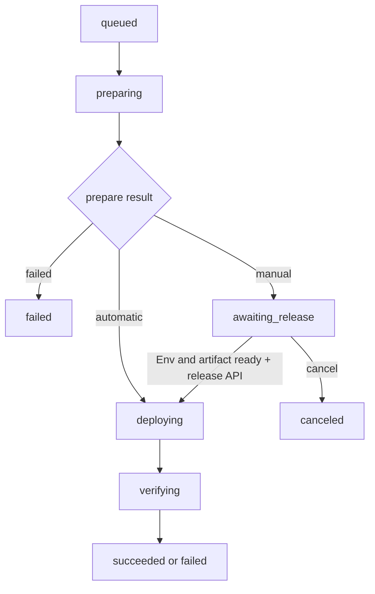

# 两阶段部署手动发布门禁

## Goal Capsule

- 目标：让两阶段部署支持 `prepare -> awaiting_release -> release`，管理员可在首次 Env 登记和同步完成后手动开始 release。
- 兼容性：保留现有自动发布行为，已有调用方不传策略时仍自动进入 release。
- 权威约束：部署脚本协议遵循 `docs/standards/application-deployment-contract.md`，恢复操作遵循 `docs/runbooks/deployment-recovery.md`。
- 范围：API 状态机、发布 API、制品保留、Admin Web、OpenAPI/客户端、测试与文档；不包含 Flutter、真实节点部署或正式环境操作。

---

## Product Contract

### Problem Frame

当前两阶段部署在 prepare 成功后立即创建 release 任务。首次接入应用时，Env 文件虽然会在 prepare 中登记，但管理员没有时间在 release 前检查、编辑并确认它们已同步到全部目标节点。

### Requirements

**发布策略**

- R1. 创建两阶段部署时可选择 `automatic` 或 `manual`，默认 `automatic`。
- R2. 策略与 deployment snapshot 一起冻结，API 重启或重试不能改变原选择。
- R3. 自动模式保持 prepare 成功后自动 release 的现有行为。

**手动门禁**

- R4. 手动模式 prepare、制品校验和 Env 登记完成后进入 `status=running, phase=awaiting_release`，且不创建 release task。
- R5. 只有应用 Env 当前版本已同步到全部部署目标，且制品仍为 verified 时才能开始 release。
- R6. `POST /api/v1/deployments/{id}/release` 必须校验 CSRF、应用权限和状态，重复请求不得创建重复任务。
- R7. 开始 release 后沿用原 commit、release version、模块、制品和目标集合。

**可恢复性与界面**

- R8. API 重启和 dispatcher reconcile 不得越过 `awaiting_release`。
- R9. 等待发布期间制品不得被过期清理；取消后恢复正常清理资格。
- R10. Web 确认页提供策略选择，详情页展示等待原因、Env 同步阻塞节点、配置 Env 入口和二次确认后的开始发布操作。

### Scope Boundaries

- 不新增环境类型字段，不改变“同一业务不同环境建为不同应用”的现有模型。
- 不允许重新 prepare、替换 commit 或上传新制品后继续同一 deployment。
- 不新增定时自动放行；手动模式必须由用户显式开始 release。

---

## Planning Contract

### Key Technical Decisions

- KTD1. **策略存入 snapshot。** `release_strategy` 属于一次部署的冻结输入，随现有 `snapshot_json` 持久化可自然参与 hash、重试和恢复，无需增加用于查询的数据库列。
- KTD2. **同一 deployment 分阶段。** 手动发布只改变 prepare 与 release 之间的推进条件，不拆成两个 deployment，保证日志、审计、制品和重试链路连续。
- KTD3. **发布端点只放行状态机。** 端点在事务中校验门禁并把 phase 改为可调度状态，由 dispatcher 复用现有 release task 构造逻辑，避免 HTTP handler 复制任务 payload 与 lease 创建逻辑。
- KTD4. **等待 phase 保护制品。** cleanup 查询显式排除仍被 `running/awaiting_release` deployment 引用的 verified artifact；取消或终态后不再保护。
- KTD5. **门禁返回结构化详情。** Env 未完成时使用稳定错误码和目标节点详情，Web 可直接呈现阻塞原因。

### State Flow

### Sequencing

先完成 API 契约、状态机和聚焦测试，再生成客户端并接入 Web，最后更新长期规范和恢复手册并执行全量质量门。

---

## Implementation Units

### U1. 发布策略与等待状态机

- **Goal:** 扩展 preview/confirm/snapshot/response，并让 dispatcher 在手动模式 prepare 成功后稳定停在 `awaiting_release`。
- **Files:** `api/src/deployments/mod.rs`、`api/src/agents/dispatcher.rs`、`api/src/deployments/runtime.rs`、`api/tests/two_stage_deployment.rs`、`api/tests/agent_dispatcher.rs`。
- **Patterns:** 复用现有 snapshot hash、两阶段 task 唯一约束和 dispatcher reconcile。
- **Test Scenarios:** 默认及显式自动策略自动创建 release；手动策略无 release task并进入等待；重复 dispatcher/recover 后仍等待；取消等待部署后不再推进。

### U2. 手动开始 release 与门禁

- **Goal:** 新增幂等发布端点，校验权限、CSRF、prepare、artifact 和全部目标 Env 同步状态。
- **Files:** `api/src/deployments/mod.rs`、`api/src/openapi.rs`、`api/src/artifacts/mod.rs`、`api/tests/deployments_api.rs`、`api/tests/two_stage_deployment.rs`、`api/tests/artifacts_api.rs`。
- **Patterns:** 复用 `grants::require_application_access`、审计记录、结构化 `ApiError.details` 和 target run/task 唯一约束。
- **Test Scenarios:** Env 未同步时返回具体目标；制品缺失/失效时拒绝；就绪后推进；重复调用幂等；等待期 cleanup 保留、取消后可清理。

### U3. Admin Web 操作闭环

- **Goal:** 部署确认时选择策略，详情页完成等待状态展示、Env 跳转、阻塞说明和发布确认。
- **Files:** `admin/src/features/deployments/DeploymentDetailPage.tsx`、部署创建相关组件与 hooks、`admin/src/api/generated/`、`admin/src/test/DeploymentFlow.test.tsx`、`admin/e2e/deployment-flow.spec.ts`。
- **Patterns:** 沿用现有 CSRF mutation、确认对话框、应用详情 Env 区域和 generated client。
- **Test Scenarios:** 自动/手动选择正确提交；等待状态显示；阻塞时按钮禁用；就绪后确认并发布；API 错误可恢复展示。

### U4. 规范、恢复与完整验证

- **Goal:** 固化新状态、操作边界、制品保留和恢复步骤，验证 API 与 Web 契约无漂移。
- **Files:** `docs/standards/application-deployment-contract.md`、`docs/runbooks/deployment-recovery.md`、必要的 OpenAPI 产物。
- **Test Scenarios:** 文档状态流与实现一致；生成客户端无漂移；Rust、Admin 和 E2E 质量门通过。

---

## Verification Contract

| 范围 | 命令 | 完成信号 |
|---|---|---|
| Rust 格式 | `cargo fmt --all --check` | 无格式差异 |
| Rust 静态检查 | `cargo clippy --workspace --all-targets -- -D warnings` | 无 warning |
| Rust 测试 | `cargo test --workspace --no-fail-fast` | 全部测试通过 |
| OpenAPI | `make api-openapi-check` | 规范无漂移 |
| 生成客户端 | `make api-client-check` | Web/Flutter 客户端无漂移 |
| Admin | `make admin-check` | 类型、lint 和单测通过 |
| Admin E2E | `make admin-test-e2e` | 部署流程回归通过 |
| Diff | `git diff --check` | 无空白错误 |

---

## Definition of Done

- R1-R10 均有实现或自动化测试证据。
- 自动模式没有行为回归，手动模式能跨 dispatcher 轮询和 API 重启保持等待。
- 发布端点具备权限、CSRF、状态、Env、artifact 和幂等保护并写入审计。
- Web 用户无需调用 API 即可完成首次 Env 配置后的手动发布。
- 规范、runbook、OpenAPI 和生成客户端与实现一致。
- 改动按可回滚小闭环提交并推送到 `origin/main`。
