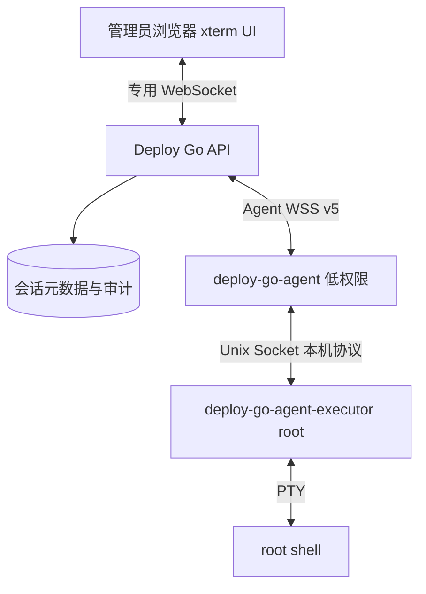
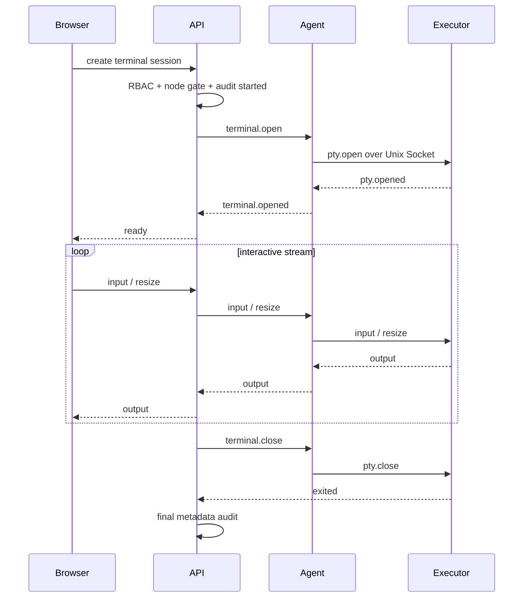
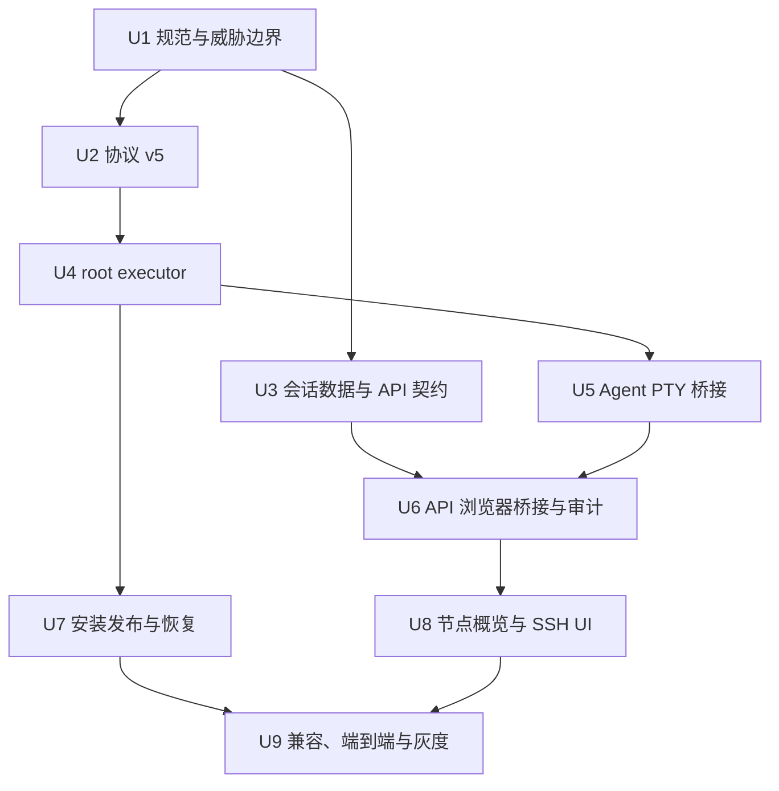

# 特权 Agent 与节点 SSH 终端实施计划

## Goal Capsule

- **目标**：让管理员无需本地 SSH 配置，即可从节点详情页通过 Agent 建立可交互的 root 终端，并为 Agent 后续承担文件、环境变量、systemd 和 Docker/Compose 等节点管理能力建立安全、可审计的特权执行底座。
- **权威约束**：当前用户需求优先于现有“禁止任意 shell/通用 root”的产品边界；实施时必须同步更新 `docs/standards/` 与 `docs/runbooks/`，不能只绕过协议限制。
- **执行范围**：协议 v5、独立 root executor、安装与升级、API 终端会话桥接、RBAC/审计、节点详情 `概览 / SSH` Tab、兼容迁移和自动化验证。
- **停止条件**：若无法保证 executor 本身不实现网络客户端、会话仅管理员可用、每节点显式启用、输入输出具备尺寸和流量限制，或安装升级不能安全回滚，则不得开放正式终端入口。PTY 子进程按产品约定具备完整 root 登录能力。
- **尾部责任**：旧 v4 Agent 继续承担已有部署任务；现有业务专属 launcher 暂时保留，待新特权通道稳定后另行评估收敛，不在本计划中删除。

---

## Product Contract

### Summary

页面中的“SSH”是管理员熟悉的交互名称，底层不实现或暴露 SSH 协议。浏览器通过 Deploy Go API 与节点 Agent 的既有 WSS 控制连接交互，Agent 再通过本机 Unix Socket 调用 root executor 创建完整 root 登录 PTY。主控是授权与审计中心，Agent 是联网代理，executor 是本机特权边界。

### Problem Frame

当前 Agent 只能执行严格枚举的结构化任务，协议和规范会拒绝任意 shell；节点详情也只有纵向概览。该设计无法处理首次导入 Env、临时系统维护、Docker/Compose 排障等需要 root 权限的场景，迫使管理员继续在本机保存 SSH 配置。直接让联网 Agent 以 root 运行虽然实现快，但会把主控凭证泄漏、协议解析漏洞和任意系统控制绑定在同一进程，风险与后续演进成本过高。

### Actors

- A1. **管理员**：可查看 SSH Tab、启停特权能力、建立和操作 root 终端，并承担操作审计责任。
- A2. **普通用户**：继续查看已授权节点与执行现有部署操作，不可发现或调用终端 API。
- A3. **主控 API**：完成会话授权、状态维护、流量转发、限额、断线清理和元数据审计。
- A4. **Agent**：维持 WSS、转发版本化 PTY 消息，不直接持有 root shell 权限。
- A5. **root executor**：仅监听本机受限 Unix Socket，校验 Agent 进程身份并管理 PTY 子进程，不访问网络或主控凭证。

### Requirements

**节点页面与权限**

- R1. 节点详情提供 `概览` 与 `SSH` 两个可深链 Tab，默认打开 `概览`；`SSH` 使用查询参数 `?view=ssh`，刷新后保持当前视图。
- R2. `SSH` Tab 仅管理员可见且对应 API 必须独立校验管理员身份，不能依赖前端隐藏实现授权。
- R3. `SSH` Tab 使用黑色终端视觉，支持键盘输入、PTY 输出、终端尺寸同步、`Ctrl+C`、主动关闭和退出状态提示；移动端至少可查看状态和关闭会话，不承诺完整软键盘体验。
- R4. Agent 离线、身份撤销、协议低于 v5、未声明 PTY 能力或节点未启用 `privileged_execution` 时不得创建会话，页面应准确显示不可用原因与处理入口。

**特权执行边界**

- R5. 联网的 `deploy-go-agent` 继续以低权限用户运行；新增 `deploy-go-agent-executor` 以 root 运行，仅通过 Unix Socket 接受本机 Agent 请求。
- R6. executor 不读取 Agent token、不实现网络客户端、不接受任意远程客户端；完整 root PTY 子进程允许联网和管理主机。Socket 目录和文件权限必须限制到 root 与 `deploy-go-agent` 的专用组。
- R7. 每个节点拥有默认关闭的 `privileged_execution` 开关；只有管理员显式启用且 Agent/executor 双方都上报兼容能力后才能创建 root 终端。
- R8. 一个节点首版最多允许一个活动终端会话；会话有空闲超时、最长存活时间、输入速率、输出缓存和单帧大小限制，进程退出或任一必要链路断开时必须可靠清理。
- R9. 会话 shell 和 home 由安装器从目标机 uid 0 账号解析并固定写入 executor 本机配置；主控不得下发 shell 二进制路径、启动用户、环境变量集合或工作目录逃逸路径。

**协议、状态与审计**

- R10. Agent 控制协议提升为 v5，新增版本化的 PTY open/opened/input/output/resize/close/exited 消息；二进制输出使用明确编码，所有消息拒绝未知高风险字段。
- R11. v4 Agent 与 v5 主控仍可协商并执行原有结构化部署任务，但 v4 节点不能打开终端；协议升级不能破坏现有任务恢复、日志和 token 刷新。
- R12. 主控持久化会话元数据与最终状态，但默认不持久化终端输入和输出正文；浏览器端不写入 localStorage、sessionStorage、IndexedDB 或遥测。
- R13. 审计至少记录操作者、节点、Agent、会话 ID、开始/结束时间、来源请求、退出原因、退出码和字节计数；不得把命令正文、终端输出、token 或 Secret 正文写入审计日志。
- R14. 浏览器、API、Agent 或 executor 任一侧断开时会话进入有限清理窗口，随后关闭 PTY；首版不跨 API/Agent 重启恢复交互终端，也不静默重新创建 root shell。

**安装、升级与后续能力**

- R15. 幂等安装脚本同时安装/升级低权限 Agent、root executor、systemd unit、Unix Socket 权限和能力配置；升级失败自动恢复上一版本，卸载/撤销流程能停止并清理 executor 会话。
- R16. release artifact 与 GitHub Actions 同时构建 Agent 和 executor 的受支持架构产物、checksum 与兼容 manifest；安装器只接受与主控兼容且校验通过的同版本配对产物。
- R17. 首期终端能力落地后，Env 首次导入、文件管理、systemd 和 Docker/Compose 应继续以结构化 API/任务构建在 executor 之上，而不是要求 Web UI 通过终端解析命令输出。
- R18. 现有业务部署默认继续走应用脚本和部署任务；通用 root 终端是管理员维护通道，不替代可复现的业务部署规范。
- R19. 安装后的 Agent 必须提供无敏感信息的 `status` 与 `doctor` CLI：前者汇总版本、协议、Agent ID、控制地址等本机静态事实；后者进一步检查配置、凭证权限、主控 HTTPS 可达性、runner 与 executor，并以稳定检查项和非零退出码表达故障。诊断不得打印 token、完整凭证、终端 capability，不得刷新 token、注册身份或建立第二条 WSS 控制连接。

### Key Flows

- F1. **管理员建立终端**
  - **Trigger**：A1 在在线节点详情打开 `?view=ssh` 并点击连接。
  - **Actors**：A1、A3、A4、A5。
  - **Steps**：API 校验管理员、节点开关、协议与能力；创建会话并通过 WSS 请求 Agent；Agent 经 Unix Socket 请求 executor 创建 PTY；浏览器收到 ready 后开始双向流。
  - **Outcome**：管理员获得该节点单一、受限且可审计的 root 交互会话。
  - **Covered by**：R1-R10、R12-R14。
- F2. **终端不可用门禁**
  - **Trigger**：节点离线、身份撤销、Agent 为 v4、executor 未安装或特权开关关闭。
  - **Actors**：A1、A3、A4。
  - **Steps**：API 返回稳定错误码和能力事实，页面映射为明确状态；不创建残留会话或下发任务。
  - **Outcome**：管理员知道具体缺口，且无法绕过门禁建立 shell。
  - **Covered by**：R2、R4、R7、R11。
- F3. **断开与清理**
  - **Trigger**：管理员关闭、浏览器掉线、Agent 断线、超时、executor 异常或 shell 退出。
  - **Actors**：A1、A3、A4、A5。
  - **Steps**：发起幂等 close，executor 终止进程组并回报退出；API 终结状态并写入元数据审计；超时路径最终强制清理。
  - **Outcome**：不存在无人持有的 root shell，页面显示可理解的终态。
  - **Covered by**：R8、R12-R14。
- F4. **安装或升级节点能力**
  - **Trigger**：管理员在节点运行新生成的幂等安装命令。
  - **Actors**：A1、A3、A4、A5。
  - **Steps**：安装器校验 manifest 与成对产物，原子安装二进制和 systemd 配置，验证 Socket、executor 健康与 Agent 上报；失败恢复旧版本。
  - **Outcome**：节点明确上报 v5 和 `pty_terminal` 能力，旧部署能力不受影响。
  - **Covered by**：R5-R7、R15-R16。
- F5. **管理员诊断离线 Agent**
  - **Trigger**：A1 已完成安装，但管理端节点持续离线。
  - **Actors**：A1、A4、A5。
  - **Steps**：管理员在节点执行 `deploy-go-agent status` 查看静态事实，再执行 `deploy-go-agent doctor` 检查配置、凭证权限、主控 HTTPS、runner 和 executor；命令逐项输出通过/失败及可操作提示。
  - **Outcome**：无需读取 token 或仓库脚本即可区分 Agent 服务、配置、权限、HTTPS 和本机组件故障；真实 WSS upgrade、身份有效性与心跳仍作为明确的未验证项，并给出固定的日志排查命令。
  - **Covered by**：R19。

### Acceptance Examples

- AE1. 管理员打开 `/nodes/<id>?view=ssh`，在线 v5 节点且特权开关已开启时可连接，执行 `id` 的终端结果表明会话为 root，调整浏览器尺寸后全屏程序不乱行。
- AE2. 普通用户直接请求终端创建接口得到 403，直接输入 `?view=ssh` 不显示终端内容，也不会创建会话记录。
- AE3. v4 Agent 仍能执行 `deployment_prepare` 和 `deployment_release`，但 SSH Tab 显示“Agent 版本不支持终端”，API 返回稳定的能力不支持错误。
- AE4. 管理员关闭标签页或网络中断后，服务端在约定窗口内终结会话，executor 中不存在对应 PTY 子进程，审计中记录断线原因但无命令正文。
- AE5. Agent 主进程被攻破后不能直接以自身 Unix 用户读取 root 文件；只有通过受权限保护的 Socket 与受协议约束的 executor 才能请求已启用能力。
- AE6. 安装器重复执行不会产生重复用户、组、unit 或配置；executor 新版本健康检查失败时恢复旧二进制并重新启动旧服务。
- AE7. 节点特权开关关闭后不再允许新会话，已有会话被主动终结；撤销 Agent 身份同样关闭活动会话。
- AE8. 在终端输入包含密码或 token 的命令后，数据库、审计日志和浏览器存储中均检索不到输入与输出正文。
- AE9. 节点离线时运行 `deploy-go-agent doctor`，配置缺失或非法，以及 DNS/TLS/HTTPS、凭证权限、runner 或 executor 故障都会得到稳定检查结果；任一决定性 `FAIL` 时返回固定非零退出码，仅存在 `PASS/WARN` 时返回 `0`。输出只包含 Agent ID 等非秘密标识，不包含 refresh/access token。

### Success Criteria

- 隔离 Linux fixture 可完成“安装 Agent/executor -> 启用节点特权 -> 浏览器连接 -> root PTY 输入输出/resize/中断 -> 关闭与审计”的端到端验证。
- v4 协议兼容测试和现有部署测试保持通过，未启用特权的节点行为无变化。
- API 与 executor 异常、WSS 断线、浏览器断线、并发连接和输出洪泛均有自动化测试，不遗留 root 进程或无限缓存。
- 安装、升级、回滚和恢复步骤同步写入 runbook，正式启用前具备明确灰度与回退检查清单。

### Scope Boundaries

**In scope**

- 单主控部署形态、单节点单活动 PTY 会话、管理员 root 终端、每节点特权开关。
- Agent/executor 双进程、Unix Socket、本机 systemd 安装、协议 v4/v5 兼容。
- 节点详情 `概览 / SSH` Tab 和黑色终端交互。

**Deferred to follow-up work**

- 终端会话审批、命令级策略、会话录像、多人共享会话和跨主控恢复。
- 文件管理、Env 首次导入、systemd、Docker/Compose 的完整可视化 API；本计划只建立可复用 executor 基础接口与能力协商。
- Agent 在线自升级编排；首版仍通过幂等安装器升级。

**Outside this product's identity**

- 对外开放 SSH 端口、实现 SSH server、保存用户 SSH 私钥或依赖本机 `~/.ssh/config`。
- 让普通用户获得通用 root shell，或让终端替代标准化、可复现的业务部署脚本。

### Key Product Decisions

- **使用“SSH”作为 UI 名称，内部使用 PTY terminal**（session-settled: user-directed）：满足管理员认知，但不引入 SSH 协议、端口和密钥管理。Governs R1-R4、R10。
- **Agent 最终具备完整节点能力**（session-settled: user-directed）：root 终端是底层能力首个使用方，后续 Env、文件和服务管理改走结构化接口。Governs R5-R9、R15-R18。
- **独立 root executor**（session-settled: user-approved）：避免联网 Agent 主进程直接以 root 运行，使用本机 Unix Socket 隔离特权。Governs R5-R9、R15-R17。
- **管理员通用 root，业务部署继续脚本化**（session-settled: user-directed）：紧急运维和平台功能扩展可使用特权底座，但日常发布不退化为不可复现命令。Governs R2、R17-R18。
- **每节点显式特权开关**（session-settled: user-approved）：能力存在不代表默认开放，管理员必须按节点启用。Governs R4、R7-R8。

---

## Planning Contract

### Key Technical Decisions

- KTD1. **协议提升到 v5 并保持 v4 下限**：PTY 消息只在协商版本为 v5 且双方声明 `pty_terminal` 能力时使用，既有 v4 任务保持原样，避免整体升级窗口阻塞部署。
- KTD2. **终端作为会话流而非普通 durable task**：部署任务适合持久化与重放，交互输入不允许重放；会话使用独立 ID、严格序号、背压与终态协议，API/Agent 重启后直接终结而非恢复 shell。
- KTD3. **浏览器到 API 使用专用 WebSocket**：PTY 输入、输出和 resize 都是双向低延迟流，SSE 需要额外上行通道且更难统一关闭语义；握手继续复用 Cookie、CSRF/Origin 与管理员授权边界。
- KTD4. **Agent 到 executor 使用 length-delimited 本机协议**：Unix Socket 消息使用版本、session ID、操作枚举和大小上限，不传主控 token；executor 通过 peer credentials 校验调用进程所属用户/组。
- KTD5. **executor 是能力提供者，不是通用远程 RPC**：首期只开放 PTY 会话所需操作；后续文件/systemd/Docker 能力各自新增结构化操作，不能把“执行任意 shell 字符串”包装成普通后台 API。
- KTD6. **终端正文不落库**：只在内存受限缓冲中转，审计保存元数据；这降低 Secret 泄漏面，同时明确首版不提供会话回放。
- KTD7. **单节点单会话与 fail-closed**：首版以数据库唯一活动状态加内存 registry 防并发；任何权限、连接代次、开关或能力状态不确定时拒绝新建并关闭已有会话。
- KTD8. **成对安装与同版本发布**：Agent/executor 由同一 release manifest 管理并原子升级，避免 Socket 协议漂移；systemd 中 executor 先启动、Agent 后启动，停止顺序相反。
- KTD9. **现有 launcher 兼容保留**：`docs/standards/privileged-release-launcher.md` 中的业务专属特权路径暂不删除，已有部署继续使用；新 executor 稳定前不扩大迁移范围。
- KTD10. **通过新增 migration 保存开关和会话元数据**：不修改已共享 migration；活动会话约束、终态和审计关联由数据库保证，终端正文不进入表结构。

### High-Level Technical Design

### Existing Patterns

- 节点详情和管理员身份判断：`admin/src/features/nodes/NodeDetailPage.tsx`、`admin/src/test/AgentNodeManagement.test.tsx`。
- 已有详情 Tab 和 URL 视图模式：`admin/src/features/deployments/DeploymentDetailPage.tsx`、`admin/src/styles/index.css`。
- API 管理员授权、审计和 Agent WebSocket：`api/src/auth/mod.rs`、`api/src/audit/mod.rs`、`api/src/agents/websocket.rs`、`api/src/agents/dispatcher.rs`。
- Agent 控制消息、schema 与任务执行：`agent-protocol/src/lib.rs`、`agent-protocol/schema/agent-control.schema.json`、`agent/src/connection.rs`、`agent/src/task_handler.rs`、`agent/src/runner.rs`。
- 安装、恢复与生产 systemd：`agent/install/install.sh`、`agent/install/deploy-go-agent.service`、`docs/runbooks/agent-onboarding.md`、`docs/runbooks/agent-recovery.md`。
- 当前安全边界：`docs/standards/agent-control-protocol.md`、`docs/standards/application-deployment-contract.md`、`docs/standards/privileged-release-launcher.md`。

### System-Wide Impact

- **安全边界**：从“Agent 永不接触通用 root”变为“联网 Agent 通过本机受控 executor 获得管理员启用的 root PTY”；相关规范、威胁模型和审计字段必须同步更新。
- **数据模型**：节点增加特权开关，终端会话增加活动/终态元数据；migration 只新增，不回写历史文件。
- **连接与背压**：API 同时桥接浏览器 WebSocket 与 Agent WSS，必须对每会话使用有界 channel，慢消费者不能拖垮全局连接或无限占用内存。
- **安装与恢复**：节点多一个 root systemd 服务、Socket 和配置文件；Agent 正常部署能力不得依赖终端服务健康。
- **前端依赖**：优先采用成熟终端组件与 fit addon，并按现有包管理锁文件接入；不自行实现 ANSI/VT 解析。
- **运维可见性**：节点能力上报应区分协议、executor 状态和 `privileged_execution` 开关，避免笼统显示“在线但终端不可用”。

### Sequencing

### Risks And Mitigations

- **通用 root 扩大攻击面**：联网 Agent 保持低权限，executor 不实现网络客户端但完整 root PTY 可以联网；Peer Credential、Socket ACL、能力开关和管理员 RBAC 多层校验，默认关闭。
- **终端正文泄漏 Secret**：正文不落库、不进审计、不进浏览器存储；日志与错误仅记录会话元数据，自动化测试扫描敏感 fixture。
- **断线遗留 root shell**：连接租约、心跳与幂等 close，executor 持有最终清理责任；进程组先 TERM 后 KILL，异常测试核对 `/proc`。
- **输出洪泛拖垮服务**：所有链路限制帧大小、速率和有界缓冲；慢浏览器触发会话关闭，不阻塞 Agent 全局控制连接。
- **协议升级破坏部署**：保持 `MIN_SUPPORTED_PROTOCOL_VERSION=4`，PTY 能力只在 v5 协商后开启，部署任务与恢复测试同时回归。
- **安装升级导致节点失联**：成对产物校验、原子替换、旧版本备份和健康失败回滚；先灰度非关键节点，再启用生产节点开关。
- **“SSH”命名造成错误预期**：页面副文本明确“通过 Agent 建立加密控制通道，不开放 SSH 端口”；API、协议和代码统一使用 `terminal` / `pty_session`。

---

## Implementation Units

### U1. 更新产品规范与特权威胁边界

- **Goal**：消除现有规范对任意 shell/root 的直接冲突，明确新边界、默认门禁、审计和业务部署不变原则。
- **Requirements**：R2、R5-R9、R12-R18。
- **Files**：修改 `docs/standards/agent-control-protocol.md`、`docs/standards/application-deployment-contract.md`、`docs/standards/privileged-release-launcher.md`；新增 `docs/standards/privileged-agent-executor.md`。
- **Approach**：把旧“完全禁止”收敛为“禁止在普通结构化任务和联网 Agent 内直接执行；仅管理员、显式开关、独立 executor 的 PTY 通道例外”，同时固定数据最小化、fail-closed 和后续结构化能力原则。
- **Test Scenarios**：文档中的 Agent 用户、root 权限、任意 shell、launcher 与终端边界无互相矛盾陈述；所有高风险入口都有授权者、默认值、审计和恢复约束。
- **Verification**：文档链接与术语扫描通过，Product Contract 不被实现细节弱化。
- **Dependencies**：无。

### U2. 定义 Agent 协议 v5 与 PTY 消息

- **Goal**：为 Agent WSS 增加不可重放的终端会话流并保持 v4 部署兼容。
- **Requirements**：R8-R11、R14。
- **Files**：修改 `agent-protocol/src/lib.rs`、`agent-protocol/schema/agent-control.schema.json`、`agent-protocol/tests/schema_compatibility.rs`、`docs/standards/agent-control-protocol.md`。
- **Approach**：新增 open/opened/input/output/resize/close/exited 类型、会话级单调序号、明确字节编码、关闭原因和能力声明；限制终端尺寸、帧大小与消息方向，拒绝把 shell 路径/用户/env/任意后台 command 混入 open payload。
- **Test Scenarios**：v5 全部消息 Rust/JSON Schema 双向一致；乱序、重复 input、非法尺寸、超大帧、未知字段和错误方向被拒绝；v4 hello 仍协商成功且不能解析/发送 PTY 消息；既有任务 fixture 不漂移。
- **Verification**：协议 crate 单元测试、schema compatibility、fmt 和 clippy 通过。
- **Dependencies**：U1。

### U3. 建立节点特权开关、会话模型与 API 契约

- **Goal**：持久化节点门禁与会话元数据，定义管理员终端 API 和稳定错误语义。
- **Requirements**：R2、R4、R7-R8、R12-R14。
- **Files**：新增 `api/migrations/<next_version>_privileged_terminal_sessions.sql`、`api/src/terminals/mod.rs`、`api/src/terminals/store.rs`、`api/tests/terminal_store.rs`、`api/tests/terminal_api.rs`；修改 `api/src/lib.rs`、`api/src/nodes/mod.rs`、`api/openapi/openapi.json`、`api/tests/nodes_api.rs`、`docs/runbooks/api-migrations.md`。
- **Approach**：新增节点布尔开关和 terminal_sessions 元数据，使用条件唯一约束保证单节点单活动会话；API 分离启停开关、能力状态、创建/关闭会话，返回离线、撤销、协议、executor、开关与并发冲突的稳定错误码。
- **Test Scenarios**：默认关闭；只有管理员可切换和创建；并发创建只成功一个；关闭开关/撤销 Agent 终结活动会话；正文不进入数据库；从当前生产 migration 链升级数据不丢失，外键检查通过。
- **Verification**：migration 空库和现有 fixture、终端 API、OpenAPI 漂移与数据库约束测试通过。
- **Dependencies**：U1。

### U4. 实现本机 root executor 与 PTY 生命周期

- **Goal**：交付本机 root 服务，以严格本机协议安全创建、操作和清理完整 root 登录 PTY。
- **Requirements**：R5-R9、R13-R17。
- **Files**：新增 `agent-executor/Cargo.toml`、`agent-executor/src/main.rs`、`agent-executor/src/config.rs`、`agent-executor/src/protocol.rs`、`agent-executor/src/peer_auth.rs`、`agent-executor/src/pty.rs`、`agent-executor/tests/protocol.rs`、`agent-executor/tests/pty_lifecycle.rs`；修改根 `Cargo.toml`。
- **Approach**：新增 workspace crate，监听固定 Unix Socket，校验 peer uid/gid；通过成熟 PTY 库管理 root 登录 shell、resize、信号、进程组与超时。协议和缓冲均有硬上限，executor 不链接 HTTP/WSS 客户端且不读取 Agent 凭证，PTY 子进程允许联网和管理主机。
- **Test Scenarios**：非授权 uid/gid 被拒；单会话限制生效；输入输出、resize 和 Ctrl+C 正确；空闲/最长超时、客户端断开、子进程异常和 executor 停止均无残留进程；输出洪泛受背压限制；配置不能覆盖成任意远程地址或非 root 用户。
- **Verification**：crate fmt、clippy、单元测试和隔离 Linux PTY 集成测试通过；依赖树确认 executor 本身没有 HTTP/WSS 客户端。
- **Dependencies**：U1、U2。

### U5. Agent 接入 executor 并桥接 PTY 流

- **Goal**：让低权限 Agent 在 v5 控制连接上转发终端会话，不影响既有 durable task。
- **Requirements**：R4-R11、R14。
- **Files**：新增 `agent/src/executor_client.rs`、`agent/src/terminal.rs`、`agent/tests/terminal_bridge.rs`；修改 `agent/src/connection.rs`、`agent/src/main.rs`、`agent/src/config.rs`、`agent/src/task_handler.rs`、`agent/tests/connection.rs`。
- **Approach**：Agent 启动时探测 Socket 和 executor 版本并上报能力；终端使用独立有界 channel，按会话路由 input/output/resize/close，连接代次变化或 WSS 断开立即触发本机关闭；不写 durable task journal，也不把终端帧混入部署日志。
- **Test Scenarios**：executor 缺失/版本不兼容时 Agent 保持在线并继续部署但不声明 PTY；重复 open、错误会话、乱序输入被拒；WSS 断线关闭 PTY；终端输出压力不阻塞心跳/token 刷新/部署事件；v4 连接完全不启动终端处理器。
- **Verification**：Agent 聚焦测试、mock executor 测试、现有任务恢复与连接测试通过。
- **Dependencies**：U2、U4。

### U6. API 桥接浏览器终端、Agent WSS 与审计

- **Goal**：建立管理员浏览器到 Agent 的受控双向会话，并完成限额、清理和元数据审计。
- **Requirements**：R2-R4、R8、R10-R14。
- **Files**：新增 `api/src/terminals/registry.rs`、`api/src/terminals/websocket.rs`、`api/tests/terminal_websocket.rs`、`api/tests/terminal_authorization.rs`；修改 `api/src/agents/websocket.rs`、`api/src/agents/registry.rs`、`api/src/audit/mod.rs`、`api/src/lib.rs`、`api/openapi/openapi.json`。
- **Approach**：专用浏览器 WebSocket 在升级前校验 Cookie、Origin、管理员与会话归属；registry 关联浏览器、Agent connection generation 和 session ID。所有方向使用有界队列和序号，断线/撤销/关开关统一调用幂等 close；审计只记录元数据。
- **Test Scenarios**：未登录、普通用户、错误 Origin、跨节点会话和过期会话均失败；并发连接被拒；慢浏览器、输出洪泛和 Agent 掉线可靠关闭；旧 connection generation 不能注入输出；审计字段齐全且无输入输出正文；API 重启把活动会话标记 interrupted。
- **Verification**：WebSocket 时序、授权、审计、限额和恢复测试通过，OpenAPI/手写 WebSocket 契约文档一致。
- **Dependencies**：U3、U5。

### U7. 调整安装器、systemd、发布与恢复

- **Goal**：以可回滚方式把 executor、Socket 权限和能力配置安装到现有及新节点。
- **Requirements**：R5-R7、R15-R16。
- **Files**：新增 `agent/install/deploy-go-agent-executor.service`、`agent/install/deploy-go-agent.socket`、executor 配置模板；修改 `agent/install/install.sh`、`agent/install/deploy-go-agent.service`、`.github/workflows/release-artifacts.yml`、`deploy/production/install.sh`、`deploy/production/test-install-contract.sh`、`docs/runbooks/agent-onboarding.md`、`docs/runbooks/agent-recovery.md`、`docs/runbooks/github-actions-release.md`。
- **Approach**：manifest 同时声明 Agent/executor 版本、架构和 checksum；安装器创建专用组、原子安装成对二进制、配置 unit 依赖与沙箱、验证 Socket/服务/能力上报后才清理备份。首次安装仍默认关闭节点数据库侧特权开关。
- **Test Scenarios**：首次安装、旧 Agent 升级、重复执行、缺失 systemd、错误架构、checksum 错误、executor 启动失败和 Agent 回连失败均有明确结果；失败恢复旧 Agent 且原部署能力可用；卸载/撤销关闭所有 PTY。
- **Verification**：安装 contract 测试、systemd-analyze verify、release artifact/manifest 检查和隔离 Linux 安装冒烟通过。
- **Dependencies**：U4、U5。

### U8. 重构节点详情并实现 SSH 终端 UI

- **Goal**：将节点详情改为 `概览 / SSH` Tab，并提供清晰、稳定、终端化的管理员操作体验。
- **Requirements**：R1-R4、R12-R14。
- **Files**：新增 `admin/src/features/nodes/NodeTerminal.tsx`、`admin/src/features/nodes/terminalSocket.ts`、`admin/src/test/NodeTerminal.test.tsx`；修改 `admin/src/features/nodes/NodeDetailPage.tsx`、`admin/src/features/nodes/api.ts`、`admin/src/styles/index.css`、`admin/src/test/AgentNodeManagement.test.tsx`、`admin/package.json` 及现有 lockfile。
- **Approach**：复用部署详情的 URL Tab 模式和紧凑返回导航；概览承载现有信息与能力开关，SSH Tab 使用成熟终端组件、黑色背景和固定可响应尺寸。页面只在用户点击连接后创建会话，显示连接中/已连接/关闭/错误状态，工具栏提供重连、清屏和关闭，离线或门禁缺失时不渲染假终端。
- **Test Scenarios**：默认/深链/浏览器前进后退正确；普通用户看不到 SSH；各门禁原因文案与按钮状态正确；连接、输入、输出、resize、Ctrl+C、清屏、主动关闭和异常断线状态可测；卸载组件关闭连接；无 terminal payload 写入浏览器存储。
- **Verification**：Vitest/RTL 聚焦测试、TypeScript build、lint 通过；桌面与移动宽度浏览器冒烟确认 Tab、终端、工具栏无重叠和横向页面溢出。
- **Dependencies**：U3、U6。

### U9. 兼容回归、灰度启用与回退演练

- **Status**：in_progress（2026-08-09，执行 `qfy-test` 容器隔离节点演练）。
- **Remote Verification Boundary**：`qfy-test` 是正式服务器别名。本次复用
  `https://deploy.quanxinfu.com` 正式控制面，只新增一个 `environment=test` 的
  Docker 隔离节点，使用独立 Agent 身份和容器内 root executor。不得覆盖
  `/opt/deploy-go`、`/var/lib/deploy-go`、`/etc/deploy-go`，不得修改或重启现有
  `deploy-go-api`、`deploy-go-web`、`deploy-go-agent`、
  `deploy-go-agent-executor`。测试 root 只验证容器节点语义，不等同于宿主 root
  灰度；停止并删除测试容器、撤销其 Agent 身份即完成回退。正式 Agent 使用固定
  WebPKI 公共 CA 根，因此不得用自签 WSS 测试修改版二进制冒充正式链路。
- **Goal**：证明特权能力不会破坏当前生产部署路径，并形成先安装、后启用、可回退的上线闭环。
- **Requirements**：R4、R7-R18。
- **Files**：新增 `api/tests/terminal_end_to_end.rs`、`docs/runbooks/privileged-agent-terminal.md`、`docs/reviews/<date>-privileged-agent-terminal-review.md`；修改 `docs/runbooks/systemd-deployment-production.md`、`Makefile` 及必要 CI workflow。
- **Approach**：在隔离节点串起真实 API、Agent、executor 与测试 WebSocket 客户端；先发布兼容主控，再升级单个非关键 Agent/executor，确认部署能力后单节点启用特权。回退先关闭开关并终止会话，再恢复 Agent/executor，不回滚已应用 migration。
- **Test Scenarios**：v4 Agent 部署、v5 Agent 未安装 executor 的部署、v5 完整节点部署均成功；终端端到端 root 身份、resize、断线和审计通过；关闭全局/节点能力后无新会话；回退旧 Agent 后节点仍可部署且 UI 正确显示终端不支持。
- **Verification**：workspace 全量测试、Admin build、协议 schema、安装 contract、端到端 fixture、`git diff --check` 和高风险代码复核全部通过；runbook 具备前置检查、启用、验证、停用和恢复步骤。
- **Dependencies**：U6、U7、U8。
- **2026-08-09 Container-isolated Evidence**：在 `qfy-test` 创建测试 Agent
  `qfy-test-container-terminal-01`（节点
  `node_01KZJWBR86CRWRTWQT1ZNQ3D4G`），正式控制面确认其在线、协议 v5、身份有效且
  `pty_terminal=true`。仅为该节点启用特权执行后，从正式 Admin 页面完成 WebSocket
  终端连接，确认容器内 `uid=0`、`HOME=/root`、`SHELL=/bin/bash`、`PWD=/root`，
  resize 返回 `23 113`，`sleep 60` 可由页面 `Ctrl+C` 中断。管理员主动关闭后，
  `terminal_sessions` 元数据为 `closed / administrator_request`，容器内无残留 PTY
  shell，四个正式 systemd 服务保持 `active` 且正式 API `readyz` 正常。Docker 默认
  capability 集无法读取已设置 `PR_SET_DUMPABLE=0` 的 Agent `/proc/<pid>/exe`，隔离
  容器需增加仅作用于其 PID namespace 的 `CAP_SYS_PTRACE` 才能通过 Executor
  可执行文件身份校验；这不适用于宿主 systemd root。该证据证明线上完整链路和
  容器节点 root 语义，不关闭 capability 离线验签、cgroup v2 及宿主 root 灰度三个
  剩余边界。

### U10. 主控 capability 与 Executor 离线验签

- **Status**：completed（2026-08-09）。
- **Goal**：即使低权限 Agent 进程被利用，也不能绕过主控 RBAC、节点开关和会话审计直接创建 root PTY。
- **Requirements**：主控为每次 `TerminalOpen` 签发 Ed25519 capability；声明绑定
  `node_id`、`agent_id`、`session_id`、`connection_generation`、签发时间、过期时间和
  单次 `capability_id`。默认 TTL 为 15 秒，不提供兼容降级；缺失、过期、签名错误、
  错节点、错 Agent、错会话或已消费 capability 必须 fail closed。
- **Key Boundary**：API 仅从 root 管理的独立私钥文件加载签名密钥；Executor 配置只保存
  raw Ed25519 公钥、绑定的节点/Agent ID 和 root 专用 replay 目录。Agent 仅透传
  capability，不持有私钥，也不能通过 Open 请求覆盖绑定身份或 TTL。
- **Replay Boundary**：Executor 在创建 PTY 前，以 capability 摘要为文件名在 root-only
  目录使用 `create_new` 原子落盘消费标记；消费失败即拒绝，重启后仍保持防重放。过期
  标记允许按其已认证过期时间清理，但清理失败不得放宽验签。
- **Files**：调整 `agent-protocol` 终端 Open、API terminal signer/AppState/config、Agent
  透传、Executor verifier/config/protocol、安装模板与生产部署密钥管理；补齐协议、签名、
  重放、安装器、API WebSocket 和端到端聚焦测试，并同步标准、runbook 与安全复核。
- **Verification**：覆盖正常签发、篡改、过期、未来签发、错绑定、重复消费、Executor
  重启重放、缺少签名配置和节点开关关闭；执行 `make privileged-terminal-check`、安装
  contract、fmt/clippy、相关 workspace 测试及 `git diff --check`。本单元只做本地和隔离
  Linux 验证，不连接或更新真实节点。
- **Dependencies**：U3、U4、U5、U9。

### U11. Linux 每会话 cgroup v2 与有界清理

- **Status**：completed（2026-08-09）。
- **Goal**：浏览器、API、Agent 或 executor 任一链路断开后，`setsid`、double-fork、忽略
  TERM 或持续持有 PTY slave 的普通后代都不能阻塞会话槽释放，也不能作为遗留 root 进程
  继续运行。
- **Boundary**：cgroup 是断线回收边界，不是对已获授权完整 root 操作者的沙箱。完整 root
  可以主动修改 cgroup 和 systemd 状态；系统不得宣称能够约束恶意 root 会话。授权与审计边界
  继续由 U10 capability、管理员 RBAC 和节点开关承担。
- **Approach**：Linux executor 在自身 systemd cgroup 下为每个会话创建独立 cgroup v2；PTY
  child 通过 root 管理的内部 launcher，在执行登录 shell 前先写入该 cgroup 的
  `cgroup.procs`，失败则不启动 shell。关闭时先向前台进程组发送 TERM，宽限期后写入
  `cgroup.kill`，等待 `cgroup.events` 的 `populated 0` 后删除会话目录。reader 必须在关闭
  PTY FD 后有界等待，超时则分离线程并释放 `SessionClaim`，不得无界 `join`。
- **Fail Closed**：Linux 上缺少 cgroup v2、executor cgroup 不可写、child 无法入组或
  `cgroup.kill` 不可用时拒绝新建 PTY；不得静默回退到仅进程组或 `/proc` 扫描。非 Linux
  保留开发测试实现，但正式安装器仅支持 Linux。
- **Test Scenarios**：正常关闭、忽略 TERM、`setsid`、double-fork、持有 PTY slave、浏览器
  断线和 executor 停止均无残留后代；child 入组失败不执行 shell；reader 超时不阻塞关闭；
  cgroup 清理后可以立即创建下一会话。真实 cgroup 行为只在隔离 Linux cgroup v2 环境验证。
- **Files**：新增 executor cgroup 生命周期模块和内部 launcher，调整 PTY/config/main、systemd
  unit、安装合同及 Linux fixture，并同步安全规范、runbook、复核文档和 Makefile 门禁。
- **Verification**：Executor fmt/clippy/test、安装与 systemd 静态合同、隔离 Linux cgroup v2
  测试、`make privileged-terminal-check`、`make deploy-production-check` 和高风险复核通过；
  不连接或更新真实节点。
- **Dependencies**：U10、U13。

### U12. 控制 Agent 与业务 runner 身份隔离

- **Status**：in_progress（2026-08-09）。
- **Progress**：U12.1 与 U12.2 已完成；U12.3 已在隔离 Linux 容器证明真实 UID/GID、
  `SO_PEERCRED`、任务降权、取消、Agent 恢复和凭证/Socket 拒绝边界，PID1 systemd 首装、
  升级、失败回滚和卸载演练仍待执行。
- **Goal**：业务部署脚本即使被恶意项目控制，也不能读取 Agent 凭证或直接连接 root executor
  Socket；部署任务的 durable journal、日志、取消和恢复语义保持不变。
- **Boundary**：控制进程继续使用 `deploy-go-agent` 用户；新增无网络 root runner broker 只接受
  控制 Agent 的 Unix peer，并在启动 child 前降权为 `deploy-go-runner` UID/GID。runner 与业务脚本
  不加入 executor Socket 的授权身份，executor 继续同时校验 Agent 的 UID、主 GID 和可执行文件。
- **U12.1 Runner 服务协议**：新增有界 Unix Socket 请求协议和 runner service 子命令；Agent
  只提交任务 ID 和有界取消宽限时间，不提交任意命令、用户、环境或工作目录。服务端从固定 task root
  派生任务目录，
  通过 no-follow FD 读取并校验 spec 后由 stdin 传给降权 child，拒绝 symlink、hardlink、越界路径、
  非普通 spec、重复启动和非控制 Agent peer；生产 Agent 禁止回退到
  同身份直接 spawn，测试构造器可显式使用本地 launcher fixture。取消请求由 broker 启动并降权到
  runner 身份的固定 helper 执行，避免 Agent 跨 UID 发信号，也不允许 root 信任 runner 可写 PID 状态。
- **U12.2 文件与安装边界**：安装器创建 `deploy-go-runner` 用户和共享任务组，数据根仅提供目录
  穿越权限，凭证保持 Agent-only `0600`；任务目录使用 setgid group，spec、临时 Git key、日志、
  事件和完成标记只在 Agent/runner 两个身份间共享。新增 runner systemd unit，成对安装、健康检查、
  失败回滚和卸载同时覆盖 Agent、runner 与 executor。
- **U12.3 隔离 Linux 证明**：在隔离容器使用真实 UID/GID 和 Unix peer credential，证明 runner
  能完成任务并被 Agent 恢复/取消，同时 runner 不能读取 `credentials.json`、不能连接
  `executor.sock`，其他本机用户不能提交 runner 请求；升级失败恢复三项服务和原权限。
- **U12.4 任务 Secret 隔离**：采用“单 runner 串行 + 活动任务目录租约”，不引入动态系统用户、
  mount namespace 或 systemd transient unit。broker 是全局串行门禁，同一时刻只允许一个活动业务
  runner；Agent 重连或多 executor 实例不能绕过 broker 门禁。
  - **U12.4.1 目录权限状态机**：tasks root 只允许 runner 穿越，不允许枚举；非活动任务目录仅 Agent
    可访问。broker 启动任务前临时授予 runner 当前目录的读写权限，child 退出后立即撤销；broker
    崩溃重启时先根据可信进程身份恢复遗留租约；若发现多个活动 runner 则 fail-closed 拒绝启动。
    broker 进程内全局串行门禁和单活动 runner 重启恢复已完成，不同连接在活动任务结束前均收到
    `runner_busy`；目录授权状态机仍待实现。
  - **U12.4.2 Secret 临时物化**：应用 Env 原件保持 Agent-only。Agent 只把当前任务声明并获授权的
    Env 复制到当前任务目录；Git key 同样仅存在于当前任务目录。runner spec 只能引用当前任务目录内
    的临时文件，完成、取消、超时、启动失败和恢复为 interrupted 时都必须清理。
  - **U12.4.3 Journal 写边界**：journal、spec 和 broker 租约保持 Agent/root 只写；runner 只能写
    stdout、stderr、events、process 和 completion 等明确输出。业务脚本不能修改自身或其他任务的
    journal、spec、取消标记和租约。
  - **U12.4.4 隔离证明**：隔离 Linux 测试同时创建两个应用和两个任务，证明活动任务无法枚举或读取
    非活动任务、其他应用 Env、并发 Git key、Agent 凭证和 executor Socket；覆盖完成、取消、超时、
    runner/broker 崩溃恢复及旧权限升级失败回滚。串行是当前安全契约，不作为可配置开关。
- **Files**：调整 `agent/src/executor.rs`、`agent/src/runner.rs`、新增 runner service/client 协议，
  修改 journal/secret/env 文件权限、Agent 配置、systemd unit、安装器、release manifest、Makefile
  门禁及相关标准/runbook/review。
- **Verification**：Agent fmt/clippy/test；安装与 manifest contract；隔离 Linux UID/GID、Socket
  ACL、任务执行、取消、恢复和越权测试；`make privileged-terminal-check`、
  `make deploy-production-check` 与高风险复核。真实节点操作仍需单独授权。
- **Dependencies**：U7、U10、U11。

### U13. 完整 root 登录终端语义

- **Status**：completed（2026-08-08）。
- **Goal**：使 `privileged_execution=true` 创建的交互终端具备与 root SSH 登录会话一致的 Shell、环境、网络和系统管理能力。
- **Decision Change**：用户确认终端产品语义从“受限 root 运维终端”调整为“完整 root 登录终端”。因此撤销 U4、R6 和 Definition of Done 中 executor/PTY 子进程不得联网的约束；executor 本身仍不实现网络客户端、不读取 Agent 凭证，且 Agent 凭证路径继续对 executor mount namespace 隐藏。
- **Files**：修改 `agent-executor/src/config.rs`、`agent-executor/src/pty.rs`、`agent-executor/tests/pty_lifecycle.rs`、`agent/install/executor.json.in`、`agent/install/deploy-go-agent-executor.service`、`agent/install/install.sh`、`agent/install/test-systemd-contract.sh`、相关标准、runbook 和 review。
- **Approach**：安装时从系统账号数据库解析 root 的 home 与登录 Shell，executor 使用清空后重建的标准 root 环境启动 login shell，并以 root home 为初始目录；移除会阻断网络、设备、systemd、容器和主机管理命令的 executor systemd 隔离项，保留 Unix Socket peer 身份校验、单会话、限额、审计和进程树清理。`InaccessiblePaths` 仅降低误读 Agent 凭证的概率，不作为抵抗完整 root 的安全边界。
- **Test Scenarios**：PTY 中 `uid=0`、`HOME/USER/LOGNAME/SHELL/PATH` 和初始目录符合 root 登录环境；安装配置采用目标机 root 账号信息；unit 不再包含网络/设备/主机管理隔离且继续隐藏 Agent 凭证；现有输入输出、resize、超时和清理测试通过。
- **Risk Gate**：`docs/reviews/2026-08-07-privileged-agent-terminal-review.md` 的 capability 离线验签和 cgroup v2 两个 P1 未关闭前，功能仍为正式环境 No-Go、节点开关默认关闭；本单元不远程启用节点。
- **Verification**：Executor fmt/clippy/test、安装 contract、systemd 静态校验、workspace 聚焦回归和文档一致性检查通过。
- **Dependencies**：U4、U7、U9。

### U14. Agent 本机状态与诊断 CLI

- **Status**：pending。
- **Goal**：让管理员在已安装节点通过 `deploy-go-agent status` 与 `deploy-go-agent doctor` 快速定位“服务已安装但管理端持续离线”的原因，不依赖仓库文件或手工组合多条敏感命令。
- **Approach**：在 Agent 二进制入口增加稳定子命令分派，复用现有 `Config`、`CredentialStore`、executor probe 和 runner probe。标准调用方式为 `sudo -u deploy-go-agent /usr/local/bin/deploy-go-agent <status|doctor>`，以获得与服务一致的 UID/GID 和 supplementary groups。诊断命令默认只读解析安装器生成的 `/etc/deploy-go-agent/config`，只接受已知 `KEY=value`，不执行 shell、不展开变量；显式环境变量覆盖文件值。`status` 只读本机静态事实；`doctor` 额外通过无 shell 的 `systemctl is-active` 查询三个 unit，并将合法 WSS control URL 派生为同 origin HTTPS `/readyz`。HTTPS 使用独立匿名客户端，不携带 Authorization、Cookie、客户端证书或 CredentialStore 字段，禁止重定向，固定超时。诊断不建立第二条 WSS，也不假装验证了 WSS upgrade、身份有效性或心跳。
- **Output Contract**：输出顺序固定，每项使用 `PASS/WARN/FAIL <CHECK_ID> <中文说明>`。说明来自固定 allowlist，禁止输出底层错误的 `Display/Debug`、HTTP 响应正文、配置原文、完整 URL、凭证 JSON或任何 token。Agent ID 可显示。`status` 可读取静态事实后返回 `0`；`doctor` 存在任一决定性 `FAIL` 时返回 `2`，仅存在 `PASS/WARN` 时返回 `0`。
- **诊断矩阵**：`CONFIG`、`CREDENTIALS`、`AGENT_SERVICE`、`CONTROL_HTTPS` 属于控制连接前置条件，失败为 `FAIL`；无法执行 systemd 查询时为 `WARN`。`RUNNER_SERVICE`、`EXECUTOR_SERVICE`、`RUNNER_PROTOCOL`、`EXECUTOR_PROTOCOL` 只影响部署或终端能力，异常为 `WARN`，不作为节点离线根因。`CONTROL_CHANNEL_AUTH` 始终为 `WARN`/未验证，明确 HTTPS 成功不证明 WSS upgrade、Agent 身份或心跳成功，并输出固定的脱敏 `systemctl status`、`journalctl` 下一步命令。前置项失败导致后续检查无法执行时，后续项输出固定 `WARN`，不省略检查项。
- **Files**：新增 `agent/src/diagnostics.rs`，调整 `agent/src/lib.rs`、`agent/src/main.rs` 与聚焦测试；同步 `docs/runbooks/agent-onboarding.md`、`docs/runbooks/agent-recovery.md` 和 Agent 安装完成提示。
- **Test Scenarios**：标准安装配置在无 systemd EnvironmentFile 注入时可读取；配置白名单、重复键、环境覆盖和无 shell 求值；正确服务 UID/GID/supplementary groups 与错误调用身份；凭证不存在、权限错误、内容非法；匿名 HTTPS ready 成功、超时、DNS/TLS/HTTP/重定向失败且请求无认证头；systemd 可用、服务停止和 systemd 不可用；runner/executor 可用与不可用；WSS 被代理拒绝或身份撤销时仍明确未验证；stdout/stderr 注入敏感值扫描；固定顺序、状态与退出码；既有内部 `runner-*`/probe 子命令不回归。
- **Verification**：`cargo fmt --all -- --check`、`cargo test -p deploy-go-agent diagnostics`、Agent 全量测试与 clippy、`make agent-install-check`、相关 runbook 命令静态核对及 `git diff --check`。
- **Dependencies**：U5、U7、U12、U13。

---

## Verification Contract

| Scope | Commands / checks | Covers | Done signal |
|---|---|---|---|
| Protocol | `cargo test -p deploy-go-agent-protocol`、`cargo clippy -p deploy-go-agent-protocol --all-targets -- -D warnings` | U2 | v4/v5 fixture 与 schema 兼容通过 |
| Executor | `cargo test -p deploy-go-agent-executor`、Linux PTY integration | U4 | 权限、PTY、限额与清理测试通过且无残留进程 |
| Agent | `cargo test -p deploy-go-agent`、`cargo clippy -p deploy-go-agent --all-targets -- -D warnings` | U5 | PTY 桥接与现有部署/恢复测试通过 |
| Diagnostics | `cargo test -p deploy-go-agent diagnostics`、Agent 全量 test/clippy、`make agent-install-check`、runbook 静态核对 | U14 | 检查项、脱敏输出与稳定退出码通过，安装提示和操作手册一致 |
| API | `cargo test -p deploy-go-api terminal` 及 migration/OpenAPI 聚焦测试 | U3、U6 | RBAC、会话状态、审计、WS 时序与迁移通过 |
| Admin | 按 `admin/package.json` 现有脚本执行 Node Terminal/Node Detail 测试、lint 与 build | U8 | Tab、门禁、终端交互和类型检查通过 |
| Installer | `deploy/production/test-install-contract.sh`、`systemd-analyze verify`、隔离 Linux 冒烟 | U7 | 首装、幂等升级、失败回滚均通过 |
| E2E | 隔离 API + Agent + executor + WebSocket 客户端真实链路 | U9 | root PTY 与 v4/v5 部署兼容场景通过 |
| Security | 敏感 fixture 扫描数据库、审计、Agent 日志与浏览器存储 | U1-U9 | 无 token、命令或终端正文泄漏 |
| Repository | `cargo fmt --all -- --check`、workspace clippy/test、`git diff --check` | U1-U9 | 全量质量门禁无回归 |

---

## Definition of Done

- R1-R19 均有对应实现单元和自动化或可重复验证证据，F1-F5、AE1-AE9 全部满足。
- 现有三份安全/部署规范已更新且与新 executor 标准一致，不再同时存在“绝对禁止”和“允许终端”的冲突。
- v5 主控兼容 v4 Agent 的现有部署；只有 v5 + `pty_terminal` + executor healthy + 节点开关启用时允许终端。
- 联网 Agent 仍为低权限进程，executor 不实现网络客户端、不读取 Agent token，并能在任一链路中断后清理 root 进程；完整 root PTY 子进程允许联网和管理主机。
- 普通用户无法通过 UI、HTTP 或 WebSocket 创建/附着终端；管理员操作只记录必要元数据，终端正文不持久化。
- 节点详情完成 `概览 / SSH` Tab，终端交互和不可用状态在桌面与移动宽度下清晰稳定。
- 安装器和 release pipeline 同时管理 Agent/executor，支持首次安装、幂等升级、校验失败与健康失败回滚。
- 正式环境启用前已有独立 runbook、灰度顺序、停用步骤和不回滚 migration 的恢复方案；实际远程部署必须另获当次明确授权。
