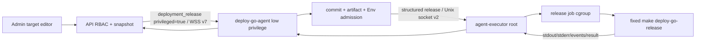
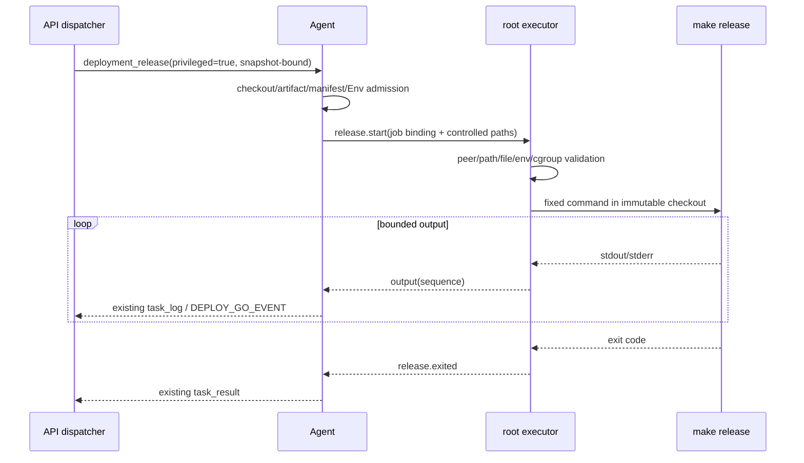
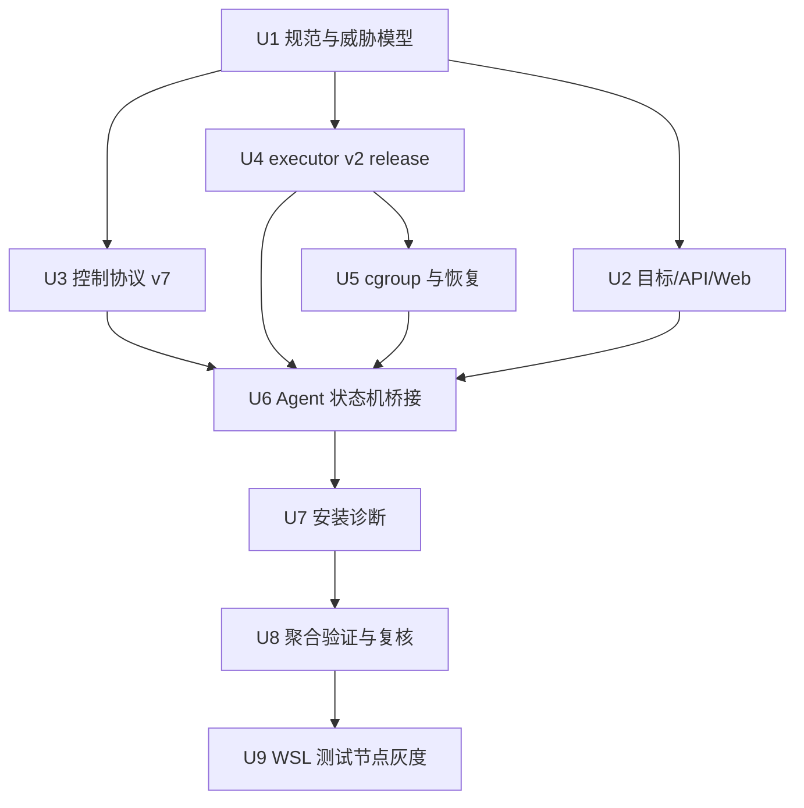

# Agent 原生结构化特权 Release 实施计划

## Goal Capsule

- **目标**：在不提升联网 Agent 和 prepare 阶段权限的前提下，由 Agent 内置 root executor 执行固定的 `make --no-print-directory deploy-go-release`，逐步替代业务应用在目标节点安装的专属 launcher 与 sudoers。
- **核心边界**：结构化 release 不是通用 root RPC，不复用浏览器终端或 PTY；主控、Agent 和 executor 均不得接受任意命令、executable、参数或环境变量集合。
- **兼容策略**：部署目标字段 `privileged_release` 默认关闭；关闭时保持现有低权限/launcher 行为，旧目标不迁移，特权执行失败时不自动降级执行后端。
- **授权事实**：管理员在部署目标上开启能力，配置进入 deployment snapshot；每次 release 只能执行该 snapshot 固定的目标、节点、环境和不可变 commit。
- **交付边界**：实现和本地/隔离验证完成后，只升级“测试环境节点（WSL）”并确认在线与 capability，不发起 `qfy-voucher-hub` 或其他业务部署，不连接或修改生产节点。

---

## Product Contract

### Problem Frame

现有两阶段部署已经能够由低权限 `deploy-go-runner` 完成 checkout、prepare、artifact/manifest 校验、Env gate 和 release 状态管理，但 release 若需要 Docker、systemd 或系统目录权限，仍依赖每个业务应用自行安装 launcher 和 sudoers。该方式将相同的权限桥接、安装、升级和审计责任重复分散到各业务仓库，也增加目标节点的应用专属系统文件。

Deploy Go 已有独立 root executor、受限 Unix Socket、cgroup v2 和 Agent 配对安装基础。本功能在 executor 中新增与 PTY 完全独立的结构化 deployment release operation，使目标节点只需维护 Deploy Go Agent/runner/executor；业务仓库继续提供标准 Make target 和业务 release 脚本，但不再为新模式提供节点安装文件。

### Actors

- **A1 管理员**：创建或编辑部署目标，开启/关闭 `privileged_release`，查看审计和能力状态。
- **A2 普通部署用户**：可按既有应用授权发起部署；可触发管理员预先授权并固化到 snapshot 的特权 release，但不能修改开关或获得终端权限。
- **A3 主控 API**：生成 snapshot、执行 RBAC 与 Agent capability 门禁、持久化任务/日志/结果和审计。
- **A4 低权限 Agent**：校验 checkout、artifact、manifest、Env 与任务目录，并通过本机结构化协议请求 executor；不直接创建 root 进程。
- **A5 root executor**：仅执行固定 release 入口，管理非 PTY root job、cgroup、日志、取消、超时和可恢复状态。

### Requirements

**部署目标、权限与快照**

- **R1**. `deployment_targets` 增加布尔字段 `privileged_release`，默认 `false`；已有目标和新建目标在未显式开启时行为不变。
- **R2**. 只有管理员可以创建或修改带有 `privileged_release` 的目标；普通用户即使拥有应用部署权限，也不能通过 HTTP payload、生成客户端或界面打开该配置。
- **R3**. `privileged_release` 必须进入 target snapshot、preview hash、deployment snapshot 和 target run snapshot；配置变化后旧 preview 必须以 `deployment_snapshot_changed` 失效。
- **R4**. 审计记录配置前后值以及部署的应用、目标、节点、commit、环境、操作者、执行后端和结果，不记录 Env、token、凭证或日志中的敏感正文。

**控制协议与能力协商**

- **R5**. Agent 控制协议升级到 v7，特权 `deployment_release` 必须明确携带 `privileged=true` 和主控签发的 release 专属授权；新增独立 capability `privileged_release`，不以 `pty_terminal` 推断。普通 release 在 wire 上省略该字段并按 `false` 处理，以保持 v6 Agent 兼容。
- **R6**. 特权 release 仅能由 snapshot 中 `privileged_release=true` 的目标产生；调度端不得读取当前 mutable target 行临时改变任务授权。
- **R7**. v6 及以下 Agent 继续支持其原有任务，但不得接收特权 release；主控在创建 release task 前检查协议和 capability，不兼容时不创建 `agent_task`，将对应 target run 及 deployment 收敛为 `failed` 并保存稳定错误码，不得永久停留在 `queued` 或静默降级为低权限 release。
- **R8**. `prepare` 无论目标配置如何，始终由低权限 runner 执行；`release` 后端在 deployment snapshot 创建时固定，任务重试和断线恢复不得切换后端。

**executor 固定操作与文件边界**

- **R9**. executor 本机协议升级到 v2，新增非 PTY、durable 的 deployment release operation；不得复用 terminal open/input/resize/close 或 capability replay 语义。
- **R10**. executor 只能在已验证 checkout 中执行固定入口 `make --no-print-directory deploy-go-release`，使用 `current_dir(checkout_dir)`；请求不得包含 command、shell、executable、args、Make target 或调用方附加参数。
- **R11**. checkout 必须是 Agent 为当前任务准备且绑定完整 commit SHA 的目录；executor 在执行前将 checkout、artifact、manifest 和 Env 安全复制并封存为 root-owned、低权限用户不可写的任务 bundle，root child 只能从该不可变 bundle 读取输入。cancel file 保持独立的受控可变信号，不进入只读输入集合。
- **R12**. Agent 与 executor 分层拒绝 symlink、hardlink、路径逃逸、非普通文件、目录身份不匹配、digest 不一致和任务目录越界；executor 必须从安全打开的源逐项复制、重新计算 digest、递归移除非 root 写权限，并在启动 root child 前独立复核 bundle，不能只信任 Agent 的布尔 admission 结果。
- **R13**. 路径和封存应使用 Linux 安全打开语义避免“先校验、后按可变路径重新打开”；并发改写源文件时，要么复制得到与已签名 digest 完全一致的稳定版本，要么在 spawn 前失败。仅使用字符串前缀、canonicalize、目录 fd 或只读 bind mount而未隔离可变 inode，均不足以作为 root 授权依据。
- **R13A**. executor 在接受任务前必须离线验证主控签发的 release 专属短期授权。授权使用与 PTY 区分的 audience/域分离，至少绑定 deployment/target-run/node/agent、snapshot hash、完整 commit、环境、release version、modules、任务 payload digest、deadline 和单次 nonce；Agent 不能签发或修改，executor 将 nonce 消费与 durable job 创建原子持久化以防重放。

**环境与凭证隔离**

- **R14**. root release 先清空继承环境，只注入固定平台变量与 executor 本机固定的最小 `PATH`；不得继承 Agent/API token、Git credential、Env secret lease、systemd service 环境或宿主用户配置。
- **R15**. 首版 release 变量白名单固定为 `DEPLOY_ID`、`DEPLOY_ENVIRONMENT`、`DEPLOY_RELEASE_VERSION`、`DEPLOY_COMMIT_SHA`、`DEPLOY_MODULES`、`DEPLOY_TARGET`、`DEPLOY_ARTIFACT_DIR`、`DEPLOY_ENV_DIR`、`DEPLOY_CANCEL_FILE`。新增变量必须更新协议、规范和测试，不接受业务自定义变量名。
- **R16**. 业务 Env 只通过受控 `DEPLOY_ENV_DIR` 中的文件提供，不展开为 root child 环境变量；平台自身的任务元数据、审计和 tracing 不输出文件正文。业务脚本的 stdout/stderr 属于受信部署日志，平台无法保证其中不含脚本主动输出的 Secret；日志继续遵守既有访问控制、保留策略和尽力脱敏边界。

**生命周期和部署状态机**

- **R17**. 特权 release 复用现有 agent task、deployment stage、journal、stdout/stderr、`DEPLOY_GO_EVENT`、退出码和最终状态语义，不创建平行部署状态机。
- **R18**. executor job 使用独立 job ID、payload digest、日志序号/offset 和 durable 状态；Agent 连接恢复后可查询并继续转发同一 job，不得重复启动 release。executor 本地日志必须有单 job 与全局字节上限、低磁盘水位、保留期限和明确截断标记；达到硬上限时终止任务并返回稳定错误，不能因 Agent 断线或慢消费无限写盘。
- **R19**. 取消和超时先向 root 进程组发送 SIGTERM，在有界宽限期后使用独立 cgroup 的 `cgroup.kill` 收敛整个任务；executor Socket/Agent WSS 断开也必须最终完成或终止任务，并向现有状态机传播准确终态。
- **R20**. root executor 不能绕过 artifact digest、manifest、Env gate、target snapshot、阶段顺序、deadline、幂等键或 release 已授权状态；任何 admission 事实不完整时 fail closed。

**安装、升级与迁移**

- **R21**. 配对安装器自动安装支持结构化 release 的同版本 Agent/executor 和现有 runner service，验证三项服务、两个本机协议和 capability 后再上报可用。
- **R22**. `status`/`doctor` 显示 Agent 版本、控制协议 v7、runner broker 协议、executor v2 以及 `privileged_release` capability 的可用/不可用原因，不泄漏凭证。
- **R23**. 现有 launcher 和低权限 release 暂时兼容；开启 `privileged_release` 的目标固定使用 executor，关闭后固定使用原模式，不在同一次部署内自动回退。
- **R24**. 完成本地和隔离验证后，仅对“测试环境节点（WSL）”执行配对升级与在线/capability 检查；不启用其他节点，不发起业务 prepare/release。

### Key Flows

- **F1 管理员授权目标**：A1 编辑两阶段部署目标并开启开关；API 校验管理员，递增 target version，审计变化；后续 preview 包含新 snapshot hash。覆盖 R1-R4。
- **F2 特权两阶段部署**：A2 创建已授权目标的部署；prepare 由 runner 完成；release 经过 commit/artifact/Env/snapshot 门禁后由 executor 固定入口执行，日志和结果进入原状态机。覆盖 R5-R20。
- **F3 不兼容 Agent 拒绝**：目标 snapshot 要求特权 release，但在线节点 Agent 未达到 v7 或未声明 capability；主控不创建 release task，将 target run 与 deployment 收敛为 failed 并给出稳定错误，不尝试 launcher/runner。节点离线仍沿用现有等待/取消语义。覆盖 R5-R8、R23。
- **F4 取消、超时与重连**：运行中的 root release 收到取消、超过 deadline 或 Agent 断线；executor 保留 durable job 身份并按规则恢复观察或终止整个 cgroup，最终只产生一个任务结果。覆盖 R17-R20。
- **F5 WSL 灰度升级**：管理员明确执行阶段到达后，仅升级测试环境节点；installer 验证配对版本和服务，节点在线并上报 capability，再运行平台 self-test，但不创建业务 deployment。覆盖 R21-R24。

### Acceptance Examples

- **AE1**. 非管理员提交 `privileged_release=true` 创建或编辑目标得到 403；管理员操作成功且审计能看到字段变化。
- **AE2**. 管理员开启开关后，使用开启前的 preview 创建部署得到 `deployment_snapshot_changed`；新 deployment 和 target run snapshot 均保存 `true`。
- **AE3**. v6 Agent 仍能执行普通低权限 release；要求特权 release 时得到稳定 incompatibility 错误，节点不产生 root 或 runner child。
- **AE4**. executor 收到带 command、args、额外 env key、相对路径、`..`、symlink、FIFO/socket/device 或其他任务 artifact/Env 的请求时，在 spawn 前拒绝。
- **AE5**. 合法 fixture 中 root release 输出可实时到达 API，`DEPLOY_GO_EVENT` 正常改变进度，退出码 0 产生 succeeded，非零退出码原样产生 failed。
- **AE6**. release fork 出忽略 TERM、setsid 或后台进程后，取消和超时仍使任务 cgroup 变为空；重复 cancel 幂等。
- **AE7**. Agent 在 release 中途断线并重连，不会重复执行 Make target；日志从已确认 offset 继续，最终状态唯一。
- **AE8**. root child 的环境快照只包含固定最小系统变量和 R15 白名单，不包含注入到 Agent unit 的敏感 fixture。
- **AE9**. 未开启开关的现有目标、旧 launcher 路径和 prepare 行为与变更前一致。
- **AE10**. WSL 测试节点升级后 `doctor` 显示新版本、协议与 capability 均兼容，主控显示在线；数据库中不存在因此次验证创建的业务部署任务。
- **AE11**. executor 拒绝缺失、篡改、过期、错节点/Agent/snapshot/commit 绑定和重复 nonce 的 release 授权；Agent 自行构造的任务不能启动 root child。
- **AE12**. 在 executor 封存期间并发修改 checkout、artifact 或 Env 时，root child 只能看到 digest 匹配的 root-owned bundle，或任务在 spawn 前失败；封存后低权限 Agent/runner 无法改写 bundle。
- **AE13**. WSL 节点运行平台自带的无业务副作用 privileged release self-test，能证明固定 Make 入口、root UID、环境白名单、日志/事件、退出码和 cgroup 清理；测试不访问业务 Env、Docker、systemd 业务服务或生产数据。

### Success Criteria

- 特权 release 的授权、路径、环境和生命周期负面测试均在 spawn root child 前或受控 cgroup 内失败，不遗留 root 进程。
- 协议 v7/v6 兼容矩阵、executor v2/v1 配对检查和既有低权限两阶段测试全部通过。
- OpenAPI 产物与 Web、Flutter 生成客户端无漂移；Web 仅向管理员展示配置且错误原因明确。
- WSL 灰度证明安装、在线、版本、capability 和平台 self-test，不依赖或触发任何业务仓库部署。

### Scope Boundaries

**本计划范围**

- 两阶段部署的 release 阶段；单脚本模式不获得特权执行。
- 每个 deployment target 独立授权；不复用节点 `privileged_execution` 终端开关。
- 固定 Make target、固定环境白名单、受控文件目录和非 PTY日志流。
- Agent/executor 配对安装、诊断、兼容和 WSL 测试节点灰度。

**后续再做**

- 逐业务应用移除已有 launcher/sudoers 的迁移计划与回退演练。
- 特权 release 审批、双人复核、commit 签名/受保护分支策略和策略引擎。
- 将文件、systemd、Docker/Compose 管理扩展为其他结构化 executor operation。

**明确不做**

- 不提供后台任意 root 命令 API，不把终端输入包装成 deployment release。
- 不删除现有 launcher 示例或兼容实现，不自动迁移已有目标。
- 不把 cgroup 描述为对恶意 root 业务代码的安全沙箱。
- 不操作其他项目、生产节点或发起 `qfy-voucher-hub` 部署。

### Key Product Decisions

- **部署目标独立开关**（session-settled: user-directed）：字段名固定为 `privileged_release`，不复用节点终端的 `privileged_execution`。Governs R1-R8。
- **已授权目标可由普通部署用户触发**（conversation-derived）：管理员控制“该目标是否允许 root release”，普通用户继续只控制“是否发起其有权部署的应用”；这不会赋予终端权限。Governs R2、R4、R6。
- **prepare 永远低权限，release 才可特权**（session-settled: user-directed）：保留构建面与联网凭证的最小权限。Governs R8、R17。
- **固定入口而非任意命令**（session-settled: user-directed）：executor 内部固定 Make 命令和参数，请求只表达任务身份与受控路径。Governs R9-R16。
- **snapshot 固定后端且不自动降级**（analysis-derived）：防止配置变化或兼容回退改变已审核 deployment 的权限语义。Governs R3、R6-R8、R23。
- **目标授权同时信任配置仓库与分支的写入者**（analysis-derived）：结构化入口限制调用面，但获准 commit 中的 Makefile/脚本拥有主机 root 能力。管理员开启开关时必须明确确认该应用仓库和固定部署分支的写入者可被视为目标节点 root 操作者；仓库 URL、固定 ref、解析 commit 与确认事实进入 snapshot/审计。完整 SHA 只保证执行对象不变，不独立证明代码可信；逐 commit 审批、签名和仓库保护 API 验证留待后续。Governs R2-R6、R11-R13A、R20。

---

## Planning Contract

### Key Technical Decisions

- **KTD1 控制协议 v7 + 向后兼容字段**：`DeploymentReleaseTask` 增加 `privileged`，反序列化缺失值按 `false`，普通任务序列化时省略 `false`，因此旧 v6 Agent 不会看到未知字段；特权任务必须在协商 v7 后携带 `true`。`AgentCapability` 新增 `PrivilegedRelease`，schema 继续拒绝其他未知字段。
- **KTD2 executor 协议 v2 采用 durable job 模型**：新增 start/status/output/cancel/exited 操作，使用 job ID、payload digest 和日志 offset；终端 PTY session 继续保持现状，两种 operation 不共享消息或生命周期。
- **KTD3 主控授权、Agent admission、executor 封存三层门禁**：API 使用 release 专属签名授权证明 snapshot 的管理员授权；checkout/下载/digest/Env gate 继续由现有 task handler 完成；executor 离线验签后，将源输入复制成 root-owned immutable bundle并重新验证 digest，再从 bundle 执行。任一层不完整均拒绝。
- **KTD4 snapshot 是调度授权事实**：调度器从 deployment/target-run snapshot 读取 `privileged_release` 并生成 `privileged`，不从当前 target 行决定执行后端；当前 SQL 中对 mutable `execution_mode` 的依赖需一并收敛，避免同类 snapshot 漂移。
- **KTD5 root child 使用干净环境**：executor `env_clear()` 后设置固定最小 `PATH` 和 R15 白名单；不加载 login profile，不设置业务可控 `HOME`/`SHELL`，避免宿主配置改变部署行为。
- **KTD6 cgroup 抽象为 executor job 资源边界**：将当前 `terminal-*` 专用实现提取为可验证的通用子 cgroup机制，再由 PTY session 与 `release-*` job 分别使用；清理失败继续 fail closed。
- **KTD7 无失败自动降级**：snapshot 选择 root executor 后，在线 Agent 协议不兼容、capability/executor 不健康时，在创建 release task 前把 target run 与 deployment 标记为 failed；任务已创建后的执行失败按现有状态机收敛为 failed。任何情况都不能转交 runner 或 launcher 再执行一次具有副作用的 release。
- **KTD8 版本成对发布**：Agent 应用版本在实施时递增一个兼容版本，控制协议固定 v7、executor 协议固定 v2；最终版本号以 release 单元更新的 workspace/package 版本为准，并同步 manifest、安装 fixture 与 doctor。

### Alternatives Considered

- **systemd transient unit + journald**：可复用 systemd 的 cgroup、终止和日志 cursor，但会把 deployment 日志写入宿主全局 journal、引入 D-Bus/systemd-run 属性构造与不同 WSL/systemd 版本兼容面，也不消除 root-owned bundle、签名授权和幂等状态的需求。首版继续使用 executor 自管 child、专属 cgroup 和有界 root-owned job journal，以复用当前 executor cgroup 安全实现并保持日志隔离；U5 隔离测试若证明无法可靠恢复/清理，必须回到计划评审而不是临时混用 transient unit。
- **直接从低权限 checkout 执行**：即使使用 no-follow 或只读 bind mount，低权限写入者仍可修改同一 inode，无法关闭校验到执行的竞态，因此拒绝，采用 root-owned 封存 bundle。
- **复用 PTY capability**：终端授权绑定浏览器 session 与短生命周期交互，无法表达 deployment snapshot、artifact/Env digest 和 durable job；采用独立 release claims、audience、nonce namespace 和 verifier。

### High-Level Technical Design

### Existing Patterns

- Target DTO、管理员写权限与审计：`api/src/deployment_targets/mod.rs`、`api/tests/deployment_targets_api.rs`。
- Snapshot 与 preview 失效：`api/src/execution_spec.rs`、`api/src/deployments/mod.rs`、`api/tests/execution_spec.rs`、`api/tests/two_stage_deployment.rs`。
- 两阶段调度、artifact/Env gate：`api/src/agents/dispatcher.rs`、`agent/src/task_handler.rs`、`agent/src/executor.rs`。
- Durable journal、日志与取消：`agent/src/journal.rs`、`agent/src/runner.rs`、`agent/src/runner_service.rs`、`agent/tests/recovery.rs`。
- executor Socket、peer、PTY 与 cgroup：`agent-executor/src/protocol.rs`、`agent-executor/src/main.rs`、`agent-executor/src/cgroup.rs`、`agent-executor/tests/`。
- 配对安装与诊断：`agent/install/install.sh`、`agent/release/generate-manifest.sh`、`agent/src/diagnostics.rs`、`docs/runbooks/agent-onboarding.md`。
- 既有演进约束：`docs/standards/privileged-release-launcher.md`、`docs/standards/privileged-agent-executor.md`、`docs/standards/application-deployment-contract.md`。

### Implementation Units

#### U1 规范、威胁模型与兼容合同

**目标**：先把 launcher 与结构化 release 的边界、root commit 信任、协议版本和失败策略写成权威规则，避免实现期间产生两套语义。

**涉及文件**：

- `docs/standards/privileged-release-launcher.md`
- `docs/standards/privileged-agent-executor.md`
- `docs/standards/agent-control-protocol.md`
- `docs/standards/agent-installation-contract.md`
- `docs/standards/application-deployment-contract.md`
- 新增 `docs/runbooks/privileged-agent-release.md`

**实施要点**：

- 定义 `privileged_release` 与节点 `privileged_execution`、`pty_terminal` 完全独立。
- 固定控制协议 v7、executor v2、能力名、环境白名单、错误码与不降级规则。
- 明确业务 commit 获得 root 权限、cgroup 仅负责资源回收、不构成恶意 root 沙箱。
- runbook 分离本地验证、WSL 灰度、回退和禁止业务部署的检查步骤。

**验证场景**：规范之间不存在“普通 release 永远低权限”与新能力冲突；launcher 被标记为兼容路径而非立即废弃；runbook 不包含生产或业务部署默认动作。

#### U2 部署目标、快照、API、审计与 Web 配置

**目标**：建立管理员控制、默认关闭且不可被旧 preview 绕过的持久授权事实。

**涉及文件**：

- 新增 `api/migrations/0018_privileged_deployment_release.sql`
- `api/src/deployment_targets/mod.rs`
- `api/src/execution_spec.rs`
- `api/src/deployments/mod.rs`
- `api/tests/migrations.rs`
- `api/tests/deployment_targets_api.rs`
- `api/tests/execution_spec.rs`
- `api/tests/two_stage_deployment.rs`
- `api/tests/audit_api.rs`
- `admin/src/features/targets/TargetEditor.tsx`
- `admin/src/test/DeploymentFlow.test.tsx`
- `api/openapi/openapi.json`
- `admin/src/api/generated/`
- `admin-app/lib/api/generated/`

**实施要点**：

- migration 只新增字段，不修改历史 migration；字段只允许两阶段目标开启。
- DTO、SQL row、expand、snapshot 和 hash 全链路携带字段。
- create/update 保持管理员校验，审计记录 before/after；普通用户 detail 可见执行方式，但不能进入编辑动作。
- Web 仅在两阶段目标显示开关；开启后展开确认区，展示应用仓库 URL、固定 ref、目标节点，以及“该仓库/ref 写入者将获得节点 root 执行能力”，管理员必须勾选默认未选中的确认项才能保存。确认内容、操作者和时间进入审计；关闭时提示只影响后续 snapshot，不改变运行中部署。
- 应用仓库 URL、固定 ref 或目标节点变化后，原确认自动失效；下一次保存或 preview 前必须由管理员重新确认并生成新 target version/snapshot hash。
- 目标编辑器展示最近上报的协议、`privileged_release` capability、executor v2 健康和时间，区分可用、在线不兼容、executor 不健康、离线、未知/加载失败。任何状态都允许管理员先保存授权以支持“先配置后升级”，但非可用状态必须强警告；部署 preview 在已知不兼容时拒绝，preview 后状态退化则由 R7 收敛失败。
- 保存期间禁用重复提交；成功后用服务端响应刷新开关/version；403/422 显示明确原因；version 冲突要求刷新并重新确认；网络/服务端失败恢复服务端权威值，不保留误导性的已开启外观。
- 重新生成 OpenAPI 和双端 client，不手改 generated 文件。

**验证场景**：默认值与历史行兼容；非管理员 403；单脚本目标开启返回 422；未确认不能保存；各 capability 状态、保存 pending/成功/403/422/冲突/网络失败反馈准确；字段变化使旧 preview 409；snapshot/run snapshot 值不随目标后续变化；审计无 Env/token 正文；OpenAPI/client 无漂移。

#### U3 Agent 控制协议 v7 与调度 capability 门禁

**目标**：让主控明确表达特权 release，并在任务产生前拒绝旧 Agent 或未声明能力的节点。

**涉及文件**：

- `Cargo.toml`
- 新增 `release-authorization/Cargo.toml`
- 新增 `release-authorization/src/lib.rs`
- 新增 `release-authorization/tests/authorization.rs`
- `agent-protocol/src/lib.rs`
- `agent-protocol/schema/agent-control.schema.json`
- `agent-protocol/tests/schema_compatibility.rs`
- `api/src/agents/dispatcher.rs`
- `api/src/agents/websocket.rs`
- 新增 `api/src/release_authorization.rs`
- `api/src/lib.rs`
- `api/tests/agent_dispatcher.rs`
- `api/tests/agent_websocket.rs`
- `api/tests/agent_end_to_end.rs`

**实施要点**：

- `PROTOCOL_VERSION=7`，保留既有最低兼容范围；`privileged=true` 只用于 v7 特权任务，普通任务 wire payload 省略该字段并由新 Agent default 为 `false`。
- Agent 只有在 executor v2 release probe 健康时声明 `privileged_release`；PTY 可用性独立探测。
- dispatcher 从 snapshot 读取授权，检查目标 Agent negotiated protocol/capability，再创建特权任务。
- Env gate、artifact manifest/digest 和 release 输入冻结后，API 才为特权任务签发专用、域分离的授权；canonical claims 直接绑定 snapshot/target run/node/Agent/commit、checkout tree、artifact manifest 与逐 artifact digest、Env 文件名与内容 digest、结构化变量、cancel-file 身份、payload digest、deadline 和 nonce，Agent 只能透传。executor 以签名 claims 中的摘要为信任根验证 bundle。
- release authorization 使用独立 claims/audience 和签名器模块；API 私钥沿用服务端 root-owned Secret 配置模式，installer 只把对应公钥写入 executor 配置。即使底层采用同一密码学算法，也不能接受 PTY claims 或共享 nonce namespace。
- 定义稳定拒绝码，例如 protocol unsupported、capability unavailable、snapshot unauthorized；在线节点不兼容时不创建 task，直接通过既有 target-run 聚合路径收敛 deployment failed。

**验证场景**：v7 特权任务拒绝缺失/非 true/额外高风险字段；v6 普通任务不含新字段且仍通过；v6 或无 capability 的特权任务明确失败而不永久排队；签名授权篡改/过期/错绑定被拒绝；伪造当前 target 开关不能改变旧 snapshot；prepare payload 永远无特权路径。

#### U4 executor v2 结构化 Release、环境白名单与路径门禁

**目标**：实现不接受任意命令的 root release job，以及 root spawn 前的独立文件系统授权检查。

**涉及文件**：

- `agent-executor/src/protocol.rs`
- `agent-executor/src/main.rs`
- 新增 `agent-executor/src/release.rs`
- `agent-executor/src/config.rs`
- `release-authorization/src/lib.rs`
- `release-authorization/tests/authorization.rs`
- `agent-executor/tests/protocol.rs`
- 新增 `agent-executor/tests/release_admission.rs`
- 新增 `agent-executor/tests/release_lifecycle.rs`

**实施要点**：

- executor v2 request 只携带 release 授权、job/deployment/commit、受控目录身份，以及构造 R15 白名单所需的 environment/release version/modules/target 等严格结构化元数据；不包含 executable、args、Make target 或任意 env map。
- 使用 release 专属 verifier 离线验证主控签名；nonce 消费记录和 durable job 首次状态原子提交，不能复用 PTY capability 或消费目录语义。
- executor 从安全打开的 checkout、artifact、manifest 和 Env 源复制为 root-owned bundle，拒绝 symlink/hardlink/非普通对象，并重新验证 Git tree/manifest/artifact/Env digest；封存后低权限身份不可写。
- executor 内部构造固定绝对路径 `make` 的 `Command`，将 bundle checkout 设置为 cwd，`env_clear()` 后从结构化元数据和 bundle 路径注入固定白名单。
- job 元数据和输出使用 root 专用目录原子持久化，payload digest 阻止同 job ID 不同请求重放；cancel file 作为独立信号，不允许替换 bundle 输入。
- root-owned job 日志按固定分块和 checksum 持久化，实施单 job/全局预算、保留期限和磁盘低水位；超限产生截断标记并终止 job，清理不得删除仍需 Agent reconcile 的唯一终态元数据。

**验证场景**：任意命令/参数/env map 因 unknown field 拒绝；授权缺失、篡改、过期、错绑定和重放被拒绝；路径逃逸、symlink ancestor/leaf、hardlink、FIFO/socket/device、其他任务目录和 digest 不匹配均不 spawn；并发修改源只能得到 digest 一致的封存副本或失败；敏感宿主环境 fixture 不进入 child；合法 release 输出、退出码和幂等 status 正确。

#### U5 通用 executor job cgroup、取消、超时与断线恢复

**目标**：确保 root release 的完整进程树可收敛，并让 Agent 断线不造成重复执行或失联任务。

**涉及文件**：

- `agent-executor/src/cgroup.rs`
- `agent-executor/src/main.rs`
- `agent-executor/src/release.rs`
- `agent-executor/tests/cgroup_v2_lifecycle.rs`
- `agent-executor/tests/run-cgroup-v2-container.sh`
- `agent-executor/tests/release_lifecycle.rs`

**实施要点**：

- 把 terminal cgroup 的安全创建/kill/empty/remove 抽成通用内部能力，保留 terminal 既有行为。
- release job 独立命名、单调状态和清理 gate；先 TERM 进程组，再在宽限期后 `cgroup.kill`。
- Socket 断开不等于浏览器终端断开：durable release 继续受 deadline 管理，Agent 可通过 status/output offset 重新附着。
- executor 重启后的状态需要明确：能够证明 child 已消失则终结 interrupted；不能证明安全终态时封锁新特权 release 并暴露 doctor 失败。
- 测试覆盖 Agent 长时间断线且 root child 持续输出、单 job/全局预算、低磁盘水位、日志截断和过期清理，确保不会耗尽根分区。

**验证场景**：正常退出、非零退出、超时、显式取消、Agent Socket 断开/重连、executor 重启、忽略 TERM、setsid、double-fork 和重复 cancel；所有场景最终 cgroup 为空且任务只有一个终态。

#### U6 Agent executor bridge 与现有部署状态机接入

**目标**：在保持现有 admission、日志、事件和恢复语义的情况下，仅替换已授权 release 的进程后端。

**涉及文件**：

- `agent/src/executor_client.rs`
- `agent/src/main.rs`
- `agent/src/task_handler.rs`
- `agent/src/executor.rs`
- `agent/src/journal.rs`
- `agent/tests/executor.rs`
- `agent/tests/task_handler.rs`
- `agent/tests/two_stage.rs`
- `agent/tests/recovery.rs`
- 新增 `agent/tests/privileged_release.rs`

**实施要点**：

- prepare 和 `privileged=false` 继续走 runner；`privileged=true` 在所有现有 artifact/Env/commit admission 通过后调用 executor bridge。
- executor output 转换成现有 journal/log event，继续使用 `DEPLOY_GO_EVENT` parser 和日志预算。
- cancel/deadline/connection reconcile 通过 job ID 和 offset 查询 executor，不重复 start。
- capability 仅在 release probe 健康且协议 v2 完整时上报；终端 probe 失败不应错误关闭 release capability，反之亦然。

**验证场景**：root release 成功和非零退出传播；stdout/stderr 实时顺序与事件解析；Env gate/digest/snapshot 未通过时 executor 零调用；取消/超时/重连唯一执行；旧低权限 release fixture 完全兼容。

#### U7 安装器、发布清单、systemd 与 Doctor

**目标**：把 v7 Agent、v2 executor 和 runner 作为可回滚配对交付，并让节点管理员能判断特权 release 是否可用。

**涉及文件**：

- `agent/install/install.sh`
- `agent/install/test-systemd-contract.sh`
- `agent/tests/install.bats`
- `agent/install/deploy-go-agent-executor.service`
- `agent/release/generate-manifest.sh`
- `agent/release/manifest-v2.schema.json`
- `agent/release/test-generate-manifest.sh`
- `agent/src/diagnostics.rs`
- `release-authorization/src/lib.rs`
- `agent/tests/fixtures/release/`
- `api/src/agents/mod.rs`
- `api/tests/agent_releases.rs`
- `docs/runbooks/agent-onboarding.md`
- `docs/runbooks/agent-recovery.md`

**实施要点**：

- 安装器继续事务化升级 Agent/executor、三个 unit 和配置，不安装应用 launcher/sudoers。
- 安装命令携带 API 当前 release authorization 公钥，executor 配置原子写入并校验；私钥绝不进入 Agent、installer 输出或节点。
- executor unit 的 `Delegate=yes`、Socket 和 root 数据目录满足 release job；不破坏现有 PTY。
- manifest 明确 Agent/executor 同版本和协议范围；旧配对恢复可继续普通部署。
- doctor 分别报告 runner protocol、executor terminal protocol、executor release protocol/capability。

**验证场景**：首次安装、重复安装、升级、executor v1 不兼容、部分替换失败回滚、三个服务版本不一致、Socket 权限错误和 cgroup v2 缺失；失败时普通低权限 Agent 能力按既有恢复策略保留，特权 capability 不上报。

#### U8 聚合验证、OpenAPI 一致性与兼容回归

**目标**：用一套可重复入口证明权限、协议、状态机、安装和旧行为没有断裂。

**涉及文件**：

- `Makefile`
- 视实现补充 `api/tests/`、`agent/tests/`、`agent-executor/tests/` 与 `admin/src/test/`
- `docs/runbooks/local-development.md`
- 新增 `docs/reviews/2026-08-10-agent-native-privileged-release-review.md`

**实施要点**：

- 新增聚焦入口 `make privileged-release-check`，聚合协议、executor、Agent、API、Web、安装器和 Linux cgroup 测试。
- 执行 `make api-openapi-check`、`make api-client-check`、`make admin-test` 及全仓适配检查。
- 复核所有错误路径不记录 Env/token 正文，不残留 root child，不改变 launcher fixture。

**验证场景**：逐项覆盖用户列出的授权、snapshot、任意命令/路径、symlink、Env 白名单、日志、退出码、取消/超时/断线、低权限兼容与 OpenAPI/client 一致性；记录 macOS 无法本机证明的 Linux cgroup 项，并以隔离 Linux 容器结果补齐。

#### U9 WSL 测试节点灰度与交付信息

**目标**：在用户对具体节点再次明确远程授权后，验证新 Agent 能力上线并运行平台自带的无业务副作用 self-test，不执行任何业务部署。

**涉及文件**：

- `docs/runbooks/privileged-agent-release.md`
- `docs/reviews/2026-08-10-agent-native-privileged-release-review.md`

**前置门禁**：

- U1-U8 已提交推送且聚焦/全仓验证通过。
- 用户在执行时明确授权连接并升级“测试环境节点（WSL）”；本计划本身不构成远程执行授权。
- 已确认节点 ID/Agent ID/环境，且不是生产节点。

**灰度步骤边界**：

- 使用新版幂等安装器配对升级 Agent/runner/executor。
- 检查三个服务、版本、协议、doctor、WSS 在线状态和 `privileged_release` capability。
- 运行 Deploy Go 自带、固定 fixture 的结构化 privileged release self-test，只输出测试事件并退出，用于证明 executor v2、root UID、环境白名单、日志回传、退出码和 cgroup 清理；fixture 不读取业务 Env，不调用 Docker，不操作 systemd 业务服务或生产数据。
- 不创建或修改 `qfy-voucher-hub` 部署目标，不点击 prepare/release，不使用 root 终端执行验证命令。
- 失败时按 runbook 回滚配对版本并确认原普通 Agent 恢复在线。

**完成输出**：报告新 Agent/控制协议/executor 协议版本、testing 节点在线状态、字段名、release 环境变量契约，以及业务仓库仍需/不再需要的节点文件。

### Sequencing

每个单元按“实现 -> 聚焦测试 -> `git diff --check` -> 小闭环提交推送”完成。U4/U5 可以在不接主控的 executor fixture 中先证明 root 边界；U9 必须最后执行，且需要当时新的远程授权。

### Risks And Mitigations

- **业务 commit 获得完整 root**：管理员授权 target，部署锁定完整 commit SHA；界面和审计明确显示 commit 与特权后端。后续受保护分支/签名审批不冒充首版已有能力。
- **仓库写入者间接获得 root**：管理员开启开关时必须确认并审计“固定仓库/分支写入者等同节点 root 操作者”；若无法接受该信任关系则不得开启，后续再引入逐 commit 审批、签名或仓库保护验证。
- **TOCTOU 路径替换**：Agent admission 后 executor 安全复制并重新校验为 root-owned immutable bundle；root spawn 不从低权限可写源直接执行，也不重新信任可变路径字符串。
- **Agent 伪造 executor 请求**：主控签发 release 专属、域分离、短期且单次的授权；executor 离线验签并原子防重放，Unix peer 校验只作为纵深防御。
- **断线导致重复副作用**：executor durable job 以 job ID + payload digest 幂等，Agent 恢复只 attach/status，不重复 start。
- **root 后台进程遗留**：独立 cgroup v2、进程组 TERM 与 `cgroup.kill`；清理失败封锁新任务并由 doctor 暴露。
- **旧 Agent 被错误降级执行**：调度前同时检查 snapshot、协商协议和 capability；失败不转 runner/launcher。
- **敏感环境泄漏**：`env_clear()`、固定白名单、受控 Env 目录、日志/审计敏感 fixture 扫描。
- **离线日志耗尽磁盘**：executor 实施单 job/全局硬预算、低磁盘水位、保留期限与截断终态；不能依赖 Agent 消费速度形成背压。
- **PTY 回归**：cgroup 和 executor 协议扩展保持 operation 隔离，既有 terminal 全套测试继续作为门禁。
- **安装半升级**：Agent/executor 同版本 manifest、事务化替换和回滚；capability 仅在本机协议 probe 成功后声明。

### Verification Strategy

**开发闭环**

- API/快照：`cargo test -p deploy-go-api --test deployment_targets_api --test execution_spec --test two_stage_deployment --test agent_dispatcher --test audit_api --test openapi_contract`
- 协议/Agent：`cargo test -p deploy-go-agent-protocol -p deploy-go-agent`
- executor：`cargo test -p deploy-go-agent-executor`
- Linux 身份与 cgroup：`make agent-runner-isolation-check`、`make agent-executor-cgroup-check`
- 安装：`make agent-install-check`、`make agent-manifest-check`
- Web：`make admin-test`、`make admin-check`
- 契约生成：`make api-openapi-check`、`make api-client-check`

**完成门禁**

- `make privileged-release-check`
- `make check`
- `git diff --check`
- `git diff --cached --check`
- 重要安全改动执行 `$ce-code-review`，发现问题回到对应实施单元修复并重新验证。

**运行态验证**

- 只按 U9 和 `docs/runbooks/privileged-agent-release.md` 检查 WSL 节点安装、在线、capability 和平台 self-test。
- 不以真实业务 release 作为本功能首轮灰度验证；完整成功/失败/取消矩阵由隔离 Linux fixture 证明，WSL 只运行无业务副作用 self-test。

### Documentation And Operational Notes

- `docs/standards/` 定义长期协议和安全边界；具体安装、灰度、诊断、回退以 `docs/runbooks/privileged-agent-release.md` 为准。
- `docs/standards/privileged-release-launcher.md` 在迁移完成前继续有效，需要清楚标注两种模式如何选择，不能互相自动回退。
- `docs/runbooks/agent-onboarding.md` 与 `docs/runbooks/agent-recovery.md` 同步三服务版本/协议检查，但不重复完整特权 release 操作手册。
- 若实施中发现现有 snapshot 调度仍依赖 mutable target 导致范围扩张，应在 U2/U3 内收敛与本功能相关的读取，不进行无关部署重构。

### Definition Of Done

- R1-R24、R13A 和 AE1-AE13 均有对应实现或自动化/隔离验证证据。
- deployment snapshot 是特权授权和执行后端的唯一事实，旧 preview 可准确失效。
- executor 无任意命令、参数或环境注入面，能独立验证主控授权，root child 只能从 root-owned immutable bundle 运行固定 Make target。
- 日志、事件、退出码、取消、超时、断线恢复与现有部署状态机一致，且无 root 进程残留。
- 旧低权限 release、launcher、PTY terminal 和旧 Agent 普通任务兼容测试通过。
- OpenAPI 与双端生成客户端一致，Web 管理员开关和审计完整。
- 安装器与 doctor 能证明 Agent/runner/executor 配对版本及 `privileged_release` capability。
- 仅 WSL 测试节点在再次授权后完成灰度，未触发任何业务部署，未操作生产节点。
- 死路实验、临时调试输出和未采用实现全部清理，不留隐藏脚本层或绕过规范的兼容分支。

### Product Contract Preservation

本计划由当前会话中已确认的需求直接引导，未发现与产品目标冲突；对原需求仅补充了当前实现实际使用的 `DEPLOY_TARGET` 环境变量，以及“snapshot 固定后端且不自动降级”的安全语义，没有扩大到任意 root 命令或生产操作。
