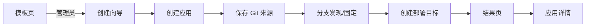

# 应用模板创建向导实施计划

## Goal Capsule

- **目标**：管理员从「应用模板」页进入创建向导，用 PostgreSQL / Redis 模板
  创建应用、Git 来源与两阶段部署目标，并拿到 Env 示例与后续步骤。
- **核心边界**：向导只编排现有 API，不新增后端接口或数据库字段；不自动创建
  业务仓库，不自动登记 Env 明文，不连接或修改真实节点。
- **完成条件**：Web 向导可通过 mock API 端到端创建应用、固定分支并创建目标；
  非管理员不可访问；模板 Env 示例与 runbook 同步。

## Product Contract

### Problem Frame

模板页目前只能只读查看文件。用户仍要在应用列表、应用详情、Git 来源、目标
编辑器之间手工复制参数，流程长且容易填错。本功能把“选模板 -> 建应用 ->
配来源与分支 -> 建目标 -> 准备 Env”合并为一个向导。

### Actors

- **A1 管理员**：创建应用、配置 Git 来源、固定分支、创建两阶段部署目标。
- **A2 普通用户**：可查看模板文件，不能进入创建向导。
- **A3 现有 API**：应用、来源、分支发现、目标创建接口；向导不修改它们。

### Requirements

- **R1**. 向导路由 `/templates/new` 只允许管理员访问，入口只出现在管理员的
  模板页。
- **R2**. 向导步骤固定为：选择模板 -> 应用信息 -> Git 来源与固定分支 ->
  部署目标 -> 确认与结果。
- **R3**. 模板预填应用说明、slug 建议、参数 Schema、脚本占位路径、超时、
  TCP 验证配置和 Env 示例；预填值来自 `examples/templates/*` 现有文件。
- **R4**. 创建顺序固定：应用 -> 来源保存 -> 分支发现与固定 -> 目标创建；
  目标只能在来源 `status=verified` 后创建。
- **R5**. 任一 API 步骤失败时不自动回滚；结果页列出已创建资源并链接到应用
  详情，用户可继续配置。
- **R6**. Env 文件不自动上传。向导在确认页展示 `compose.env` 与
  `<service>.env` 示例、复制按钮和 runbook 指引。
- **R7**. 向导不新增后端接口、不新增 migration、不发起部署任务。
- **R8**. 分支发现复用现有轮询语义，失败可重试；Agent 离线或仓库不可达时
  给出稳定错误。

### Key Flows

- **F1 完整创建**：A1 选择模板，填写应用信息，保存来源，轮询分支发现，选择
  并固定分支，填写目标配置（含可选 `privileged_release` 确认），提交后创建
  目标并跳转应用详情。
- **F2 仅创建应用**：A1 在来源步骤选择“仅创建应用”，向导只创建应用并给出
  后续配置清单。
- **F3 非管理员拒绝**：A2 直接访问 `/templates/new` 得到 403，不出现入口。

### Acceptance Examples

- **AE1**. 管理员完整创建成功后，数据库存在一个新应用、一条 verified 来源、
  一条两阶段目标；结果页有应用详情链接。
- **AE2**. 分支发现失败后重试成功；来源保存失败时结果页提示已创建应用并可
  继续到应用详情。
- **AE3**. 非管理员路由被拒绝；模板页不显示创建按钮。
- **AE4**. 目标创建请求的 `parameter_schema` 与模板 `parameter-schema.json`
  一致；`privileged_release=true` 时未确认会被拒绝并显示原因。
- **AE5**. Env 示例内容与 `compose.env.example`、`postgres.env.example` /
  `redis.env.example` 一致，不包含真实密码。

### Success Criteria

- 向导成功路径和“仅创建应用”路径都有测试覆盖。
- 管理端 lint / typecheck / 全部测试 / build 通过。
- 不产生后端 diff，不操作真实节点或创建真实业务应用。

### Scope Boundaries

**本计划范围**

- Web 创建向导、模板入口、向导样式与测试。
- runbook 与模板 README 的向导说明。

**后续再做**

- Env 文件的管理员首次登记 UI（当前只支持 Agent lease 登记）。
- 模板 zip/tar 一键下载与独立仓库脚手架。
- 从已有应用反向“生成模板”或模板版本管理。

**明确不做**

- 不新增后端模板复合接口，不改部署目标状态机。
- 不在向导中保存或传输 Env 明文，不自动创建业务 Git 仓库。
- 不连接真实节点，不发起任何业务部署。

### Key Product Decisions

- **纯前端编排现有 API**（analysis-derived）：现有 API 已覆盖全部能力；
  复合接口会引入新事务边界和审计面。跨请求非原子用结果页补偿。Governs
  R4-R7。
- **来源必须先 verified 再建目标**（system-derived）：现有
  `deployment_targets` API 强制该顺序，向导内嵌分支发现而不是绕过校验。
  Governs R4、R8。
- **Env 只在结果页展示示例**（system-derived）：当前无管理员首次登记接口，
  向导不伪造登记流程。Governs R6。

---

## Planning Contract

### Key Technical Decisions

- **KTD1 向导默认创建两阶段目标，并允许“仅创建应用”**：来源不可达时用户
  仍可先建应用，避免把向导做成必须一次成功的黑盒。默认走完整流程。
- **KTD2 复用 `applicationTemplates` raw 导入作为唯一模板事实源**：
  `admin/src/features/templates/createFromTemplate.ts` 集中维护向导默认值
  （slug 建议、脚本占位路径、验证配置、Env 文件名），`applicationTemplates.ts`
  保持只读模板数据，并增加单元测试断言默认值与 raw 内容一致。
- **KTD3 分支发现逻辑先复制后抽取**：现有 `ApplicationSourceSection` 的
  轮询逻辑在向导内复制一份，首版不改现有页面；若两处继续膨胀再抽取共享
  hook。
- **KTD4 创建状态保存在向导组件内**：用应用、来源、目标的独立状态记录已创建
  资源，失败时在对应步骤直接展示，不依赖 URL 状态或全局 store。

### High-Level Technical Design



### Assumptions

- 节点列表、Git 凭证列表、Agent 列表沿用现有管理端 API。
- 目标 `environment` 继续使用平台兼容值 `prod`，与现有目标创建一致。
- 向导不校验模板文件是否已推送到仓库；由分支发现结果自然暴露。

### Risks & Dependencies

- 分支发现依赖在线 Agent；离线时结果页提供“仅创建应用”出口。
- 目标创建校验依赖节点 `work_root`，脚本占位路径在选中节点后根据
  `workRoot` 预填，仍由 API 最终校验。

---

## Implementation Units

### U1. 向导数据与辅助函数

- **Goal**：提供模板向导的类型、默认值和纯函数，供页面与测试复用。
- **Requirements**：R2、R3、AE5。
- **Files**
  - `admin/src/features/templates/applicationTemplates.ts`（只读数据源）
  - `admin/src/features/templates/createFromTemplate.ts`（新增）
  - `admin/src/test/createFromTemplate.test.ts`（新增）
- **Approach**
  - 新增 `TemplateWizardDefaults`：`appName`、`slugSuggestion`、`description`、
    `verificationConfig`、`serviceEnvFileName`、`composeEnvFileName`。
  - 辅助函数：`slugify(name, fallback)`、`defaultScriptPath(workRoot, slug)`、
    `templateEnvExamples(template)`、`downloadTemplateFile(template, file)`。
- **Test Scenarios**
  - PostgreSQL / Redis 的 Env 示例与 raw 文件内容一致。
  - slug 建议符合 API 约束（小写、连字符、3-64 位）。
  - `downloadTemplateFile` 生成带正确文件名与 MIME 的 Blob。

### U2. 创建向导页面

- **Goal**：实现五步向导与结果页，调用现有 API 完成创建。
- **Requirements**：R2-R8、F1、F2、AE1、AE2、AE4。
- **Files**
  - `admin/src/features/templates/CreateFromTemplatePage.tsx`（新增）
  - `admin/src/styles/index.css`（新增向导样式）
- **Approach**
  - 步骤状态机：`template -> app -> source -> target -> done`。
  - 应用步骤复用 `applicationsApi.applicationsCreate`。
  - 来源步骤复用 `applicationSourcesApi.applicationSourceSave`、
    `applicationSourceRefreshRefs`、`applicationSourceRefreshShow`、
    `applicationSourceSetBranch`，轮询逻辑对齐
    `admin/src/features/applications/ApplicationSourceSection.tsx`。
  - 目标步骤复用 `deploymentTargetsApi.deploymentTargetsCreate`，预填模板
    参数 Schema、两阶段模式、占位脚本路径、TCP 验证配置；`privileged_release`
    默认关闭，开启时必须勾选确认。
  - 结果页展示 Env 示例、复制按钮、已创建资源与“继续到应用详情”。
- **Test Scenarios**
  - 完整创建路径按应用、来源、分支、目标顺序发出请求。
  - 分支发现 running 后轮询，succeeded 后出现分支选择。
  - 来源保存失败时结果页仍展示已创建应用。
  - 未确认 `privileged_release` 时前端阻止提交并显示错误。

### U3. 路由、入口与样式接线

- **Goal**：把向导接入管理端路由与模板页入口。
- **Requirements**：R1、F3、AE3。
- **Files**
  - `admin/src/routes/AppRoutes.tsx`（修改）
  - `admin/src/features/templates/ApplicationTemplatesPage.tsx`（修改）
- **Approach**
  - 在 `AdministratorGuard` 内注册 `templates/new`。
  - 模板页仅在管理员身份下显示“从模板创建”按钮，链接到
    `/templates/new?template=postgres` 或默认页内选择。
- **Test Scenarios**
  - 非管理员访问 `/templates/new` 渲染 403 或重定向。
  - 管理员模板页出现创建按钮。

### U4. 集成测试与回归

- **Goal**：用 MSW 覆盖向导成功、失败和权限路径。
- **Requirements**：R1、R4-R6、AE1-AE4。
- **Files**
  - `admin/src/test/CreateFromTemplate.test.tsx`（新增）
  - `admin/src/test/ApplicationTemplates.test.tsx`（修改，补充入口断言）
- **Approach**
  - 复用 `admin/src/test/server.ts` 的 MSW 模式，按顺序 stub
    applications、source、refreshes、targets 端点。
  - 非管理员用例复用 `AppRoutes.test.tsx` 的 guard 模式。
- **Test Scenarios**
  - 完整创建：创建应用、保存来源、刷新分支、固定分支、创建目标。
  - 仅创建应用：来源步骤选择退出后只调用应用创建。
  - 非管理员：`/templates/new` 被拒绝。
  - 目标创建 422 时保留已创建资源并显示错误。

### U5. 文档与契约检查

- **Goal**：更新 runbook 与模板 README，使向导步骤可复现。
- **Requirements**：R3、R6、AE5。
- **Files**
  - `docs/runbooks/application-templates.md`（修改）
  - `examples/templates/README.md`（修改）
- **Approach**
  - runbook 增加“从模板创建应用/目标”章节，写明向导步骤、Env 示例用途与
    业务仓库前置要求。
  - README 说明模板页创建入口。
- **Test Scenarios**
  - 文档中的文件清单与向导 Env 文件名一致。

---

## Verification Contract

```bash
npm run typecheck --workspace deploy-go-admin
npm test --workspace deploy-go-admin
npm run check --workspace deploy-go-admin
make app-template-check
git diff --check
```

提交前执行 `git diff --cached --check` 与 `git diff --cached` 复查，按仓库
规则提交并推送 main。

## Definition of Done

- U1-U5 全部完成，上述验证命令通过。
- 向导成功路径、仅创建应用、非管理员、部分失败路径均有测试。
- 无后端代码或 migration 改动，无真实节点/业务部署操作。
- 文档与模板文件同步，无死代码或未使用的辅助函数。
