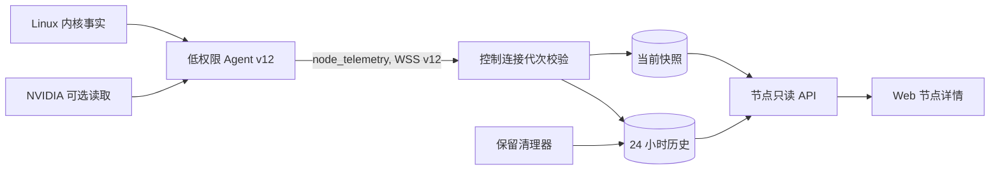

# Agent 节点运行遥测与详情可视化实施计划

## Goal Capsule

- **目标：** 让 Deploy Go 的节点详情可靠显示 Agent 采集的 CPU、内存、磁盘容量与使用率、磁盘 I/O、网络上下行和可选 GPU 指标，并提供最近 24 小时趋势。
- **权威边界：** 当前用户指令、`AGENTS.md`、`docs/standards/agent-control-protocol.md`、`docs/standards/api-contract.md` 与相关运行手册优先于本计划。
- **停止条件：** 本计划不授权连接真实节点、升级 Agent、执行 migration、重启控制面或部署业务应用。实现和运行验证必须在后续获得单独授权。
- **执行轮廓：** 先扩展可回退的 v12 协议和低权限采集，再持久化与暴露只读 API，最后接入管理端与运行手册。每个单元独立验证和提交。首版容量目标为最多 100 个在线 Agent；超过目标规模时必须受控降级，不得挤占部署控制流。

## Product Contract

### Summary

Deploy Go 需要以 Agent 为唯一数据源提供只读节点运行遥测。控制面保存最新快照和 24 小时历史。节点详情显示数值、趋势和数据状态，而不是把旧数据伪装成实时数据。

### Problem Frame

当前 Agent 心跳只上报连接代次和活动任务。`SystemInspect` 是一次性检查，只返回系统、架构、主机名和工作目录文件系统的可用空间。管理员缺少带时间和数据状态的资源事实，无法区分短暂尖峰与持续压力。本期提供当前值和最近 24 小时趋势供人工判断，不给出“适合部署”结论，也不把遥测变成部署门禁。

### Requirements

- **R1. 低权限采集：** 在线 Agent 必须定期采集 CPU 使用率、内存总量与已用量、工作根目录文件系统容量与使用率、磁盘读写吞吐与忙碌度、非 loopback 网络上下行速率。采集不得要求 root、sudo、Docker 组或特权终端。
- **R2. 可选 GPU：** 在 Linux NVIDIA 指标可读取时，Agent 必须上报最多 8 张 GPU 的名称、利用率、显存总量/已用量与温度。只有能确认没有 NVIDIA 硬件时报告 `unsupported` / `hardware_not_present`；驱动或后端缺失、权限不足、超时和解析失败分别报告 `collection_error` 及稳定原因码，不得影响 Agent 在线、认证或部署任务。
- **R3. 差分和预热：** CPU、磁盘 I/O 与网络速率必须由连续计数器样本计算。首样本、计数器回退和重连后的未完成差分必须标记为 `warming_up`，不得以零速率替代。
- **R4. 独立协议：** Agent 必须以独立的有界 telemetry 消息上报快照。心跳仍只承担在线和任务活动语义，任务事件序列与遥测样本不得互相影响。
- **R5. 兼容升级：** 控制面必须支持 v11 与 v12 Agent 的连接协商。v11 Agent 保持既有部署能力，并在节点详情显示“不支持遥测”；仅协商到 v12 的 Agent 上报遥测。v12 Agent 连接只支持 v11 的旧控制面时必须降级为 v11 heartbeat/部署模式，不发送 telemetry。不得在本功能上线或控制面回滚时让仍正常工作的节点离线。
- **R6. 数据正确性：** 控制面只接受当前认证 Agent 的当前连接代次的受限 telemetry payload。每个样本必须绑定 node、Agent、连接代次、连接内单调 `sample_sequence`、采集时间与服务端接收时间。服务端接收时间是 current、历史排序、查询、保留和 stale 判断的唯一可信时间；采集时间只用于展示与时钟偏差诊断。重复、乱序、时间无效、超限或旧代次样本不得写入历史或覆盖 current。
- **R7. 最小化与保留：** 控制面只持久化聚合数值、有限 GPU 摘要、采集/接收时间和字段状态。不得采集进程、命令行、用户、IP/MAC、路由、完整挂载路径、GPU UUID/序列号或原始命令输出。最新快照持久保留，历史仅保留 24 小时。
- **R8. 只读访问：** 节点遥测 API 必须复用节点读取的授权语义。管理员可读全部节点；普通用户只能读其已授权应用关联节点；无权节点按既有 404 语义隐藏。遥测不加入 external deployment API。
- **R9. 管理端：** Web 节点详情必须展示当前资源摘要、最近采集时间、数据失效状态、单项不支持/采集失败状态和 24 小时趋势。首版节点列表保持现状，不展示遥测，也不为列表节点发起 telemetry 请求。
- **R10. 故障隔离：** 采集、序列化、发送或落库失败不得阻塞心跳、token rotation、任务派发、任务恢复或业务部署。断线期间不要求 Agent 本地缓存历史；重连后以新快照恢复，趋势保留真实缺口。

### Actors

- **节点 Agent：** 在低权限运行身份下采集并发送只读快照。
- **控制面 API：** 校验连接、存储当前值与历史、清理过期样本，并按节点授权返回数据。
- **管理员与已授权用户：** 在节点详情读取受权限约束的状态和趋势。

### Key Flows

1. v12 Agent 完成 WSS 协商后按控制面声明的采样间隔采集本机事实，并在不影响 heartbeat 的前提下发送快照。
2. API 校验 Agent 与连接代次，在同一事务更新当前快照和历史样本。后台清理器分批删除超过 24 小时的历史。
3. 用户打开节点详情。管理端用一个聚合只读请求获取当前状态和固定窗口趋势，分别呈现节点连接状态、遥测能力、快照新鲜度和单项指标状态，不把这些状态折叠成一个枚举。
4. Agent 刷新凭证、断线或重连后继续既有任务对账。重连的首个速率样本预热，历史保留中断区间。

### Acceptance Examples

- **AE1.** 在线 v12 节点连续上报后，节点详情显示 CPU、内存、工作根目录磁盘使用率、磁盘读写/忙碌度和网络上下行，并可查看最近 24 小时趋势。
- **AE2.** 首次启动或重连后的速率指标显示“采集预热中”，不会显示误导性的零值；下一次有效差分后显示真实速率。
- **AE3.** 确认无 NVIDIA 硬件的节点仍完整上报基础指标，GPU 区域显示“不支持”；驱动/后端缺失、权限不足、超时或解析失败显示对应的脱敏原因，不使节点离线。
- **AE4.** v11 节点继续可被调度，详情显示需要升级 Agent 才能提供遥测；控制面升级不主动终止其连接。
- **AE5.** Agent 离线时连接状态立即显示“离线”，最后快照和值仍保留并标注时间；最新样本接收时间超过 90 秒时另行显示“数据已过期”。离线与 stale 独立呈现，趋势不补造断线期间的数据。
- **AE6.** 普通用户可读取其授权节点的聚合指标，不能通过节点 ID 读取无关节点或写入任何 telemetry 数据。
- **AE7.** 已产生 v12 遥测的节点降级为 v11 后，详情显示“不支持遥测”，不返回旧 latest 或趋势；历史行保留至正常过期，节点重新协商 v12 并产生新样本后恢复展示。
- **AE8.** v12 Agent 连接旧 v11 控制面时协商为 v11，heartbeat、任务恢复和部署能力保持可用，且不发送 telemetry。

### Success Criteria

- 在隔离测试中，v12 Agent 的基础指标可从低权限 Linux 进程采集并被控制面查询。
- 24 小时窗口、趋势点上限、历史清理和当前快照在 API 重启后保持正确。
- 100 个在线 Agent 按 30 秒采样时，telemetry 写入、清理和详情查询不阻塞 heartbeat 或部署状态写入；10 倍超目标负载触发限流和历史保护而不是无限增长。
- 协议、数据库、RBAC、管理端和多架构 Agent release 的质量门禁均通过，且无业务部署或真实节点变更。

### Scope Boundaries

**In scope**

- Agent v12 的只读 Linux 遥测、当前快照、24 小时趋势、节点授权 API 与 Web 节点详情。
- NVIDIA GPU 的 best-effort 采集和明确的缺失状态。
- v11 到 v12 的兼容期、发布物与接入/生产手册更新。

**Deferred to follow-up work**

- 告警、阈值、通知、自动重启/扩缩容、容量预测、跨节点聚合、Prometheus/Grafana/OpenTelemetry 导出和外部 API key 读取。
- AMD/Intel GPU、进程级/容器级指标、完整挂载点与网卡清单、长于 24 小时的降采样归档。
- 在管理端增加“立即采集”操作或其他 Agent 主动管理命令。

**Outside this feature**

- 通用 shell、任意命令执行、特权提升、读取 Secret、业务容器管理或业务应用发布。

### Sources

- `agent/src/connection.rs` 与 `api/src/agents/websocket.rs`：当前 heartbeat、连接代次和 token refresh 生命周期。
- `agent/src/system_info.rs`、`agent/src/task_handler.rs`、`api/src/nodes/mod.rs`：一次性 `SystemInspect` 的既有边界。
- `docs/solutions/agent-reconnect-sequence-gap.md`：任务序列不得承载重连期间可缺失的遥测样本。
- `docs/standards/agent-control-protocol.md`、`docs/standards/api-contract.md`、`docs/runbooks/api-migrations.md`：协议、授权、OpenAPI 与 SQLite migration 约束。

## Planning Contract

### Key Technical Decisions

- **KTD1. 通过独立 v12 `node_telemetry` 消息上报：** 遥测有单独的消息类型、大小上限和连接代次校验，不扩展 `heartbeat` 或 `task_result`。这保留在线判定和任务对账的现有语义，满足 R4、R6、R10。
- **KTD2. 采用 v11-v12 双向协商过渡：** 将协议当前版本提升为 v12，最低支持版本维持 v11。初始 `hello` envelope 使用最低兼容 v11，`Hello.min_protocol_version/max_protocol_version` 声明 11-12；双方从 `hello_ack` 后才使用协商版本。v12 Agent 只在协商 v12 后发送 telemetry；连接旧 v11 控制面时保持 v11 heartbeat/部署能力。该策略同时支持控制面先升级和控制面回滚，满足 R5。
- **KTD3. 低权限 Linux 原生采集与有界 NVIDIA 后端：** 基础指标从 `/proc`、`/sys` 和 `statvfs` 读取。GPU 仅通过无 shell、固定绝对路径、固定 argv、清理后的环境、5 秒超时和 8 KiB 输出预算的 NVIDIA 读取路径采集；最多解析 8 张 GPU，单个名称最多 96 bytes，不提供可配置命令或 shell。此决策满足 R1、R2、R10。
- **KTD4. 当前快照与历史样本分表：** 当前表以 node 为主键，供详情页快速读取；历史表按 `(node_id, received_at)` 索引，唯一键为 `(agent_id, connection_generation, sample_sequence)`。一个事务按服务端接收时间更新 current 并追加历史，重复或乱序样本幂等忽略。现有 deployment worker 在启动时和每小时分批删除 24 小时外历史，满足 R6、R7、R9。
- **KTD5. 30 秒采样、90 秒失效与受限趋势：** 主控只在协商到 v12 的 `hello_ack` 中提供 30 秒 telemetry interval；协商为 v11 的 ACK 保持原 wire shape。管理端按服务端 `received_at` 将超过 90 秒的最新样本标记为 stale。API 只接受最近 24 小时查询，以 2 分钟 `received_at` bucket 对有效数值求平均、空 bucket 保持缺口，最多返回 720 个点。该限制控制 SQLite 写入与浏览器负载，满足 R7、R9、R10。
- **KTD6. 保留聚合而非主机明细：** 磁盘容量限定为 `work_root` 文件系统；磁盘 I/O 为合格物理块设备的读写总量和最大忙碌度；网络为非 loopback 接口聚合。GPU 只保存显示所需的有限摘要。该策略满足 R1、R2、R7。
- **KTD7. telemetry 是可丢弃的单向数据流：** Agent 不重试、不补传、不等待 ACK。出站队列饱和、采集失败、服务端校验失败、限流或落库失败只丢弃该次 telemetry，并以有界、脱敏、限频诊断记录；合法但不可接受的 telemetry 不关闭 WSS。只有完整 envelope 无法解析或协议版本错误时沿用连接级协议错误。重连与采样基线重置后使用 `warming_up`，满足 R3、R10。
- **KTD8. 只读 API 复用节点可见性：** telemetry 路由复用节点详情的管理员与 application grant 授权判断，不新增浏览器写入口、CSRF 写操作或 external API scope，满足 R8。
- **KTD9. 服务端强制资源预算：** 单 Agent/connection 每 10 秒最多接受一个样本；全局使用 20 samples/s、burst 100 的接收预算。单条 telemetry JSON 不超过 16 KiB。历史最多保留每节点 3,600 行、全局 360,000 行，为 27 秒最短抖动间隔和每小时清理预留余量；达到任一上限时仍更新 current，但停止追加 history。该边界以 100 个在线 Agent 为首版容量目标，10 倍负载只验证受控降级，不承诺完整趋势。

### Canonical State And API Contract

- `connectivity`：`online` / `offline` / `disabled` / `unknown`，映射既有节点状态并与 telemetry 独立；`missing_credential`、`unchecked`、`checking` 等非 Agent 在线状态统一映射为 `unknown`。
- `capability`：`supported` / `unsupported` / `unavailable`。当前有效 Agent 最后一次成功协商到 v12 时为 `supported`，协商版本低于 v12 时为 `unsupported`，没有有效 Agent、Agent 已撤销/归档或从未成功协商时为 `unavailable`。`capability_reason` 仅在非 `supported` 时出现，使用 `protocol_v11`、`no_agent`、`revoked`、`archived`、`not_connected`；UI 据此分别显示升级、重新绑定、安装或等待连接提示。离线不会抹除已知 capability，也不会隐藏同一有效 Agent 的 latest/history。
- `freshness`：`empty` / `fresh` / `stale`，只按 latest `received_at` 计算；90 秒内为 `fresh`，连接离线不会改写 freshness。
- 单项 `status`：`available` / `warming_up` / `unsupported` / `collection_error`。`value` 只在 `available` 时存在；`reason` 使用稳定枚举，不承载原始路径、命令输出或驱动文本。
- GPU `reason` 至少包括 `hardware_not_present`、`backend_unavailable`、`permission_denied`、`timeout`、`parse_error`。无法确认硬件不存在时不得使用 `hardware_not_present`。
- `GET /api/v1/nodes/{id}/telemetry` 返回 `node_id`、`connectivity`、`capability`、`freshness`、`captured_at`、`received_at`、`latest` 和 `history`。`latest` 固定包含 `cpu_usage_ratio`、`memory_total_bytes`、`memory_used_bytes`、`work_root_total_bytes`、`work_root_used_bytes`、`disk_read_bytes_per_second`、`disk_write_bytes_per_second`、`disk_busy_ratio`、`network_receive_bytes_per_second`、`network_transmit_bytes_per_second` 与 `gpus`；数值项使用 `{status, reason?, value?}`，单位由字段名固定。`gpus` 最多 8 项，每项仅含受限名称和利用率、显存、温度状态值。`history` 点使用 `received_at` bucket 时间和同名可空聚合值；空 bucket 不生成点，前端据时间间隔绘制缺口，不用零填充。
- GPU 项使用 Agent 报告的有界本地 `index`（0-7）和名称作为 24 小时内的显示 series key，不采集 UUID/序列号；同一 index 的名称变化时结束旧 series 并从新 series 预热，不跨名称连接趋势。
- `captured_at` 必须是有效 RFC3339，允许相对 `received_at` 前后偏差 5 分钟；超出时丢弃样本并记录 `clock_skew` 脱敏诊断。排序、current 覆盖、stale、趋势和 retention 均不依赖节点时钟。

| 条件 | 顶部状态 | latest/history | 指标呈现 |
| --- | --- | --- | --- |
| `online + supported + fresh` | 在线、数据已更新 | 返回当前有效 Agent 数据 | 按字段状态显示 |
| `offline/disabled + supported + fresh` | 离线或已禁用，并显示最近采集时间 | 保留并返回当前有效 Agent 数据 | 标为最后快照，不伪装为在线实时值 |
| 任意 connectivity + `supported + stale` | 连接状态与“数据已过期”同时显示 | 返回当前有效 Agent 最后快照和趋势 | 保留字段状态并弱化趋势 |
| `supported + empty` | 在线时显示“等待首个样本”，离线时显示“尚无遥测数据” | `captured_at=null`、`received_at=null`、`latest=null`、`history=[]` | 不显示零值 |
| `unsupported + protocol_v11` | 不影响连接/部署状态，显示“需要升级 Agent” | 时间戳为 `null`、`latest=null`、`history=[]` | 不展示前次 v12 数据 |
| `unavailable` | 按 `capability_reason` 显示安装、重新绑定或等待连接提示 | 时间戳为 `null`、`latest=null`、`history=[]` | 不展示已撤销、归档或前任 Agent 数据 |
| 基础项 `available`，GPU `unsupported/collection_error` | 顶部仍按 connectivity/freshness 显示 | 返回基础数据与 GPU 字段状态 | GPU 单项显示原因，不把整机标成失败 |

空状态响应必须保持固定 wire shape，例如：

```json
{
  "node_id": "node_01",
  "connectivity": "offline",
  "capability": "unavailable",
  "capability_reason": "not_connected",
  "freshness": "empty",
  "captured_at": null,
  "received_at": null,
  "latest": null,
  "history": []
}
```

历史查询只返回当前有效 Agent 的样本。Agent ID 更换后旧 history 保留至 retention 清理但不再对外返回；同一 Agent 在 v12-v11-v12 间切换时，v11 阶段隐藏数据，重新协商 v12 并产生首个新样本后可继续展示该 Agent 的 24 小时历史。

### High-Level Technical Design

下图表达组件边界与数据流，不规定类型或函数签名。



### Data And Lifecycle Rules

- Agent 在建立连接后立即采集一次基础静态指标，并为速率项建立基线。后续按 30 秒 interval 加最多正负 10% 抖动采集；同一时间最多有一个采集任务在运行，前一次未完成时跳过新 tick。采集在有界 blocking 工作中完成。
- 每条 v12 telemetry 都包含当前 `connection_generation`、从 1 开始且连接内单调递增的 `sample_sequence`、Agent 采集时间和固定大小的结构化快照。服务端同时记录可信的接收时间。
- API 仅在数据库中仍为当前 generation 的 Agent 身份上接受样本。旧代次、重复/回退 sequence、时钟偏差超限、无效数值、重复字段、超限 JSON 和超过消息预算的 payload 必须忽略并限频记录诊断，不关闭正常 WSS 连接。
- 历史样本使用服务端接收时间排序、窗口筛选和保留清理。采集时间只用于展示与时钟偏差诊断，避免节点时钟倒退破坏 current 或 retention。
- Agent 或 API 重启不补传旧样本。当前快照可被下一个有效样本替代；历史中断保持为缺口。
- 清理复用现有 deployment worker：启动后先执行一次，之后每小时执行；每批最多 20,000 行、每轮最多 10 批，批次间主动 yield。SQLite busy 或清理失败记录限频告警并在下一周期重试；行数上限继续保护 history，current、heartbeat 和部署写入保持可用。

### System-Wide Impact

- **协议与发布：** v12 需要同步 Rust 类型、JSON Schema、协议文档、Agent release manifest 和安装器兼容说明。控制面必须先支持 v12，再逐节点安装 v12 配对 Agent；本次不提升最低支持版本到 v12。
- **数据生命周期：** 高速样本不进入 `agent_tasks`、部署事件或审计日志。数据库需要新 migration、索引、有限 JSON 校验、保留任务和受控清理失败语义。
- **授权与隐私：** Agent 身份是唯一写入者。浏览器只有节点范围内的读权限；指标不泄露主机敏感标识或运行命令。
- **客户端：** OpenAPI 仍是 Web 与 Flutter client 的唯一契约。首版实现 Web 节点详情；生成 Flutter client 必须保持可构建，移动端详情展示留给后续单独 UX 计划。
- **业务连续性：** telemetry 永远不是部署前置条件。v11 Agent、GPU 不支持、采集预热、WSS 重连、SQLite 瞬时故障和历史清理故障均不能改变 deployment 状态机。

### Risks And Dependencies

| 风险 | 缓解 |
| --- | --- |
| 控制面直接强制 v12 会使未升级节点离线 | 维持 v11 最低协议，并仅把 telemetry 置为 v12 能力。后续另行决定何时退休 v11。 |
| `/proc`、块设备与 GPU 驱动在发行版间不同 | 使用解析 fixture、每个字段的 unsupported/error 状态与 Linux only 边界；不把缺失视为 Agent 故障。 |
| 高频 SQLite 写入或趋势响应放大 | 服务端按 connection/global 限流、30 秒采样、100 节点容量目标、current/history 分表、行数硬上限、24 小时 retention、接收时间索引和 720 点上限。 |
| 旧连接、重复样本或错误时钟覆盖新快照 | 将 Agent、node、generation、sample sequence 与接收时间共同校验；节点时钟不参与排序或 current 覆盖。 |
| GPU 读取阻塞或敏感输出泄露 | 使用固定功能、超时、输出预算和结构化最小结果；原始输出不写入日志、数据库或 API。 |
| schema 或生成 client 漂移 | 把协议 schema、internal OpenAPI、Web/Flutter client generation 纳入每次变更验证。 |

### Sequencing

1. U1 先建立 v12 协议、兼容策略和文档契约。
2. U2 在协议之上实现低权限采集、差分和有界发送。
3. U3 处理 migration、写入校验、保留和只读 API。
4. U4 使用稳定 API 完成 Web 详情和生成 client 校验。
5. U5 同步运行手册、执行高风险复核并准备受授权后的分阶段发布。

## Implementation Units

### U1. v12 遥测协议与兼容契约

- **Goal:** 定义独立的 telemetry 线协议和 v11-v12 协商，不改变 heartbeat 或任务恢复语义。
- **Requirements:** R4、R5、R6、R10。
- **Files:** `agent-protocol/src/lib.rs`、`agent-protocol/schema/agent-control.schema.json`、新增 `agent-protocol/schema/agent-control-v11.schema.json`、`agent-protocol/tests/schema_compatibility.rs`、`api/src/agents/websocket.rs`、`agent/src/connection.rs`、`agent/tests/connection.rs`、`docs/standards/agent-control-protocol.md`。
- **Approach:** 保存当前 v11 Schema 为不可变的 `agent-control-v11.schema.json`，并把 `agent-control.schema.json` 更新为 latest v12。新增从 Agent 到服务端的严格 `node_telemetry` 消息和受限 snapshot schema。把 `PROTOCOL_VERSION` 提升至 12 且保持最低支持版本为 11；初始 Hello 使用 v11 envelope 声明 11-12，后续使用协商版本。新 Agent 将 telemetry interval 建模为可选字段；控制面只在协商 v12 时序列化该字段，v11 ACK 完全保持旧 wire shape。接收端必须先识别完整 envelope 的消息类型，再对 `node_telemetry` payload 做隔离的严格解析，使 telemetry 内部未知字段或错误值能被丢弃而不被误判为整个 envelope 无法解析；它不得进入 dispatcher 的 `unexpected_message` 断链路径。
- **Test scenarios:** 真实 v11 fixture 可反序列化新控制面协商为 v11 的 ACK；新 v12 Agent 连接旧 v11 server fixture 后继续 heartbeat/任务流且不发 telemetry；v12 双方协商后发送有效 telemetry；v11 envelope、错误方向、超限 payload、未知 metric 状态、旧 generation 和 sequence 重放被稳定忽略；遥测不会改变现有 reconnect reconciliation 的任务序列。
- **Verification:** `cargo test -p deploy-go-agent-protocol`、`cargo test -p deploy-go-agent --test connection` 与 `cargo test -p deploy-go-api --test agent_websocket --test agent_dispatcher`。
- **Dependencies:** 无。

### U2. Agent 低权限采集、差分与发送隔离

- **Goal:** 在低权限 Agent 内采集有限 Linux 指标，并把 telemetry 失败隔离于控制连接和部署执行。
- **Requirements:** R1、R2、R3、R4、R7、R10。
- **Files:** 新增 `agent/src/telemetry.rs`、`agent/src/lib.rs`、`agent/src/connection.rs`、`agent/src/main.rs`、`agent/src/system_info.rs`（仅在需要共用主机事实时）、新增 `agent/tests/telemetry.rs`、`agent/tests/connection.rs`。
- **Approach:** 建立可注入的 Linux collector，读取受控的 `/proc`、`/sys` 与 `statvfs`。以两次原始计数器和单调时钟计算 CPU、I/O 与网络速率；首次、倒退或异常间隔返回 `warming_up`。以无 shell、固定绝对路径、清理环境、固定 argv、超时和输出上限读取可选 NVIDIA 数据；任何 GPU 或单指标异常都转为字段状态。采样使用 server 宣告的 30 秒 interval 和有限抖动，单次采集未结束时不并发启动下一次；发送背压时丢弃本次样本。
- **Test scenarios:** 基础 `/proc` fixture 的 CPU/内存/磁盘/网络解析；计数器差分、首样本、计数器回退和重连预热；空/损坏文件、权限失败、虚拟块设备过滤、零间隔、过大值；无 GPU、驱动/后端缺失、权限不足、超时和异常输出；采集超过 interval 时不重入；队列饱和时 heartbeat 与任务处理仍可继续。
- **Verification:** `cargo test -p deploy-go-agent --test telemetry --test connection` 与 `cargo clippy -p deploy-go-agent --all-targets -- -D warnings`。
- **Dependencies:** U1。

### U3. 遥测持久化、保留、授权 API 与控制面接收

- **Goal:** 安全保存当前快照与 24 小时趋势，并以节点范围提供一个只读查询接口。
- **Requirements:** R6、R7、R8、R9、R10。
- **Files:** 新增 `api/migrations/0026_node_telemetry.sql`、新增 `api/src/node_telemetry.rs`、`api/src/lib.rs`、`api/src/agents/websocket.rs`、`api/src/nodes/mod.rs`、`api/src/deployments/runtime.rs`、`api/openapi/openapi.json`、`api/tests/agent_websocket.rs`、新增 `api/tests/node_telemetry_api.rs`、新增 `api/tests/node_telemetry_load.rs`、`api/tests/nodes_api.rs`、`api/tests/deployment_runtime.rs`、`api/tests/migrations.rs`、`api/tests/database_constraints.rs`、`api/tests/openapi_contract.rs`。
- **Approach:** 以 typed aggregate columns 保存 current 与 history，并只为最多 8 张 GPU 的有限摘要使用 4 KiB 上限 JSON。current 绑定产生它的 Agent；当前有效 Agent 变化后，在新 Agent 首个有效样本到达前返回 `freshness=empty`，不得展示前任 Agent 的 current。通过节点、Agent、generation、sequence 和接收时间的事务校验更新 current 并追加 history。接收层落实每 connection 和全局限流；合法但被拒绝或落库失败的 telemetry 只丢弃并限频诊断。新增 `GET /api/v1/nodes/{id}/telemetry`，按 canonical state/API contract 返回 latest 和受限趋势，复用 `nodes_show` 可见性。24 小时清理复用现有 deployment worker；查询使用接收时间索引、2 分钟 bucket、24 小时硬上限和 720 点上限。
- **Test scenarios:** 正常样本原子写入 current/history；旧 generation、越权 Agent、sequence 重放/回退、时钟偏差、重复/超大字段和无效数值不会污染数据；快速合法样本触发限流但 WSS/heartbeat/任务继续；v11 返回 `unsupported`，无有效 Agent 或从未成功协商返回 `unavailable`，两者都隐藏旧快照；离线 v12 仍为 `supported`；Agent 更换后在首样本前返回 `empty`；连接、能力、新鲜度和字段状态组合符合状态矩阵；管理员与普通用户授权边界；趋势排序、2 分钟聚合、缺口、24 小时清理、连续清理失败、API 重启补偿、每节点/全局行数上限；100 节点基线和 10 倍超量负载不阻塞部署状态写入。
- **Verification:** 首次按 migration 规则执行 `make setup-git-hooks` 与 `make verify-git-hooks`；只暂存新增 migration 后执行 `make migration-git-guard-staged`，并保留正常 pre-commit 门禁；随后执行 `cargo test -p deploy-go-api --test agent_websocket --test node_telemetry_api --test nodes_api --test deployment_runtime --test migrations --test database_constraints --test openapi_contract`、`cargo test -p deploy-go-api --test node_telemetry_load -- --ignored --nocapture`、`make api-openapi-check`、`make api-client-check`。
- **Dependencies:** U1、U2。

### U4. Web 节点详情与 API client 同步

- **Goal:** 在不放大轮询的前提下，让节点详情可读、可扫描地显示当前指标和 24 小时趋势。
- **Requirements:** R8、R9、R10。
- **Files:** `admin/src/features/nodes/api.ts`、`admin/src/features/nodes/NodeDetailPage.tsx`、`admin/src/styles/index.css`、`admin/src/api/generated/`、`admin/src/test/AgentNodeManagement.test.tsx`、新增 `admin/src/test/NodeTelemetry.test.tsx`、`admin/e2e/agent-node-management.spec.ts`、`admin-app/lib/api/generated/`。
- **Approach:** 使用一个 query 获取详情需要的 latest 和 history，每 30 秒刷新；页面不可见时暂停，组件卸载时取消，失败时保留最后成功快照并显示错误与重试按钮。节点列表保持现状，不请求 telemetry。详情首屏顺序固定为连接/新鲜度、CPU/内存/工作盘、I/O/网络、GPU、Agent 管理与能力检查；状态按 canonical matrix 分层展示。趋势使用语义化标题、固定单位、非颜色状态标识和可读的最新/平均摘要，键盘或屏幕阅读器可读取时间与数值；390px 下使用单列且不发生文本或图表遮挡。同步生成两个客户端，移动端先保持 API 可构建而不新增未设计的页面。
- **Test scenarios:** online v12 正常数据、离线 v12 仍为 `supported`、v11 `unsupported`、无有效 Agent 或从未成功协商时 `unavailable` 及各 reason、v12 降级隐藏旧数据、Agent 更换后的空状态、无 GPU、GPU 各失败原因、首次预热、offline 但 freshness 尚 fresh、stale、历史空洞、加载与 API 错误、普通用户授权详情、窄屏与长节点名；页面隐藏时暂停轮询、失败保留旧值、重试恢复、组件卸载取消；访问节点列表时不发 telemetry 请求、不出现遥测列且原有列表保持可用；Playwright 覆盖桌面与移动 viewport 的无重叠、非空趋势、键盘焦点和非颜色状态。
- **Verification:** `make admin-test`、`make admin-build`、`make admin-test-e2e`、`make api-client-check`、`make admin-app-check`。
- **Dependencies:** U3。

### U5. 运行手册、发布准备与复核记录

- **Goal:** 记录 v12 的兼容期、Agent 成对升级、migration 前置和生产验证边界，使后续受授权的发布可回放。
- **Requirements:** R5、R7、R10。
- **Files:** `docs/standards/agent-control-protocol.md`、`docs/standards/agent-installation-contract.md`、`docs/runbooks/agent-onboarding.md`、`docs/runbooks/systemd-deployment-production.md`、`docs/runbooks/api-migrations.md`、`agent/release/generate-manifest.sh`、`agent/release/manifest.schema.json`、`scripts/sync-agent-release.sh`（仅在协议范围校验需要调整时）、新增 `docs/reviews/2026-08-16-node-telemetry-review.md`。
- **Approach:** 说明 v12 latest / v11 compatible 的过渡矩阵、先发布控制面再逐节点配对安装的顺序、v11 节点仍可部署的限制、最新指标的 stale 语义、历史保留、GPU 缺失与故障排查。复核 migration 的不可变性、数据最小化、协议方向、RBAC、背压与 rollback。手册只描述后续人工授权流程，不包含或执行真实节点命令。
- **Test scenarios:** 文档中的协议版本、v11/v12 协商/回滚矩阵、manifest、OpenAPI 路径、状态名称、保留时长、容量边界和验证入口与最终实现一致；review 覆盖协议、数据完整性、性能、授权和 UI 回归；本地双架构 release manifest 同时包含 Agent/executor 的 x86_64 与 aarch64 条目。
- **Verification:** `cargo fmt --all --check`、`cargo clippy -p deploy-go-api --all-targets -- -D warnings`、`cargo clippy -p deploy-go-agent --all-targets -- -D warnings`、`cargo test -p deploy-go-agent-protocol -p deploy-go-agent`、聚焦 API 与管理端验证、`make agent-check`、`make deploy-production-agent-build`（仅本机构建与 manifest 校验，不上传、不部署）、`git diff --check`。
- **Dependencies:** U1、U2、U3、U4。

## Verification Contract

| 层级 | 验证 | 通过信号 |
| --- | --- | --- |
| 协议 | `cargo test -p deploy-go-agent-protocol` | v11/v12 协商、消息方向、schema 和大小限制一致。 |
| Agent | `cargo test -p deploy-go-agent --test telemetry --test connection` | Linux fixture、差分预热、GPU 缺失和背压不影响控制连接。 |
| API | `cargo test -p deploy-go-api --test agent_websocket --test node_telemetry_api --test nodes_api --test deployment_runtime --test migrations --test database_constraints --test openapi_contract` | 写入、RBAC、retention、历史查询、worker 生命周期和 OpenAPI 均正确。 |
| Migration 门禁 | 暂存新增 migration 后执行 `make migration-git-guard-staged` | migration 编号、命名、模式和不可变规则通过 Git index 门禁。 |
| 静态检查 | `cargo fmt --all --check`；两个 package 的 `cargo clippy --all-targets -- -D warnings` | Rust 格式和 lint 无告警。 |
| 契约生成 | `make api-openapi-check`；`make api-client-check` | internal OpenAPI、Web 和 Flutter client 无漂移。 |
| Agent 发布物 | `make agent-check`；`make deploy-production-agent-build` | v11-v12 协议范围、安装器以及 Agent/executor 的 x86_64/aarch64 manifest 和本地构建产物一致，不上传。 |
| 管理端 | `make admin-test`；`make admin-build`；`make admin-test-e2e`；`make admin-app-check` | Web 组件、响应布局与生成移动 client 均正常。 |
| 容量与隔离 | `cargo test -p deploy-go-api --test node_telemetry_load -- --ignored --nocapture` | 100 节点基线满足 30 秒采样和 24 小时趋势；1,000 节点超量 fixture 下限流/历史上限生效，并在测试的 5 秒控制流超时内完成 heartbeat 与部署状态写入。 |
| Diff | `git diff --check` 与 `git diff --cached --check` | 无空白错误或非本轮范围文件。 |

## Definition of Done

- U1-U5 全部完成，且每个实现单元的目标场景与验证均通过。
- v12 Agent 可在低权限 Linux 环境提供完整基础遥测；GPU 或单项指标异常不会影响在线和部署。
- v11 Agent 在兼容期保持可连接和可调度，并在 API/UI 中明确没有 telemetry。
- current/history、24 小时保留、状态矩阵、授权范围、断线缺口、重连预热、sequence 幂等、服务端限流和历史硬上限均有自动化覆盖。
- 节点列表保持既有字段与轮询行为，不展示遥测，也不发起 telemetry 请求。
- 生成契约、Agent 双架构 release 内容、Web 管理端和相关手册保持一致。
- 未保留用于试验的采集命令、调试输出、敏感主机标识或未使用依赖；未执行任何未经授权的真实环境操作。
