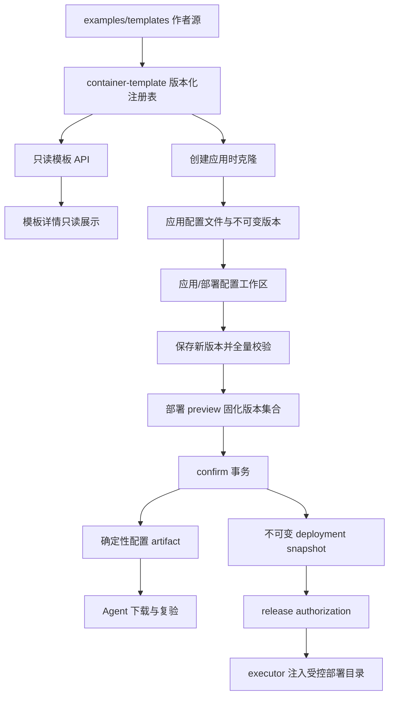

# 应用模板部署配置工作区实施计划

## Goal Capsule

- **Objective:** 让管理员从应用模板创建应用后，直接在部署流程中查看、理解和修改该应用自己的完整部署配置副本，并让每次部署准确固化最终文件版本、部署目录和摘要。
- **Means:** 建立“平台只读模板 -> 应用可编辑配置副本 -> 不可变部署快照”三层模型；后端统一提供模板和校验契约，管理端使用带语法高亮的黑底多文件编辑器（KTD1-KTD5）。
- **Authority:** 本计划及 `docs/standards/application-deployment-contract.md`（实施时新增或扩展）约束产品和快照语义；`docs/standards/deploy-script-contract.md` 继续约束发布脚本；现有 `docs/plans/2026-08-18-platform-etcd-configuration-center-plan.md` 只约束配置中心能力，不覆盖本计划的通用模板配置工作区。
- **Execution profile:** 直接在 `main` 按 U1-U8 小闭环实施、验证、提交和推送；migration 只允许新增前进版本。
- **Stop conditions:** 缺少 Compose 安全校验边界、Secret 明文可能进入普通 snapshot/日志、或需要连接真实节点验证时暂停，不以 UI 可编辑代替后端安全校验。
- **Tail ownership:** 完成后由应用模板、应用配置、部署 preview/confirm、Agent release 和 Admin 工作区共同维护；模板新增文件必须同时通过注册表、注释和契约测试。

---

## Product Contract

### Summary

应用模板拥有一套平台维护、只读且带充分注释的默认部署文件。管理员从模板创建应用时，平台克隆出属于该应用的配置副本；模板后续升级不会静默覆盖应用副本。管理员可在应用配置页或发起部署流程内编辑该副本，保存后生成新版本，再由部署 preview/confirm 固化具体版本和 digest。历史部署及重试始终使用原快照，不读取应用当前最新配置。

### Problem Frame

当前 PostgreSQL 18、Redis 7 和 etcd 3.6 的 image 模式只允许配置模板、镜像、宿主端口和 Env 文件名。`container-template` 在控制面编译期嵌入固定 Compose 和服务配置，部署页面明确提示“配置已由目标固定，无需配置参数”。因此模板中数据库名、用户名、密码、端口、服务配置和实际部署目录不能在部署流程内完成调整，管理员只能先下载示例、再到其他入口登记 Env，流程割裂且容易遗漏。

当前黑底原文编辑器由行号 `<pre>` 和 `<textarea>` 组成，只支持 dotenv 校验，没有语法高亮、搜索、括号匹配或 YAML/JSON/INI 诊断。模板文件事实源还同时存在于前端 raw import 与 Rust `include_str!`，缺少统一的文件类型、可编辑性、敏感性、推荐调整项和版本 digest 契约。

### Actors

- A1. **管理员:** 从模板创建应用、编辑应用配置副本、调整部署目录、校验并确认部署。
- A2. **应用使用者:** 按授权查看非敏感配置和部署快照；没有 Secret grant 时不能读取敏感文件明文。
- A3. **模板维护者:** 维护只读模板默认文件、逐文件注释、推荐调整项、格式和安全约束。
- A4. **控制面:** 提供模板事实源、版本化配置、Secret 保护、校验、preview/confirm 和 artifact 生成。
- A5. **Agent/executor:** 只接收已验证、已签名的配置制品和部署目录，不解释模板 UI 元数据，不接受任意执行代码。

### Requirements

**模板与配置副本**

- R1. 平台应用模板是后端权威的只读资源，至少包含模板 ID、版本、digest、部署机制、默认镜像、默认端口、文件清单及每个文件的路径、格式、语言、可编辑性、敏感性和用途说明；Admin 不再维护独立模板事实源。
- R2. PostgreSQL、Redis 和 etcd 模板的每个可部署配置文件必须在文件原文中写明用途、推荐调整项、默认值关系和不能修改的安全边界；注释、顺序、空行和排版属于模板内容，克隆和编辑不得丢失。
- R3. 从模板创建应用时事务性创建应用模板绑定和应用配置副本；`*.example` 克隆为实际部署文件名，例如 `postgres.env.example` 生成 `postgres.env`。模板升级只影响以后新建的应用，不覆盖既有副本。
- R4. “全部配置文件可查看和修改”指模板声明的部署配置文件，包括 Compose、Env 和服务配置；README、参数 Schema 可以查看，Makefile、`scripts/release.sh`、`deploy-go.yaml`、artifact manifest 等平台执行代码只读且不能被应用副本覆盖。
- R5. 应用配置文件使用乐观版本和内容 digest；任一保存生成新版本，历史版本不可变。工作区可以查看版本历史、比较并恢复历史版本；也可以恢复指定模板版本的单文件默认值，所有恢复都生成新版本并记录来源，不改写历史。

**编辑体验**

- R6. 管理端提供左侧文件列表、右侧黑底编辑器的配置工作区，默认选中第一个可编辑文件；文件列表显示格式、敏感/只读、已修改和校验状态。
- R7. 编辑器按 YAML、JSON、dotenv、Shell、Markdown、INI/Properties 提供语法高亮，并支持行号、搜索、自动缩进、括号匹配、错误行提示、切换文件保留草稿和离开页面未保存提示；视觉延续现有 `#0d1117` 黑底风格。
- R8. 原始文本是配置权威数据。常用字段快捷编辑只能对原文做可验证的定位修改，不得通过对象重新序列化导致注释、顺序或格式丢失；无法安全定位时引导用户在编辑器内修改。
- R9. 每个文件支持查看模板默认值、与模板默认值比较、恢复默认、下载当前文件；工作区支持校验全部文件和下载脱敏配置包。下载包无论是否持有 grant 都不得包含 Secret 明文，敏感文件使用去值占位内容，并由 manifest 标明部署时由 Secret delivery 补齐。
- R10. 敏感配置默认遮蔽，读取和修改沿用管理员重新认证、短期 grant、`Cache-Control: no-store`、CSRF、加密存储及审计边界；密码不得进入普通列表、URL、browser storage、React Query 持久缓存、部署事件或错误正文。

**部署流程与目录**

- R11. image 模式发起部署时不再显示“配置固定，无需配置参数”，而是在 preview 前嵌入应用配置工作区。用户修改后必须先保存为应用配置新版本，再基于该版本生成 preview；首期不保存浏览器端或普通 preview JSON 中的临时 Secret override。
- R12. 新建目标或显式修改目录时，部署目录由后端按目标节点生成默认值 `{node.work_root}/applications/{application.slug}/{application.environment}`，管理员可修改；最终路径必须规范化后仍位于节点 `work_root` 内，并拒绝父目录跳转、符号链接逃逸和系统保护目录。既有 image 目标保留只读 legacy directory mode，不自动搬迁目录或数据卷，也不允许新目标选择该模式。
- R13. preview 返回模板 ID/版本/digest、最终文件清单及版本、按 `target_id` 固化的部署目录、镜像、端口和校验结果；非敏感文件返回 digest，敏感文件只显示“已配置”和 opaque version ID，content digest 仅在服务端用于一致性校验，不能作为弱密码的离线验证器返回客户端。
- R14. confirm 必须引用有效 preview 和完全一致的配置版本集合；任一应用配置、目标、模板绑定或部署目录变化都返回稳定的 `deployment_snapshot_changed` 并要求重新预览。
- R15. 部署 snapshot 和 target run snapshot 固化模板、文件版本/digest、部署目录和 artifact digest。模板或应用配置后来变化不影响已确认部署；deployment retry 复用原 snapshot 和制品。
- R16. 平台 artifact 使用已验证的应用配置版本生成，而不是重新读取当前模板默认值；只有 `delivery=artifact` 的非敏感用户配置进入模板 archive，`delivery=env_lease` 或 `secret_file_lease` 的敏感文件通过 snapshot 固定版本后独立交付，平台托管的 Makefile、release 脚本和 manifest 仍由可信代码生成。

**安全、兼容与审计**

- R17. Compose 编辑必须经过结构化解析和后端策略校验，拒绝 `privileged`、host network/PID/IPC、Docker socket、设备映射、危险 capability、越界 bind mount、任意可执行入口覆盖和平台保留路径；拒绝远程或外部 `include`、`extends`、`build.context`，`env_file`、`configs`、`secrets` 等路径型引用只能指向模板声明且位于 artifact 根内的相对文件。不能只依赖前端提示或字符串匹配。
- R18. 文件路径、数量、单文件/总大小、编码、格式和模板 allowlist 必须由后端校验；只接受模板声明的相对路径，不接受绝对路径、`..`、符号链接和未知可执行文件。
- R19. 部署目录通过受控协议字段和 release authorization 绑定传给 executor，模板脚本读取固定环境变量；不得借用用户参数、任意 env map 或 shell 拼接。每个 `target_id` 必须拥有独立的规范化目录值，不能用单数目录覆盖多节点 `work_root` 差异。依赖该能力的目标必须对旧 Agent 明确提示升级，未启用配置工作区的 v11-v13 普通部署保持兼容。
- R20. 审计记录模板克隆、配置读取授权、配置保存、恢复默认、全量校验和部署确认，只记录路径、版本、digest 和结果，不记录明文内容。
- R21. 敏感的 YAML/JSON/INI/Compose/Shell 等非 dotenv 文件不得进入普通 artifact、snapshot、task payload、事件或日志；必须通过独立的加密配置 lease 传给指定 target/进程，Agent/executor 仅在内存中接收并将其安装到快照目录，任务终态、撤销、超时、重试和 Agent 重连都必须覆盖其清理与重新获取。
- R22. `application_directory` 扩展 Agent control wire shape 时使用新协议 v14，冻结 v13 schema；v11-v13 只执行不需要新能力的普通任务。能力不兼容时不创建 release task，target run/deployment 进入可重试的稳定失败状态并写入明确升级事件，Agent 升级后可重新 preview/retry，且不能重复创建任务。
- R23. 模板 Secret 默认使用不可部署占位符；管理员可手动填写，也可调用受控生成操作。生成值使用系统 CSPRNG、直接写入加密配置新版本，仅在有效 re-auth grant 下展示一次，之后只显示已配置状态。

### Key Flows

- F1. **从模板创建:** A1 选择 PostgreSQL 18，查看带注释的模板文件，创建应用和 image 目标；控制面克隆 `compose.yaml`、`compose.env`、`postgres.env`、`config/postgresql.conf`，生成默认部署目录，并进入应用配置工作区。
- F2. **部署前调整:** A1 在部署页修改数据库名、用户名、密码、端口、部署目录和 `postgresql.conf`；Secret 编辑经过重新认证。保存生成应用配置新版本，校验通过后生成 preview。
- F3. **确认与执行:** A1 核对模板/文件版本、digest 和目录后确认；控制面生成不可变 artifact 和 snapshot，Agent/executor 只使用快照绑定的文件与目录执行 Compose release。
- F4. **模板升级隔离:** A3 更新 PostgreSQL 模板注释或默认配置；已有应用仍保持原副本，工作区显示绑定版本与当前模板版本，用户可以查看逐文件差异并选择恢复到指定模板版本；恢复记录来源并生成应用新版本，不发生自动覆盖或三方 merge。
- F5. **并发变化:** A1 打开 preview 后另一管理员保存配置；confirm 检测版本集合变化并拒绝，用户重新加载、处理差异并再次 preview。
- F6. **历史重试:** 新应用配置已经变化时重试旧部署；平台仍复用旧 snapshot/artifact，不把最新配置混入旧部署。

### Acceptance Examples

- AE1. PostgreSQL 18 新应用首次进入部署页即可看到四个实际配置文件及模板注释，默认选中 `compose.yaml`；修改文件不会改变模板详情页内容。
- AE2. 编辑器正确高亮 YAML、dotenv 和 `postgresql.conf`，切换文件后草稿不丢；恢复默认保留模板注释并生成新版本。
- AE3. 用户将 `POSTGRES_DB`、`POSTGRES_USER`、`POSTGRES_PASSWORD` 改为正式值并保存；普通 API、snapshot、审计、日志和下载包中找不到密码明文或可用于验证弱密码的 content digest。
- AE4. 默认部署目录落在节点 `work_root` 内；输入 `../`、`/etc`、符号链接逃逸路径或其他节点根目录时，API 在 preview 前拒绝。
- AE5. Compose 增加 Docker socket、`privileged: true`、host network 或越界 bind mount 时，编辑器显示诊断且后端稳定拒绝；移除危险配置后可通过校验。
- AE6. preview 后修改任一文件，旧 snapshot confirm 返回 `deployment_snapshot_changed`；重新 preview 后 artifact 内文件内容和 snapshot digest 一致。
- AE7. 模板更新后旧应用配置、历史 deployment 和 retry 内容不变；新应用取得新模板版本。
- AE8. v11-v13 Agent 可继续执行未启用 v14 目录能力的普通任务；需要 v14 的配置工作区目标在不支持能力时不会创建 release task，部署收敛为可重试失败并显示明确升级提示；Agent 升级后重新 preview/retry 可继续且不重复创建任务。

### Success Criteria

- PostgreSQL、Redis、etcd 三个模板均能完成模板克隆、配置编辑、全量校验、preview/confirm、artifact 生成和隔离测试 release。
- 所有模板可编辑文件都有非空的用途、推荐调整项、默认值关系和安全边界注释，契约测试防止新增文件漏写 metadata 或任一注释组成。
- CodeMirror 编辑器在桌面和移动宽度下可用，文件列表、编辑器和操作栏不重叠，键盘和屏幕阅读器可完成核心操作。
- Secret 明文与敏感 content digest 扫描覆盖 API 响应、数据库普通 JSON、deployment snapshot、artifact、executor/Agent journal、审计、脱敏下载包和 Admin 测试缓存。
- 未获当前对话明确授权时，不连接真实节点、不执行真实部署、不应用真实环境 migration、不升级 Agent。

### Scope Boundaries

**In scope**

- PostgreSQL 18、Redis 7、etcd 3.6 image 模板的统一后端注册表、默认文件注释和应用配置克隆。
- YAML、JSON、dotenv、Shell、Markdown、INI/Properties 的查看/高亮；模板声明的 Compose、Env 和服务配置编辑。
- 应用配置版本、部署目录、preview/confirm snapshot、artifact 和 Agent/executor 受控目录传递。
- 单文件默认值/Diff/下载、全量校验及 Secret 安全交互。

**Deferred**

- 本次部署专属且不保存为应用版本的临时 Secret override；首期部署页编辑会先明确保存为应用配置新版本。
- 用户创建全新模板、上传任意文件、从现有应用反向生成模板、模板版本合并器和自动三方 merge。
- 浏览器内 Compose 图形化设计器、数据库参数专家调优和跨模板配置迁移。

**Outside this feature**

- 允许用户修改 Makefile、release 脚本、任意 command/args、Docker daemon 配置或绕过 executor 授权。
- 正式环境控制面、业务应用或真实节点部署，以及本计划之外的 etcd 配置中心业务功能。

### Dependencies And Assumptions

- 现有应用 Env 的加密、re-auth、版本和节点同步模式可作为 Secret 配置实现参考，但不会直接把 YAML/INI 强塞进只允许 `dotenv-v1` 的旧表。
- 首期把应用配置副本作为部署页内的权威工作副本；用户点击“保存并生成预览”时先保存配置版本，再生成 preview，不提供未保存的 Secret 临时快照。
- 现有 `container-template` 继续负责可信平台脚本和确定性 artifact；本计划扩展其输入为经过验证的配置文件集合。
- 部署目录是应用运行目录，不替代 Agent 自身任务工作目录、artifact staging 目录或 Secret 根目录。

### Sources

- `docs/plans/2026-08-11-direct-image-deployment-plan.md`
- `docs/plans/2026-08-10-002-template-app-wizard-plan.md`
- `docs/plans/2026-08-11-unified-application-config-entry-plan.md`
- `docs/plans/2026-08-18-platform-etcd-configuration-center-plan.md`
- `docs/standards/deploy-script-contract.md`
- `examples/templates/`
- `container-template/src/lib.rs`
- `api/src/deployments/mod.rs`
- `api/src/application_envs/mod.rs`
- `admin/src/features/application-envs/ApplicationEnvEditor.tsx`
- `admin/src/features/deployments/NewDeploymentPage.tsx`

---

## Planning Contract

### Product Contract Preservation

会话中已确认的三层模型、模板内注释、黑底编辑器和语法高亮保持不变；规划补充了安全边界、版本语义、兼容策略和实施顺序，没有缩减用户可编辑的部署配置文件范围。

### Key Technical Decisions

- KTD1. **后端模板注册表是唯一事实源:** `container-template` 提供版本化模板描述、默认文件及 digest，API 暴露只读列表/详情/文件；Admin 由 API 数据渲染。`examples/templates/` 仍是仓库内作者源，但不再由前端另行 raw import 形成第二套运行时事实。
- KTD2. **通用配置资源与旧 Env 兼容并行:** 新建支持安全相对路径和多格式的应用配置文件/版本模型，复用现有加密和 re-auth helper。旧 `application_env_files` API 与同步行为保持兼容；实施时通过适配层让模板 Env 文件在统一工作区展示，避免一次性重写所有历史 Env 数据。
- KTD3. **首期部署编辑先显式保存应用版本:** 部署页承载完整工作区，但 preview/confirm 只传配置版本集合和目录，不传 Secret 明文。用户必须在变更摘要中确认“保存为应用长期配置并生成预览”；取消、离开或 preview 失败不会回滚已保存版本，但工作区提供恢复上一版本入口。这样复用应用级版本、同步和审计，避免为临时 Secret 草稿新增第二套加密生命周期。
- KTD4. **原文和版本 digest 是权威:** 配置快捷字段不持有第二份对象状态；CodeMirror 文档内容直接保存。后端解析仅用于验证和受控 patch，绝不重新格式化用户全文。
- KTD5. **CodeMirror 6 替换原始 textarea:** 使用模块化语言扩展覆盖 YAML、JSON、Shell、Markdown 和 properties/dotenv，高亮主题匹配现有黑底编辑器；封装稳定的业务组件，不让测试依赖 CodeMirror 内部 DOM class。
- KTD6. **可编辑 Compose 采用受限策略:** 服务定义可以按模板允许项调整，但平台托管执行入口、服务身份和安全不变量不可覆盖。目标级 image/host port 继续是权威值，快捷编辑通过受控 patch 同步修改原文；直接编辑 Compose 后若两者不一致则校验失败，不做静默覆盖。使用 YAML 结构化解析与显式 deny/allow policy，不以正则扫描代替解析。
- KTD7. **部署目录进入签名链路:** 新增按 `target_id` 绑定的 `application_directory` map，并覆盖 task payload digest、release authorization claims、executor IPC 和模板脚本。该字段导致 Agent control wire shape 扩展时新增 v14，保存不可变 v13 schema，v11-v13 旧任务继续使用旧目录链路；只有声明新 capability 的 Agent 才接收 v14 目录任务。
- KTD8. **snapshot 引用版本，artifact 固化内容:** 普通 snapshot 记录模板/文件版本与 digest，不保存 Secret 明文；confirm 在事务内读取固定版本构建确定性 artifact，并把 artifact digest 回写 snapshot。retry 复用 artifact，不重新渲染。
- KTD9. **敏感文件走独立 lease:** dotenv 继续复用现有 Env gate；其他敏感配置文件使用 `secret_config_file_v1` descriptor 和加密 lease，descriptor 只包含 target、相对路径、opaque version、服务端 digest、目标进程和 audience。snapshot 固定敏感版本，confirm/retry 必须从该版本而非应用当前版本取值；每个 target run/task attempt 签发新 lease，并绑定 task、target run、Agent connection generation、delivery nonce 和 deadline。状态机覆盖 `issued/granted/consumed/expired/revoked/failed`，Agent 重连可在同一 attempt 内幂等重取，executor 重启或 retry 必须废止旧 lease 后签发新 lease。

### High-Level Technical Design

### Canonical Data And API Contract

- 新增前进 migration `api/migrations/0032_application_template_configuration_workspace.sql`，不修改 `0030`、`0031` 或更早 migration。
- `application_template_bindings` 记录应用、模板 ID/版本/digest、克隆时间和版本；同一应用最多一个 active 模板绑定。
- `application_config_files` 记录应用、相对路径、模块、格式、语言、敏感性、可编辑性、`delivery`（`artifact/env_lease/secret_file_lease/reference`）、模板来源 digest、当前版本/digest、删除状态和乐观版本。
- `application_config_versions` 保存不可变内容版本；内容统一加密存储以降低用户误放 Secret 的风险，AAD 至少绑定应用、文件和版本身份。
- 旧 `application_env_files` 继续存在；迁移/适配逻辑必须保证已有应用 Env 不丢失、不重复同步。模板新应用的 dotenv 文件映射到 `env_lease` 并沿用现有 Env 同步门禁；非敏感服务配置使用 `artifact`，敏感非 dotenv 配置使用 `secret_file_lease`，只读资料使用 `reference`。
- 模板 API 至少提供 list/show/file，响应包含 metadata 和非敏感默认内容；敏感模板只提供占位文本，不包含可直接部署的默认密码。
- 应用配置 API 至少提供 list、grant、read、update、controlled-patch、versions、restore-version、restore-template-version、validate；列表不返回 content。所有端点先校验 application grant；非敏感读取允许获授权的应用使用者，保存、恢复、Secret 操作和部署确认仅允许管理员。Secret grant 绑定用户、会话、应用、文件/操作和过期时间，并校验撤销、重放与 CSRF。
- deployment preview 请求携带 `configuration_versions` 和按 `target_id` 索引的 `application_directories`；服务端在事务内验证每个 file/version 都属于当前 deployment application，响应和 preview record 固化相同集合。confirm 只接受 preview hash，不重新接受文件正文。
- 敏感文件在对外 snapshot 中只保存 opaque version/descriptor，content digest 留在服务端；confirm/retry 按 snapshot 固定版本创建 target/task attempt 绑定的加密 lease，明文只经过 Agent/executor 内存 IPC 和受限目录安装，不进入 artifact。

### Security And Failure Rules

- 模板密码默认值必须是明确不可部署占位符；保存/校验阶段要求用户替换，或由受控“生成密码”操作写入加密版本。
- 所有配置内容按 Secret 等级处理请求日志和错误；错误只返回路径、行列、规则码和脱敏消息。
- Config Diff 默认只用于非敏感文件；敏感文件 Diff 仅显示 Key 级变化或统一遮蔽值，并要求有效 grant。
- 应用配置保存成功但节点同步尚未完成时，preview 显示等待状态，release 继续受 Env gate 和敏感文件 lease gate 约束，不能绕过同步直接启动。
- artifact 构建失败、Compose policy 失败或版本集合不一致时不创建 deployment；幂等键重放只能返回完全相同 snapshot 的结果。
- 模板配置导致协议能力升级时，控制面在创建 release task 前做 capability gate；不让不兼容任务无限 queued。
- executor 在安装配置和启动 release 前再次校验目录、文件路径、签名 descriptor 与快照根边界，防止 preview 后的 symlink/TOCTOU 逃逸。

### System-Wide Impact

- **数据库:** 新增模板绑定和通用配置版本表；deployment preview/snapshot 增加配置版本集合和目录；migration 必须覆盖既有 image 应用的兼容回填。
- **API/OpenAPI:** 新增模板和配置文件 API，扩展 preview/target response；更新生成 Admin/Flutter clients。本期只接入 Admin UI，Flutter 仅要求生成客户端不漂移和旧功能兼容。
- **模板 crate:** 从固定替换镜像/端口扩展为模板注册表、文件 metadata、内容校验和已验证文件集合的确定性 artifact builder。
- **Agent protocol/executor:** application directory 成为签名绑定字段；用户配置仍作为 artifact/Env 文件传递，不开放任意 env map 或命令。
- **Admin:** 模板页改用 API；新增共享 CodeMirror 编辑器与多文件配置工作区；应用配置页和部署页复用同一工作区状态机。
- **运行与文档:** 更新模板、onboarding、部署 runbook 和配置/脚本标准；正式部署和 Agent 升级另行授权。

### Risks And Mitigations

- **Compose 编辑扩大 root 攻击面:** 使用结构化 policy、固定平台脚本、artifact 复验和 authorization digest 四层约束；安全测试覆盖危险字段、路径型引用、外部 include 与 YAML alias/merge 边界。
- **通用配置与旧 Env 双模型混乱:** API 输出统一文件视图，内部 adapter 明确 source；首期不删除旧表，不做大爆炸迁移。
- **模板/前端/Rust 内容漂移:** 后端 API 为运行时唯一事实源，契约测试比较 `examples/templates`、注册表 metadata 和 artifact 文件清单。
- **编辑器依赖增加 bundle:** 采用 CodeMirror 6 按语言动态装载；构建门禁记录 Admin bundle 变化并避免一次加载 Monaco 级别资产。
- **目录迁移影响现有容器:** 既有 image 目标回填当前 `/srv/deploy-go-apps/{target}` 兼容目录或保持 legacy directory mode；只有显式保存新目录后使用新布局，不能静默移动现有数据卷/Compose project。
- **模板更新和应用副本分叉:** 不自动 merge；提供只读 Diff 和逐文件恢复，所有变更生成新版本。

### Sequencing

1. U1-U3 建立模板、版本、授权和校验基础；U6 的编辑器组件可在 U3 API 契约稳定后并行推进。
2. U4 与 U7 先以 PostgreSQL 18 和现有 dotenv Env gate 形成首个可见闭环：克隆、编辑、保存、preview/confirm 和确定性 artifact；该里程碑通过后再扩展 Redis/etcd。
3. U5 单独引入 v14 部署目录签名链；在其完成前首个闭环沿用只读 legacy/default directory，不把协议升级阻塞配置编辑价值验证。
4. U6-U7 补齐三个模板、敏感非 dotenv lease、版本恢复、模板升级 Diff 和完整状态机。
5. U8 完成兼容初始化、文档、浏览器回归和高风险复核；任何真实环境操作留待计划完成后的独立授权。

---

## Implementation Units

### U1. 版本化模板注册表与默认注释契约

- **Goal:** 让后端成为应用模板和文件 metadata 的唯一运行时事实源，并把每个配置文件的推荐调整项写入原文和契约。
- **Requirements:** R1-R4、R18、AE1、AE7。
- **Files:** `container-template/src/lib.rs`、`examples/templates/postgres/`、`examples/templates/redis/`、`examples/templates/etcd/`、`api/src/application_templates/mod.rs`（新增）、`api/src/lib.rs`、`api/src/main.rs`、`api/tests/application_templates_api.rs`（新增）、`container-template/tests/`（新增或扩展）。
- **Approach:** 为模板和文件定义稳定 descriptor；区分 editable config、sensitive config、reference 和 platform-managed，并声明 `delivery`；计算模板/文件 digest；API 只读返回 metadata 和允许展示的默认原文。补齐 Compose、Env、服务配置中的中文注释，测试要求每个 editable 文件具备用途、推荐调整项、默认值关系和不可修改的安全边界。
- **Test Scenarios:** 三个模板 ID/版本/digest 稳定；文件路径唯一且安全；`.example` 到实际文件名映射正确；新增配置文件缺 metadata 或 R2 四类注释时测试失败；模板 API 不返回真实密码或平台执行脚本的可编辑标记。
- **Verification:** `cargo test -p deploy-go-container-template`；`cargo test -p deploy-go-api --test application_templates_api`。
- **Dependencies:** 无。

### U2. 应用配置副本、版本和兼容 migration

- **Goal:** 创建可独立于模板演进的应用配置副本，并保留不可变内容版本和 Secret 保护。
- **Requirements:** R3-R5、R10、R20、F1、F4、AE3、AE7。
- **Files:** `api/migrations/0032_application_template_configuration_workspace.sql`（新增）、`api/src/application_configs/mod.rs`（新增）、`api/src/crypto/mod.rs`、`api/src/applications/mod.rs`、`api/tests/migrations.rs`、`api/tests/database_constraints.rs`、`api/tests/application_configs_api.rs`（新增）。
- **Approach:** 新增模板绑定、配置文件和配置版本表；所有内容加密保存，列表只出 metadata；创建模板应用时事务性克隆默认文件，Secret 占位符未替换时保持 `incomplete`。提供管理员 opt-in 初始化 API，按 image target 的模板、legacy image spec 和现有 Env 映射既有应用；以应用 ID + 模板版本作为幂等键，冲突返回稳定状态且不覆盖 Env，并提供删除未启用副本的回退路径。复用 master key rotation 和 AAD 约束。
- **Test Scenarios:** 空库与已有 0031 数据库前进迁移；模板克隆原文注释完全保留；模板更新不改变应用副本；并发保存只有一个版本成功；密文不能跨应用/文件/版本解密；previous key 可读并可重加密；归档/删除不破坏历史 snapshot；既有初始化幂等、冲突可见且 Env 行和同步状态完整保留。
- **Verification:** `make setup-git-hooks && make verify-git-hooks && make migration-git-guard-self-test`；`cargo test -p deploy-go-api --test migrations --test database_constraints --test application_configs_api`。
- **Dependencies:** U1。

### U3. 配置文件授权、校验、Diff 与 OpenAPI

- **Goal:** 提供统一、安全、版本化的配置文件管理 API，并用后端规则阻止危险内容进入部署链路。
- **Requirements:** R5、R8-R10、R17-R18、R20、R23、F2、F5、AE3-AE5。
- **Files:** `api/src/application_configs/mod.rs`、`api/src/application_envs/mod.rs`、`api/src/reauth/`（如现有 helper 抽取需要）、`api/src/lib.rs`、`api/openapi/openapi.json`、生成 clients、`api/tests/application_configs_api.rs`、`api/tests/credential_encryption.rs`。
- **Approach:** 实现 list/grant/read/update/controlled-patch/versions/restore/validate/generate-secret；逐端点权限矩阵由 API 契约和 OpenAPI 固化。受控 Secret 生成使用 CSPRNG、直接保存加密新版本且只展示一次。按格式使用结构化 parser，Compose 执行安全 policy；dotenv 保留注释并校验占位密码；Diff 对敏感值脱敏；统一稳定错误码、行列诊断、版本冲突和 `no-store` 响应。旧 Env API 保持原行为，通过 adapter 合并到工作区列表；旧登记/编辑路由后续只调用同一 adapter，不形成第二个保存事实源。
- **Test Scenarios:** 跨用户/会话/应用/文件授权、grant 过期/撤销/重放、CSRF 和并发版本冲突；Secret 生成使用随机值、只展示一次且列表/审计不回显；YAML/JSON/INI/dotenv 合法与非法输入；Docker socket、privileged、host namespace、危险 capability、设备、越界挂载、外部 include/extends/build、未声明路径型引用和 YAML merge/alias 绕过均拒绝；controlled patch 保留注释/顺序/空白；恢复历史或指定模板版本生成新版本；错误/审计/OpenAPI 不含明文。
- **Verification:** `cargo test -p deploy-go-api --test application_configs_api --test credential_encryption --test openapi_contract`；生成物一致性检查。
- **Dependencies:** U2。

### U4. 配置版本驱动的 preview、snapshot 与 artifact

- **Goal:** 让部署预览和平台制品精确绑定应用配置版本，而不再从固定模板重新渲染。
- **Requirements:** R11、R13-R18、R21、F3、F5-F6、AE5-AE7。
- **Files:** `container-template/src/lib.rs`、`api/src/deployments/mod.rs`、`api/src/artifacts/mod.rs`、`api/src/execution_spec.rs`、`api/tests/deployments_api.rs`、`api/tests/agent_dispatcher.rs`、`api/tests/artifacts_api.rs`、`container-template/tests/`。
- **Approach:** preview 接收配置版本 map，事务性校验版本归属并读取固定版本，全量校验后生成 record；snapshot 对外只记录 metadata/opaque version 和允许公开的 digest。confirm 从固定版本生成 deterministic artifact，把 `delivery=artifact` 文件与平台托管文件分层合并；Secret Env/文件从 snapshot 固定版本签发 lease，不进入普通 artifact。目标级 image/host port 与 Compose 不一致时拒绝；retry 复用原 artifact 并从原 snapshot 版本签发新 lease。
- **Test Scenarios:** 跨应用版本 ID 拒绝；文件版本或目标变化使旧 preview 失效；artifact 内 Compose/服务配置与选定版本逐字一致；image/host port 不一致拒绝；平台脚本不能被用户覆盖；Secret 文件不进入 artifact/snapshot 且未授权响应不返回 content digest；Secret 旋转后历史 confirm/retry 仍取得 pinned version；相同输入生成相同 digest；模板更新后历史 confirm/retry 不漂移；artifact 失败不留下半成品 deployment。
- **Verification:** `cargo test -p deploy-go-container-template`；`cargo test -p deploy-go-api --test deployments_api --test agent_dispatcher --test artifacts_api`。
- **Dependencies:** U3。

### U5. 部署目录与 Agent/executor 签名绑定

- **Goal:** 提供有安全默认值且可编辑的应用部署目录，并完整绑定到控制协议和特权执行链。
- **Requirements:** R12、R15、R19、R22、AE4、AE8。
- **Files:** 新增更高版本 migration（若 U2 表无法安全承载目标目录）、`api/src/deployment_targets/mod.rs`、`api/src/deployments/mod.rs`、`api/src/agents/dispatcher.rs`、`agent-protocol/src/lib.rs`、canonical schema 与冻结前一版本 schema、`release-authorization/src/lib.rs`、`agent/src/task_handler.rs`、`agent-executor/src/protocol.rs`、`agent-executor/src/release.rs`、三个模板 `scripts/release.sh`、相关协议/API/Agent/executor 测试。
- **Approach:** 后端根据 node work root 生成默认目录并规范化校验；目录进入 preview 请求/响应/record、target/deployment snapshot、task payload digest、authorization claims 和 executor allowlist 环境；模板脚本以固定 `DEPLOY_APPLICATION_DIR` 构造 release/current 目录。冻结 v13 并新增 v14 schema/capability；既有目标保持只读 legacy directory mode，不自动搬迁现有目录或数据卷。
- **Test Scenarios:** preview 返回规范化目录；绝对越界、`..`、空路径、超长路径、保留目录和 symlink escape 在 preview 前拒绝，executor 执行前再次拒绝 TOCTOU；篡改 task/claim/IPC 任一目录拒绝；v11-v13 普通任务兼容；缺 v14 capability 时不创建 release task、部署写升级事件并可在升级后 retry；现有 image 目标升级不移动数据。
- **Verification:** 协议 schema/compatibility 全测；`cargo test -p deploy-go-release-authorization -p deploy-go-agent -p deploy-go-agent-executor`；`cargo test -p deploy-go-api --test deployment_targets_api --test agent_dispatcher`。
- **Dependencies:** U4。

### U6. CodeMirror 黑底编辑器与共享配置工作区

- **Goal:** 建立可复用的多文件编辑体验，保留现有黑底风格并提供真实语法高亮和诊断。
- **Requirements:** R6-R10、AE1-AE3。
- **Files:** `admin/package.json`、lockfile、`admin/src/components/CodeEditor.tsx`（新增）、`admin/src/features/application-configs/DeploymentConfigWorkspace.tsx`（新增）、相关 hooks/helpers、`admin/src/styles/index.css`、`admin/src/test/CodeEditor.test.tsx`（新增）、`admin/src/test/DeploymentConfigWorkspace.test.tsx`（新增）。
- **Approach:** 引入 CodeMirror 6 的 state/view/language 及 YAML、JSON、Shell、Markdown、properties/dotenv 支持；按需装载语言；使用受控 adapter 保持 React 状态与 EditorState 同步。桌面使用左文件列表/右编辑器，移动端使用文件选择器切换单栏；提供受控快捷字段、Diff、版本历史/恢复、模板版本 Diff/恢复、脱敏下载、全量校验和未保存门禁。敏感文件使用 `locked -> reauth_loading -> revealed/editing -> saving -> expired/revoked` 状态机，过期前提示，清理敏感草稿但保留非敏感草稿。
- **Test Scenarios:** 默认选中首个文件；语言映射正确；编辑/切换不丢草稿；快捷字段 patch 保留注释与空白；错误行诊断；恢复历史/模板版本；只读文件不可修改；Secret re-auth 失败、保存中失效和过期清空；已授权/未授权下载均无明文；最长文件名和移动/桌面宽度不溢出；文件列表语义、accessible name、状态播报、键盘切换与焦点恢复可用；测试不依赖 CodeMirror 私有 class。
- **Verification:** `npm test --workspace deploy-go-admin -- --run src/test/CodeEditor.test.tsx src/test/DeploymentConfigWorkspace.test.tsx`；Admin typecheck/lint/build。
- **Dependencies:** U3。

### U7. 模板创建、应用配置和部署流程接线

- **Goal:** 把统一工作区接入模板创建、应用详情和 image 部署 preview/confirm，形成完整用户流程。
- **Requirements:** R1-R16、F1-F5、AE1-AE7。
- **Files:** `admin/src/features/templates/applicationTemplates.ts`、`ApplicationTemplatesPage.tsx`、`CreateFromTemplatePage.tsx`、`admin/src/features/application-configs/`、`admin/src/features/application-envs/`、应用详情 `ApplicationEnvSection`、`admin/src/features/deployments/NewDeploymentPage.tsx`、`DeploymentDetailPage.tsx`、API adapters/generated clients、`admin/src/test/ApplicationTemplates.test.tsx`、`TemplateWizard.test.tsx`、`DeploymentFlow.test.tsx`、`admin/e2e/deployment-flow.spec.ts`。
- **Approach:** 模板页移除 raw import 并完全改用后端 API，继续保持只读；向导创建应用后自动进入配置副本；应用详情提供长期配置入口。旧 Env 登记/编辑入口重定向或接入相同 adapter、授权和版本状态机，同一路径只允许一个写事实源。部署页在 preview 前嵌入同一工作区，先展示长期影响和变更摘要，再执行“保存为应用配置并生成预览”；preview 展示非敏感 digest、目录和 Secret 已配置状态，任何编辑都会使 preview 失效。Env 同步状态明确区分保存中、待同步、同步中、失败可重试、就绪和无目标节点，未就绪时阻止 preview。
- **Test Scenarios:** 模板页不再 raw import，模板只读且应用副本可编辑；旧 Env 路由与统一工作区读写同一版本；PostgreSQL 名称/用户/密码/端口/目录完整路径；保存失败保留草稿，取消/离开/preview 失败后已确认保存的版本仍保留且可恢复；Secret re-auth；Env pending/failed/retry/ready 状态正确；配置未完整或校验失败阻止 preview；preview 后编辑强制重新生成；并发版本冲突显示 reload/diff；模板新版本可逐文件 Diff/恢复并记录来源版本；详情显示历史 snapshot；普通 two-stage/script 部署 UI 不回归。
- **Verification:** 聚焦 Vitest；`npm run check --workspace deploy-go-admin`；Playwright 使用 mock API 完成模板到部署确认路径。
- **Dependencies:** U1、U3-U6。

### U8. 兼容迁移、runbook、浏览器验收与高风险复核

- **Goal:** 收口既有 image 应用兼容、文档、全量门禁和安全复核，确保计划可部署但不执行真实部署。
- **Requirements:** R2、R15、R17-R23、AE7-AE8。
- **Files:** `docs/standards/application-deployment-contract.md`、`docs/standards/deploy-script-contract.md`、`docs/runbooks/application-templates.md`、`docs/runbooks/application-onboarding.md`、相关 migration/API/Admin/协议回归测试、`docs/reviews/2026-08-19-application-template-configuration-workspace-review.md`（需要保留复核时新增）。
- **Approach:** 写明模板、应用副本、配置版本、目录、snapshot、Secret lease 和 retry 权威关系；提供既有 image 应用 opt-in 初始化 API/操作步骤、冲突处理和回退说明；浏览器检查桌面/移动布局、键盘/读屏操作、长文件和错误状态；执行 correctness/security/migration/API-contract/testing review 并修复 P0/P1。
- **Test Scenarios:** 已有 PostgreSQL/Redis/etcd 目标不被自动搬目录或覆盖 Env；初始化配置副本幂等且冲突可恢复；v11-v13 普通部署与 v14 能力门禁保持兼容；键盘可完成编辑/保存/恢复/preview，读屏可识别文件列表和校验状态；浏览器无文本重叠、编辑器非空且高亮可见；Secret 主动打印/错误路径、数据库普通 JSON 和脱敏下载包仍无明文；runbook 命令与实现一致。
- **Verification:** migration hook/guard、Rust fmt/clippy/test、OpenAPI/client、Admin check、模板契约、`git diff --check`；浏览器测试只连接本地 mock/开发服务。
- **Dependencies:** U1-U7。

---

## Verification Contract

| Gate | Commands | Covers | Passing signal |
|---|---|---|---|
| Migration | `make setup-git-hooks`、`make verify-git-hooks`、`make migration-git-guard-self-test`、`cargo test -p deploy-go-api --test migrations --test database_constraints` | U2、U5 | 前进迁移、既有数据保留、Git migration 门禁通过 |
| Template | `cargo test -p deploy-go-container-template`、`make app-template-check` | U1、U4 | 文件 metadata、注释、安全 policy、确定性 artifact 通过 |
| API | `cargo fmt --all --check`、`cargo clippy -p deploy-go-api --all-targets -- -D warnings`、聚焦 API tests | U1-U5 | 模板/配置/preview/confirm/Secret/API contract 全通过 |
| Protocol | protocol、release authorization、Agent、executor 对应 fmt/clippy/test | U5 | wire compatibility、目录签名绑定和旧任务兼容通过 |
| OpenAPI/client | 仓库现有 OpenAPI 与 generated client 生成/一致性命令 | U3、U7 | Schema 和 Admin/Flutter client 无漂移 |
| Admin unit | `npm run check --workspace deploy-go-admin` | U6、U7 | lint、typecheck、Vitest、build 全通过 |
| Browser | Playwright mock E2E + 本地桌面/移动截图、键盘和可访问性检查 | U7、U8 | 模板克隆到确认流程可用，无重叠、空白编辑器或 Secret 泄露，键盘与读屏语义可用 |
| Security scan | 聚焦测试扫描 API 响应、数据库普通 JSON、snapshot、artifact、journal、audit、脱敏下载包、浏览器缓存 | U2-U8 | 已知 Secret 明文和未授权 content digest 在所有禁止载体中均不存在 |
| Repository | `git diff --check`、`git diff --cached --check` | 全部 | 无空白错误，只暂存本轮文件 |

---

## Definition of Done

- U1-U8 均完成各自聚焦验证并按可回滚小闭环提交；没有把整个计划压成单个不可复核提交。
- 应用模板为后端只读事实源，三个内建模板的全部部署配置文件都有明确注释、metadata、版本和 digest。
- 从模板创建的应用拥有独立配置副本；模板升级不覆盖应用，用户可比较指定模板版本并逐文件恢复，恢复会记录来源并生成新版本；应用历史版本可以查看、Diff 和恢复。
- 管理员可以在应用页和部署页使用黑底 CodeMirror 工作区查看/修改模板声明的配置文件，语法高亮、Diff、恢复、下载、全量校验和未保存保护可用。
- PostgreSQL 数据库名、用户名、密码、端口、服务配置和应用部署目录能在同一部署流程中完成配置，保存后 preview 准确显示版本/digest 和 Secret 状态。
- Compose、路径和平台执行文件安全边界由后端强制；任何危险输入不能进入 artifact 或 executor。
- deployment snapshot、artifact、authorization 和 retry 对同一文件版本集合与目录保持一致；配置变化不会污染历史部署。
- Secret 明文不进入普通 API、URL、缓存、snapshot、artifact、下载包、日志、事件或审计；敏感 content digest 不向未授权客户端暴露；grant/lease 过期后前端、控制面、Agent 和 executor 均清理明文。
- 旧 Env API、既有 image 目标及 v11-v13 普通部署完成兼容回归；v14 schema 和 capability gate 可验证，需要新能力的目标在 release task 创建前得到明确、可重试的 Agent 升级失败。
- 所有 migration、OpenAPI/client、Rust、Admin、模板、浏览器和 diff 门禁通过；无废弃实验代码、重复模板事实源或无引用兼容分支残留。
- 未执行任何真实环境 migration、控制面部署、Agent 升级或业务节点操作。
