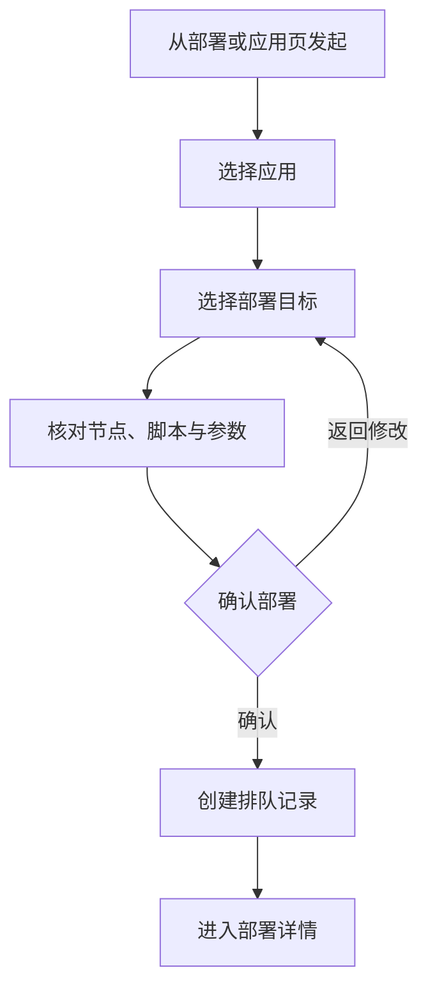
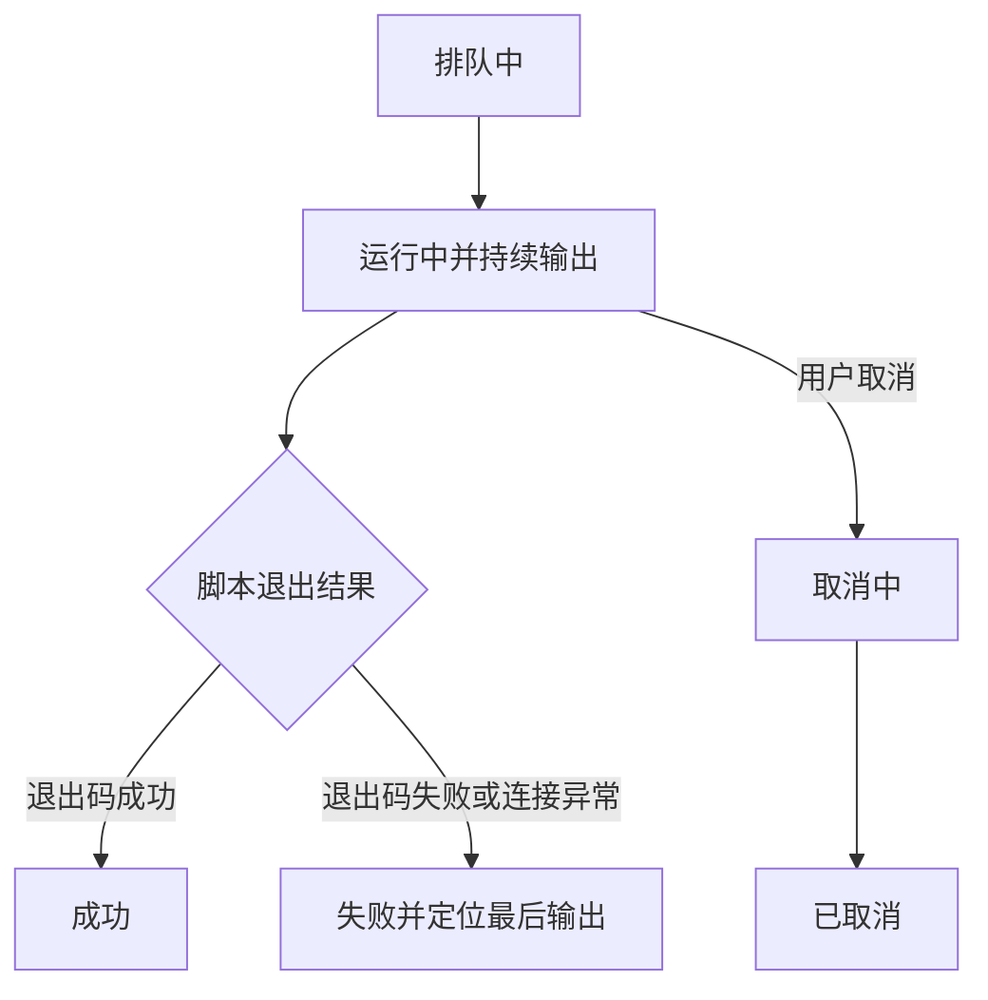

# UI 页面地图

## 设计原则

- 围绕“现在是否可部署、正在发生什么、失败在哪里”组织信息层级。
- 状态同时使用文字、图标和语义色，不只依赖颜色。
- 发起部署属于高影响操作，必须先展示目标和参数摘要再确认。
- 日志是工作内容，不放在装饰卡片中；需要支持持续滚动、暂停跟随和复制。
- Web 面向高密度管理，App 面向快速查看与操作，两端共享语义而非布局。

## 核心状态

| 对象 | 状态 |
| --- | --- |
| 节点 | 未检查、检查中、在线、检查失败、离线、凭证无效、已停用 |
| 应用 | 正常、部署中、异常、已归档 |
| 部署 | 排队中、运行中、成功、失败、取消中、已取消 |
| 日志流 | 连接中、实时跟随、已暂停、已断开、已结束 |

## Web 管理端

### 导航结构

- 概览
- 部署
- 应用
- 节点
- 设置

### P0 页面

| 路由 | 页面 | 核心内容与操作 |
| --- | --- | --- |
| `#/web/overview` | 概览 | 运行中部署、失败摘要、异常节点、最近活动 |
| `#/web/deployments` | 部署列表 | 状态过滤、应用 / 节点筛选、发起部署、历史记录 |
| `#/web/deployments/new` | 发起部署 | 应用、目标、脚本、参数摘要和最终确认 |
| `#/web/deployments/:id` | 部署详情 | 状态时间线、实时日志、执行摘要、取消操作 |
| `#/web/apps` | 应用列表 | 状态、环境、节点、最近部署和搜索 |
| `#/web/apps/:id` | 应用详情 | 部署目标、脚本入口、部署历史和发起部署 |
| `#/web/nodes` | 节点列表 | 连接状态、地址摘要、应用数量、最近检查 |
| `#/web/nodes/:id` | 节点详情 | 基础信息、连通性、承载应用和部署历史 |
| `#/web/apps/new` | 创建应用 | 基础信息、默认目标、脚本入口与契约校验 |
| `#/web/apps/:id/edit` | 编辑应用 | 修改应用和默认部署目标 |
| `#/web/apps/:id/targets/new` | 新增部署目标 | 节点、脚本、参数、敏感引用和健康检查 |
| `#/web/apps/:id/targets/:targetId/edit` | 编辑部署目标 | 修改目标执行与验证配置 |
| `#/web/nodes/new` | 接入节点 | 连接信息、凭证引用和能力检查 |
| `#/web/nodes/:id/edit` | 编辑节点 | 修改连接与执行边界 |
| `#/web/settings` | 系统设置 | 部署默认值与当前会话，仅管理员可见 |
| `#/web/settings/users` | 用户管理 | 普通用户创建、查看和启停 |
| `#/web/settings/users/new` | 新增用户 | 管理员直接创建固定身份为普通用户的新账号 |
| `#/web/settings/users/:id` | 用户详情 | 身份、状态、会话和凭证操作 |
| `#/web/settings/audit` | 审计记录 | 登录、配置变更和部署操作 |
| `#/web/login` | 登录 | 管理员分配账号登录、失败与会话失效 |

### 桌面布局

- 左侧固定主导航。
- 设置激活时在侧栏展开系统设置、用户管理和审计记录二级菜单，内容区不使用功能卡片代替导航。
- 顶部承载当前页面标题、全局状态和主要操作。
- 列表页使用连续表格或列表，不把每一行做成独立大卡片。
- 部署详情采用摘要与日志主区域，宽屏可辅以执行元数据侧栏。

## App 管理端

### 一级导航

- 概览
- 部署
- 应用
- 节点
- 我的

“我的”固定占用一级导航，承载账号身份、个人资料、偏好、系统管理和退出入口，为账号体系提供稳定入口。

权限模型固定为一个管理员和多个普通用户。系统管理能力只对管理员开放，不设计自定义角色、角色分配或多个管理员。

### P0 页面

| 路由 | 页面 | 核心内容与操作 |
| --- | --- | --- |
| `#/app/overview` | 概览 | 运行中、失败和异常节点摘要，最近活动 |
| `#/app/login` | 登录 | 管理员分配账号登录、失败与会话失效 |
| `#/app/deployments` | 部署列表 | 状态分段、搜索、部署记录 |
| `#/app/deployments/new` | 发起部署 | 分步选择应用与目标，确认后执行 |
| `#/app/deployments/:id` | 部署详情 | 状态、关键元数据、日志和取消操作 |
| `#/app/apps` | 应用列表 | 状态、最近部署和搜索 |
| `#/app/apps/:id` | 应用详情 | 目标摘要、最近部署和发起部署 |
| `#/app/nodes` | 节点列表 | 在线状态、承载应用和最近检查 |
| `#/app/nodes/:id` | 节点详情 | 连接状态、基础信息和相关活动 |
| `#/app/mine` | 我的 | 账号身份、个人资料、偏好和系统管理入口 |
| `#/app/mine/users` | 用户管理 | 用户列表、账号状态和新增入口，仅管理员可见 |
| `#/app/mine/users/:id` | 用户详情 | 查看身份和活动；启用或停用普通用户 |
| `#/app/mine/users/new` | 新增用户 | 管理员直接创建固定身份为普通用户的新账号 |
| `#/app/mine/profile` | 个人资料 | 姓名、邮箱、登录状态和安全设置摘要 |
| `#/app/mine/preferences` | 通知与偏好 | 部署结果、失败和异常节点通知开关 |
| `#/app/mine/about` | 关于 | 产品信息、脚本契约和服务状态 |

### 移动布局

- 一级页面使用底部导航，二级页面使用明确返回路径。
- 一级页面顶栏只显示页面标题，不显示副标题和账号头像；“我的”根页直接显示身份信息，不设置重复顶栏。
- 底部导航通过黑底白色图标、加粗标签和顶部短指示条共同表达选中状态。
- 移动端不定义鼠标悬浮反馈，只设计触摸按下、选中、禁用和焦点状态。
- 列表优先显示状态、名称和最近活动，低频元数据进入详情页。
- 长日志使用独立全屏阅读面，固定保留跟随 / 暂停和跳到末尾操作。
- 危险确认使用全屏或底部面板，不能仅用浏览器原生确认框。

## 路由与权限规则

- 未知路由和未知资源 ID 必须进入明确的未找到页面，不回退到入口或第一条 Mock 数据。
- 未登录访问业务路由时进入对应 Web / App 登录页。
- 普通用户不显示 Web 设置导航和 App 系统管理入口，通过深链访问时显示权限不足。
- 唯一管理员账号不能停用；普通用户由管理员直接创建和启停。

## 关键交互流程

### 发起部署

### 运行与结果

## Mock 数据场景

- 空仓库：没有节点、应用和部署记录。
- 正常运行：同时存在排队、运行和成功部署。
- 部分异常：节点离线、部署失败、日志流断开。
- 高密度历史：多应用、多环境、大量部署记录和超长日志。
- 敏感参数：摘要与日志中以脱敏值展示。
- 加载中、筛选无结果、局部请求失败、服务不可用、会话失效和权限不足。
- 脚本契约失败、节点凭证无效、日志断连和超长日志。

## 首轮评审路径

1. 从 Web 概览定位一个失败部署，进入详情查看最后有效日志。
2. 从应用详情发起部署，核对目标并确认，进入运行中详情。
3. 切换到 App，在部署列表找到同一记录并查看实时状态。
4. 查看离线节点及其受影响应用。
5. 切换空数据场景，检查两端的下一步操作是否明确。
